> Title: **Overview of Dynamic Systems**
>
> Lecture @ 2026-3-16

## 什么是动态系统 (Dynamic System)

> 令人怀念的 **是什么** 起手

**动态系统** (Dynamic System) 是一种可以提供 **输入**（或者叫 **激励** (excitation)），或者让它偏离 **平衡状态** (equilibrium) 来启动的系统。它的动作被作为这个系统的 **输出**（或者叫 **响应** (response)）。它的输出和他的输入和它的内部行为相关。如果我们知道一个系统的行为，我们就可以指定一个特定的输入，然后获取预期的输出。

然后，现在的问题就到了，该怎么描述一个系统的内部行为？

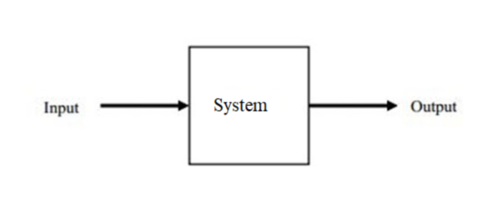

---

是的，他叫 **系统** (System) ，我们还没有从痛苦的信号与系统的泥潭中走出来。

众所周知，系统在信号与系统中的定义就是一个将输入信号映射到输出信号的黑盒子。我们可以把系统看成一个函数，输入是自变量，输出是函数值。这里使用了相同的概念————我们可以用类似的很多方式来定义这里的输入输出关系，比如

- 用数学术语来定义动态系统
- 一组表示系统动态的方程
- 多种可能的数学模型
- 动态可能使用微分方程进行描述
- 对于特定系统使用物理定律
- 测试特定系统的原型，或者测量它关于输入的响应

其中，最重要的部分是推倒合理的数学模型。

来点人话，比如说这是一个自行车，它由两个并联阻尼器组成，其中输入和输出都是位置。这个模型具体的就是在特定刹车行程下，刹车的输入和自行车的输出位置之间的关系。

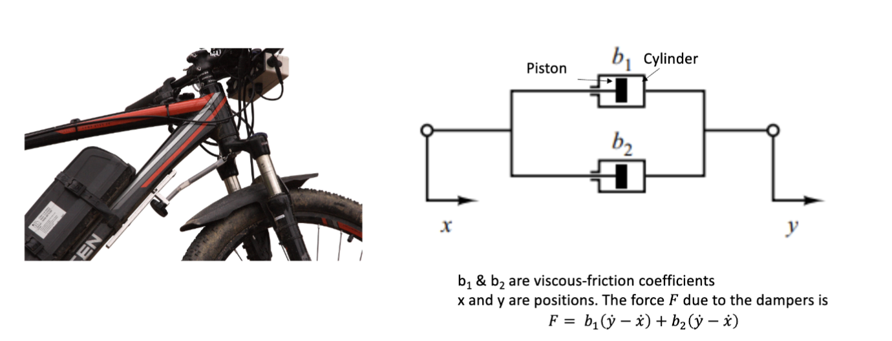

类似的还有串联阻尼器组成的模型

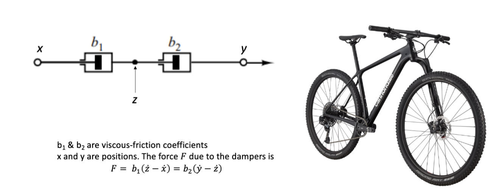

还有在信号与系统里已经差不多受够了的电气系统建模

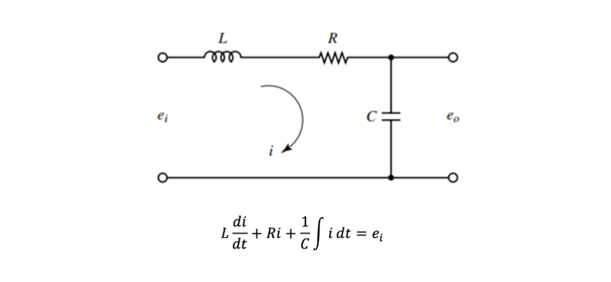

类似的，还有通过牛顿第二定律定义的机械系统。这是一个小车，在水平方向上受一个输入力 $F(t)$ 的作用，输出的是它的位置 $x(t)$。这个系统的动力学方程是 $m\ddot{x}(t) = F(t)$，其中 $m$ 是小车的质量。这是一个二阶系统。

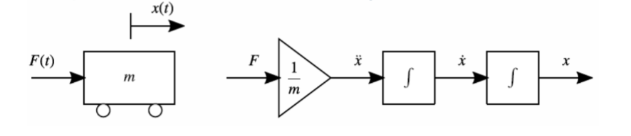

## 描述动态系统

想要精确的描述一个动态系统，有这么几种办法

- 提供这个系统的运动方程
- 描述这个系统的输入输出关系
- 描述其导数作为输入的函数
- 多输入多输出系统

### 一阶系统 (First-Order System)

一阶系统就是用一个一阶微分方程来描述的系统，形式是

$$
\dot{x}(t) + \frac{1}{\tau}x(t) = K u(t)
$$

其中， $x(t)$ 是系统的状态（或者说输出）， $u(t)$ 是系统的输入， $\tau$ 是系统的时间常数， $K$ 是系统的增益。

改变 $\tau$ 改变的是系统的响应速度， $\tau$ 越小，系统响应越快。改变 $K$ 改变的是系统的增益， $K$ 越大，系统的输出越大。

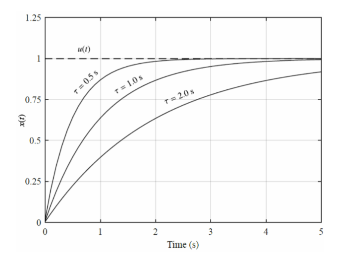

> 是的，[一阶滤波器](https://github.com/Cateds/CAD_Lecture_Notes/blob/main/Lecture12.md) ，欢迎回来。

### **二阶系统** (Second-Order System)

二阶系统则是一个二阶微分方程，形式是

$$
\ddot{x}(t) + 2\zeta\omega_n \dot{x}(t) + \omega_n^2 x(t) = K u(t)
$$

其中， $\zeta$ 是系统的阻尼比， $\omega_n$ 是系统的自然频率， $K$ 是系统的增益。

改变 $\zeta$ 改变的是系统的震荡程度， $\zeta$ 越大，系统的震荡越大。改变 $\omega_n$ 改变的是系统的自然频率， $\omega_n$ 越大，系统的响应越快。改变 $K$ 改变的是系统的增益， $K$ 越大，系统的输出越大。

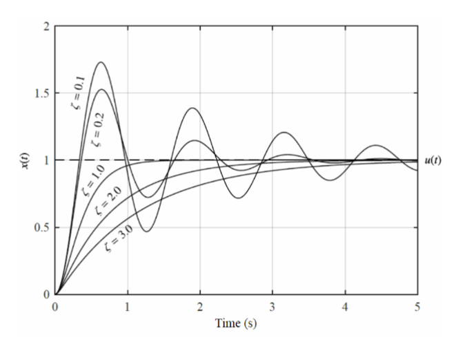

### 高阶系统 (Higher-Order System)

类似的，我们还有更高阶的系统，比如说三阶系统，四阶系统等等。这些系统的微分方程会更复杂，但是它们的行为也会更丰富。

$$
x^{(n)}(t) + a_{1} x^{(n-1)}(t) + \cdots + a_n x(t) = K u(t)
$$

## 拉普拉斯变换 (Laplace Transform)

拉普拉斯变换，信号与系统里的压轴主角，可以将难以用框图建模的积分方程和微分方程分别用各自的方程来描述，然后把他们的之间的相互关系转换成代数方程。

$$
\mathcal{L}\{f(t)\} = F(s) = \int_{0}^{\infty} f(t) e^{-st} dt
$$

输入和输出之间的关系叫做 **传递函数** (Transfer Function)，它是输入和输出的拉普拉斯变换的比值。

比如说对于这个简单的一阶系统，

$$
\dot{x}(t) + \frac{1}{\tau}x(t) = K u(t)
$$

对他进行拉普拉斯变换，可以得到

$$
sx(s) + \frac{1}{\tau}x(s) = K u(s)
$$

从而可以得到他的传递函数

$$
F(s) = \frac{x(s)}{u(s)} = \frac{K}{s + \frac{1}{\tau}}
$$

随堂小练习：计算这个二阶系统的传递函数

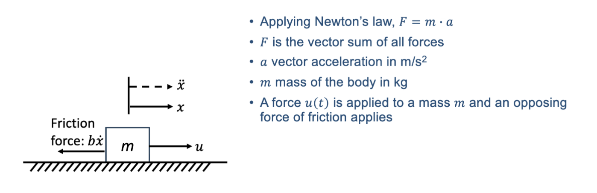

这是一个同时受外部力 $u(t)$ 和摩擦力 $b\dot{x}(t)$ 作用的二阶系统，动力学方程是

$$
\ddot{x}(t) + \frac{b}{m}\dot{x}(t) = \frac{1}{m}u(t)
$$

对这个方程两侧进行拉普拉斯变换，可以得到

$$
s^2 X(s) + s \frac{b}{m} X(s) = \frac{1}{m} U(s)
$$

进而可以得到他的传递函数

$$
F(s) = \frac{X(s)}{U(s)} = \frac{1}{ms^2 + bs}
$$

更通用一点的计算

对于这个二阶系统的通用形式

$$
\ddot{x}(t) + 2\zeta\omega_n \dot{x}(t) + \omega_n^2 x(t) = K u(t)
$$

使用类似的方式，可以得到

$$
s^2 X(s) + 2 s \zeta \omega_n X(s) + \omega_n^2 X(s) = K U(s)
$$

进而

$$
F(s) = \frac{X(s)}{U(s)} = \frac{K}{s^2 + 2 s \zeta \omega_n + \omega_n^2}
$$

---

类似的，对于更高阶的系统，比如说这个 $n$ 阶系统

$$
x^{(n)}(t) + a_{1} x^{(n-1)}(t) + \cdots + a_n x(t) = K u(t)
$$

进行拉普拉斯变换，可以得到

$$
s^n X(s) + a_{1} s^{n-1} X(s) + \cdots + a_n X(s) = K U(s)
$$

进而可以得到他的传递函数

$$
F(s) = \frac{X(s)}{U(s)} = \frac{K}{s^n + a_{1} s^{n-1} + \cdots + a_n}
$$

## 响应特性

### 输入类型

控制器的目标是确定一个输入 $u(t)$ 来让系统的输出 $x(t)$ 满足某些特定的要求。我们可以根据输入的类型来分类不同的控制问题。

这里并不仅限于 $u(t)$ ，也可以是常数或者任何的时间相关函数，通过施加特定输入并观察输出响应，我们可以更深入的了解某个系统。

最常用的还是阶跃输入，定义为

$$
u(t) = \begin{cases}
0, & t < 0 \\
a, & t \geq 0
\end{cases}
$$

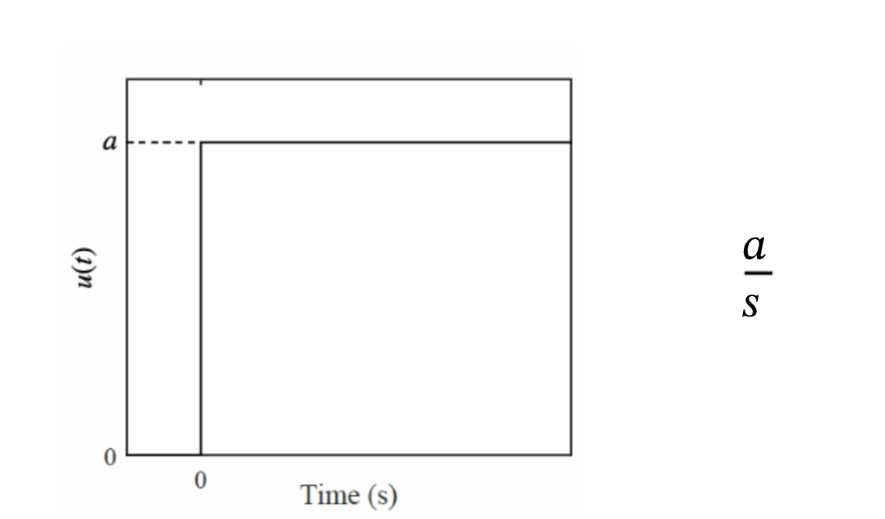

类似的还有斜坡输入 (ramp input)，定义为

$$
u(t) = \begin{cases}
0, & t < 0 \\
at, & t \geq 0
\end{cases}
$$

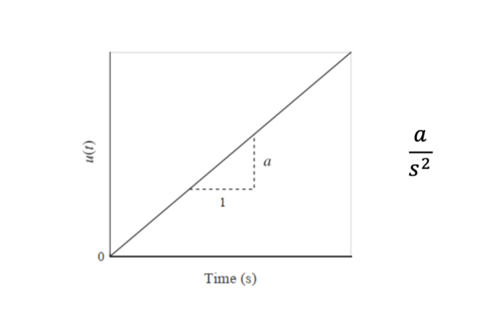

### 响应属性

通过向某个处于静止状态的系统施加阶跃输入，我们使系统进入受迫振动 (forced vibration) 状态

系统在稳定到恒定稳态 (steady-state value) 之前处于运动状态，这个处于运动状态的阶段被称为瞬态阶段 (transient phase) 。在理论上，一个理想的系统在 $t \rightarrow \infty$ 的时候才进入稳态阶段 (steady-state phase) ，但是在实际过程中我们认为它运动足够不明显就行。

可以使用终值定理 (final-value theorem) 来求稳态的值，比如对于二阶系统，就有

$$
x_{ss} = x(\infty) = \frac{K_a}{\omega_n^2}
$$

:::note
终值定理 (final-value theorem) 指的是当 $t \rightarrow \infty$ 或者 $s \rightarrow 0$ 的时候，系统的输出值可以通过系统的传递函数来求得。对于一个系统的传递函数 $F(s)$ 和输入的拉普拉斯变换 $U(s)$，系统的输出的终值可以通过以下公式计算：

$$
\lim_{t \to \infty} x(t) = \lim_{s \to 0} s F(s) U(s) \\
\lim_{t \to 0} x(t) = \lim_{s \to \infty} s F(s) U(s)
$$

:::

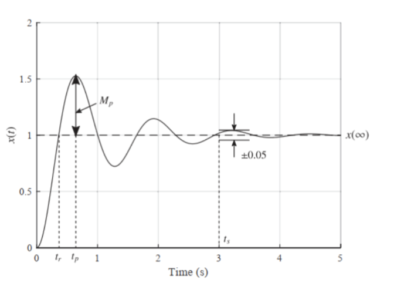

在运动阶段，系统的响应可以被多种属性描述，比如响应的峰值 $M_p$，峰值时间 $t_p$，上升时间 $t_r$，稳定时间 $t_s$，等等。

这些指标只在系统稳定时成立。换句话说，一个不稳定的系统在接受输入后永远不会达到稳态值，或者永远不会达到平衡状态。

有些系统会故意设计成这种不稳定的状态，比如战斗机。在这种情况下，我们会设计一个控制系统来稳定飞机。

我们可以通过设计控制系统来为整个系统赋予期望的性质，比如说稳定性，快速响应，等等。
