> Title: **Basics of Control System Analysis**
>
> Lecture @ 2026-3-16

## 控制系统简介

**控制系统** (Control System) 是一种使用了控制技术的系统，它有广泛的使用场景，比如功率放大、远程控制等。他有方便的输入形式，同时对外部干扰也能有很强的补偿能力。

一个常见的控制方式是 **开环控制** (Open-Loop Control)，它的输入和输出之间没有反馈关系。比如说一个简单的烤面包机，用户设置一个时间，面包机会在这个时间结束后弹出面包。这个系统的输入是时间，输出是面包的状态（是否弹出）。如果用户设置的时间不合适，面包可能会烤得过熟或者不熟。

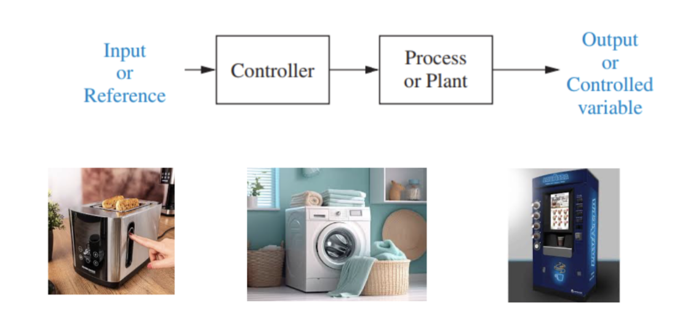

而另一种控制方式， **闭环控制** (Closed-Loop Control)，则解决了这个问题。它通过 **反馈机制** 把系统的输出信息反馈到输入端，从而调整系统的行为，最终实现了更好的性能和稳定性。

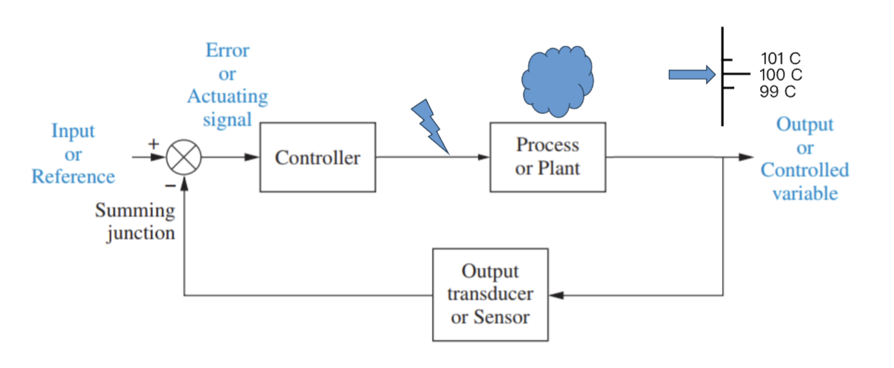

比如说电机转速控制系统。输入是电压，输出是转速。通过测量转速并将其反馈到输入端，系统可以调整电压以保持所需的转速，即使负载发生变化或者外部干扰存在。

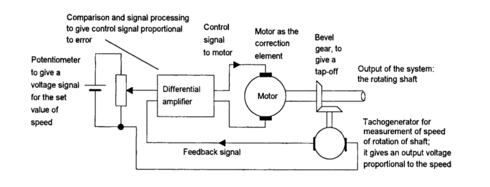

## 设计流程

要设计一个控制系统，我们通常要经历如下几个步骤：

1. 根据需求确定物理系统及其规格要求
2. 绘制功能框图
3. 将物理系统转化成原理图
4. 利用原理图获得框图、信号流图或状态空间表达式
5. 若存在多个模块，将框图简化为单个模块或闭环系统
6. 分析、设计与测试，验证是否满足需求和规格要求

其中，框图 (Block Diagram) 是一种用于时域、频域分析与设计的常用工具。它由基础的功能块组成，表示系统组件间的互联以及信号流向。

## 框图 (Block Diagram)

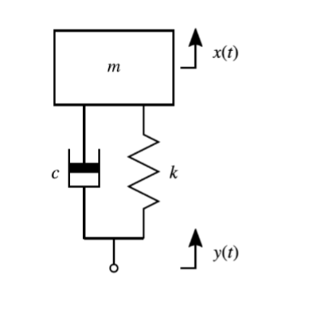

从这个简单的情况下手：这是一个简单的机械系统，输入是 $y(t)$，响应为 $x(t)$，系统的运动方程是

$$
m \ddot{x} + c \dot{x} + k x = c \dot{y} + k y
$$

对他使用 [拉普拉斯变换](./lec1.md#拉普拉斯变换-laplace-transform)，使用零初始条件，可以得到他的传递函数

$$
F(s) = \frac{X(s)}{Y(s)} = \frac{c s + k}{m s^2 + c s + k}
$$

那么，这个系统的框图就可以画成下面这个样子：

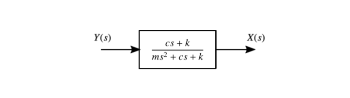

其中，输入是 $Y(s)$，输出是 $X(s)$，系统的传递函数是 $F(s) = \frac{c s + k}{m s^2 + c s + k}$。

---

一般来说，具有输入 $u(t)$，响应 $x(t)$, 传递函数 $G(s)$ 的系统元素都可以表示为下图的单个模块：

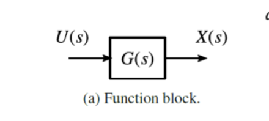

如果一个系统由多个组件组成，则各个模块之间使用箭头连接，显示信号流动的方向。信号之间进行比较的地方被称为 **求和点** (Summation Point)，它用一个圆圈表示，里面有一个加号或者减号，表示输入信号的加权和。同一个信号分支的地方叫做 **分支点** (Branch Point)，它表示允许信号同时流向多个模块。

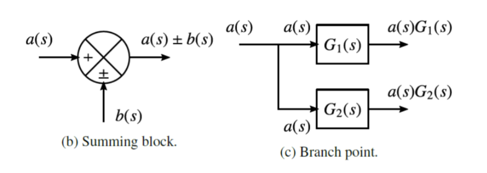

一个控制系统在结构上或者设计上可能非常复杂，对应的方框图可能也非常复杂，它会显示系统的所有输入、输出和扰动。

我们可以把框图简化成一个简单的传递函数，它关联单个输入与单个输出，可以通过应用七条基本规则来实现

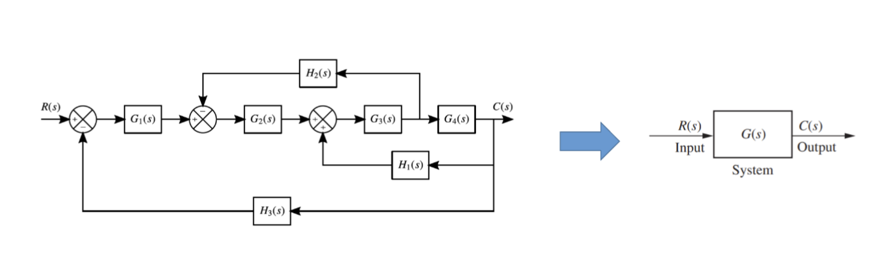

## 框图简化

### 级联两个信号

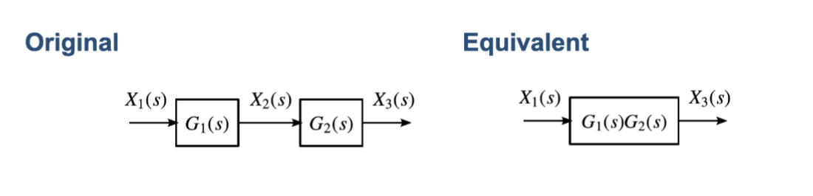

如果有两个串联的块，传递函数分别为 $G_1(s)$ 和 $G_2(s)$，那么它们的等效传递函数就是 $G(s) = G_1(s) G_2(s)$。

### 求和两个信号

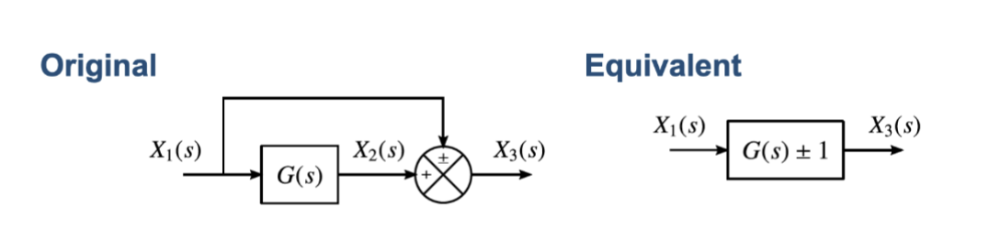

如果有一个信号是两个块的求和，传递函数分别为 $G_1(s)$ 和 $G_2(s)$，那么它们的等效传递函数就是 $G(s) = G_1(s) + G_2(s)$。

类似的，有系数的情况，如果有一个信号是 $a G_1(s) + b G_2(s)$，那么它们的等效传递函数就是 $G(s) = a G_1(s) + b G_2(s)$。

### 求和点移到块后方

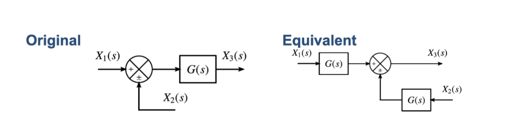

如果 $X_1(s)$ 和 $X_2(s)$ 是求和点的输入，$G(s)$ 是块的传递函数，那么它们的等效传递函数就是 $G(s) = G(s) X_1(s) + G(s) X_2(s)$，相当于是把 $G(s) X_1(s)$ 和 $G(s) X_2(s)$ 分别求得后再求和。

### 求和点移到块前方

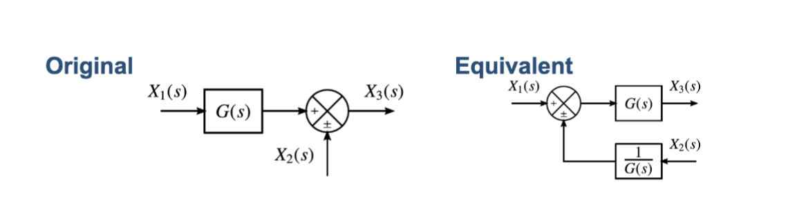

类似的，如果 $G(s) X_1(s)$ 和 $X_2(s)$ 是求和点的输入，$G(s)$ 是块的传递函数，那么它们的等效传递函数就是 $G(s) = G(s) X_1(s) + X_2(s)$，相当于是把 $X_1(s)$ 和 $\frac{1}{G(s)} X_2(s)$ 求和后再通过块 $G(s)$。

### 把分支点移到块之前

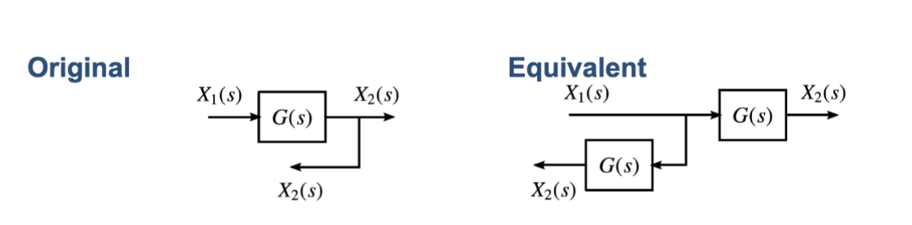

如果在块 $G(s)$ 的输出处有一个分支点，那么等效于把分支点提到块的输入处，每条分支路径上都有一个相同的块 $G(s)$。

### 把分支点移到块之后

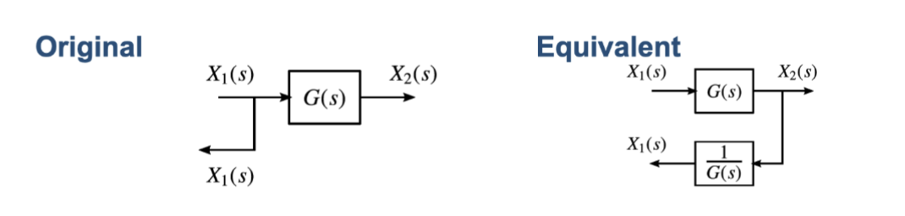

如果在块 $G(s)$ 的输入处有一个分支点，那么等效于把分支点提到块的输出处，每条被移过来的分支路径上都有一个相同的块 $\frac{1}{G(s)}$。

### 消除反馈回路

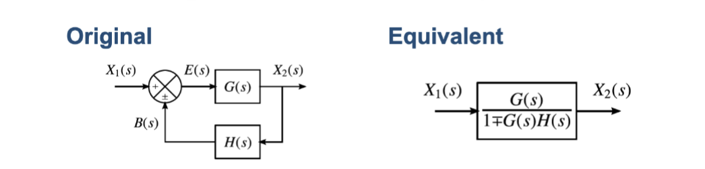

对于包含反馈回路的系统，设前向通路的传递函数为 $G(s)$，反馈通路的传递函数为 $H(s)$。在求和点处，输入信号 $X_1(s)$ 与反馈信号 $B(s)$ 进行比较，产生误差信号 $E(s) = X_1(s) \pm B(s)$，其中正号表示正反馈，负号表示负反馈。

根据框图关系，我们可以写出：

$$
\begin{aligned}
E(s) &= X_1(s) \pm B(s) \\
X_2(s) &= E(s)G(s) \Rightarrow X_2(s) = (X_1(s) \pm B(s))G(s) \\
B(s) &= H(s)X_2(s) \Rightarrow X_2(s) = (X_1(s) \pm X_2(s)H(s))G(s)
\end{aligned}
$$

整理可得：

$$
(1 \mp G(s)H(s))X_2(s) = X_1(s)G(s)
$$

因此，闭环系统的等效传递函数为：

$$
\frac{X_2(s)}{X_1(s)} = \frac{G(s)}{1 \mp G(s)H(s)}
$$

其中，负反馈时取正号（分母为 $1 + G(s)H(s)$），正反馈时取负号（分母为 $1 - G(s)H(s)$）。特别地，对于单位负反馈系统（$H(s) = 1$），等效传递函数简化为 $\frac{G(s)}{1 + G(s)}$。

---

运用这些规则，我们可以把一个复杂的系统框图简化成一个单一的传递函数，方便我们进行分析和设计。
