> Title: **Block Diagram Reduction**
>
> Lecture @ 2026-3-16

## 使用方框图简化规则

[方框图简化规则](./lec2.md#框图简化)，位于 Part.1 Lec.2 最后一部分

快速回顾

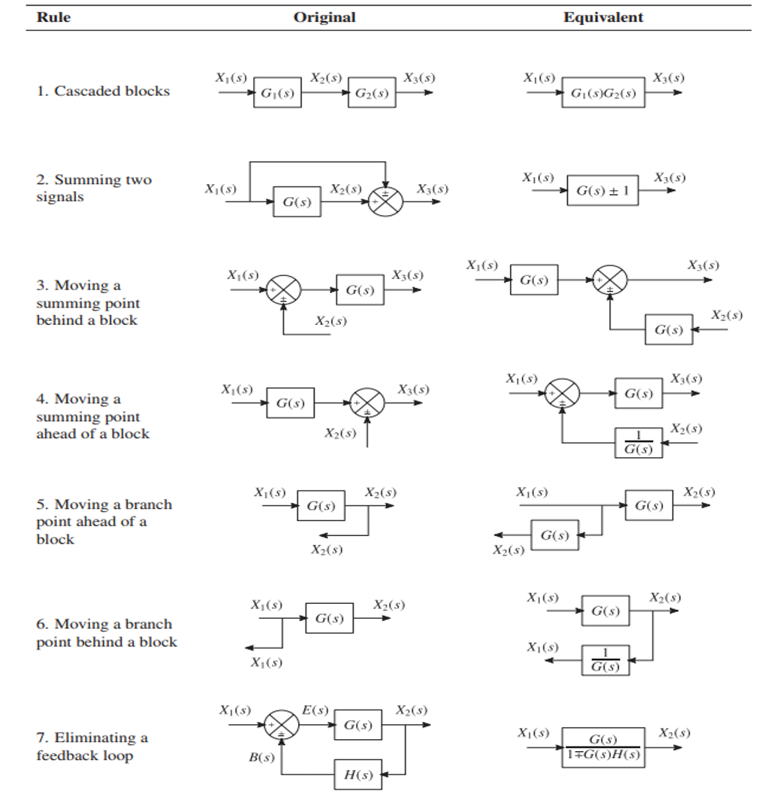

### 对比两种方法

从一个简单的例子入手

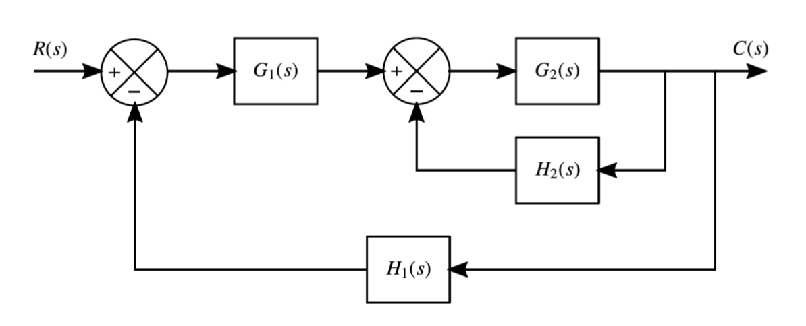

一个非常非常力大砖飞的方法是把每个中间信号都求出来，最后再把它们组合成一个单一的传递函数。比如在这里，我们有

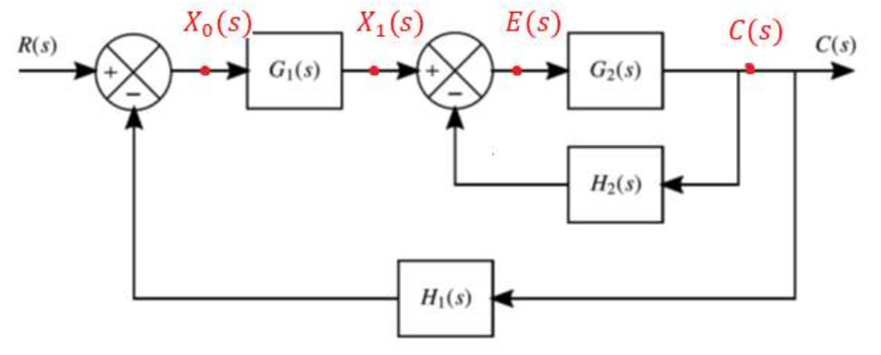

$$
\begin{aligned}
  C(s) & = E (s) G_2(s) \\
  E(s) & = x_1 (s) - C(s) H_2 (s) \\
  X_1(s) & = X_0 (s) G_1(s) \\
  X_0(s) & = R (s) - C(s) H_1 (s)
\end{aligned}
$$

然后把这个方程组联立带入，可以得到

$$
\begin{aligned}
  C(s) &= E(s) G_2(s) \\
  &=(X_1(s) - C(s)H_2(s))G_2(s) \\
  &=(X_0(s) G_1(s) - C(s)H_2(s))G_2(s) \\
  & = [R(s) - C(s)H_1(s) G_1(s) - C(s)H_2(s)] G_2(s) \\
  & = R(s) G_1(s) G_2(s) - C(s) H_1(s) G_1(s) G_2(s) + C(s) H_2(s) G_2(s)
\end{aligned}
$$

然后就有

$$
\frac{C(s)}{R(s)} = \frac{G_1(s) G_2(s)}{1 + H_1(s) G_1(s) G_2(s) + H_2(s) G_2(s)}
$$

可行，但是够麻烦，看到这么多的式子大脑先要栈溢出了。为了精神状态健康，我们可以选择换一种方法，也就是是我们之前提到的方框图简化方法。

---

还是这个熟悉的图

先使用第七条规则，去掉一个包括 $G_2(s)$ 和 $H_2(s)$ 的反馈回路

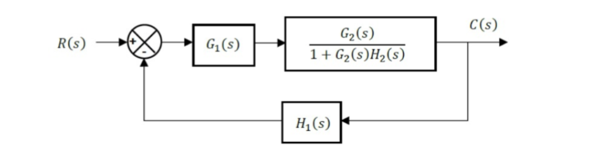

然后使用第一条规则，把级联的 $G_1(s)$ 和 $\frac{G_2(s)}{1+G_2(s) H_2(s)}$ 合并成一个块

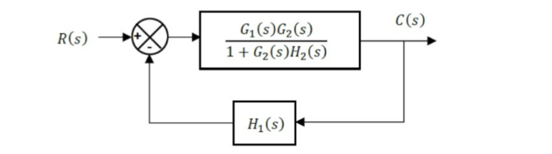

最后使用第七条规则，去掉剩下的反馈回路，就得到了最终的结果

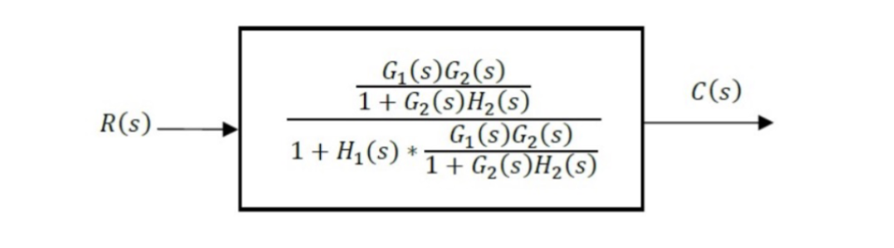

最后把式子简化一下，可以得到和之前一样的结果

$$
\frac{C(s)}{R(s)} = \frac{G_1(s) G_2(s)}{1 + H_1(s) G_1(s) G_2(s) + H_2(s) G_2(s)}
$$

简单清晰快捷，精神状态健康，而且更重要的是，这个方法可以让我们更好地理解系统的结构和行为，而不是被一大堆复杂的数学式子淹没。

### 另一道练习

俗话说得好，只要肯做题，就有做不完的题。我们再来看看另一个例子。

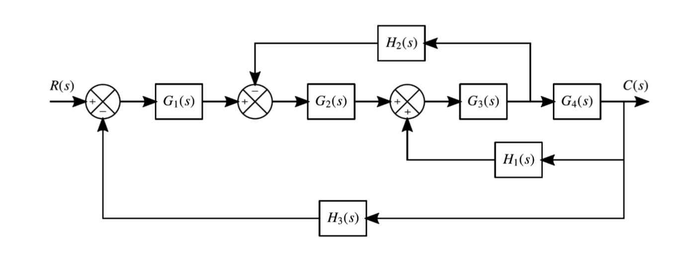

先使用第六条，把 $H_2(s)$ 的分支入口后移到 $G_2(s)$ 的输出处

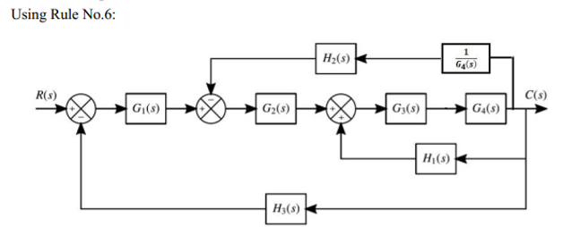

然后使用第一条消除级联的块

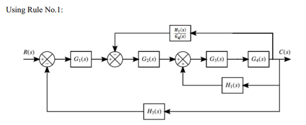

然后使用第一条和第七条，消除最右边的反馈回路

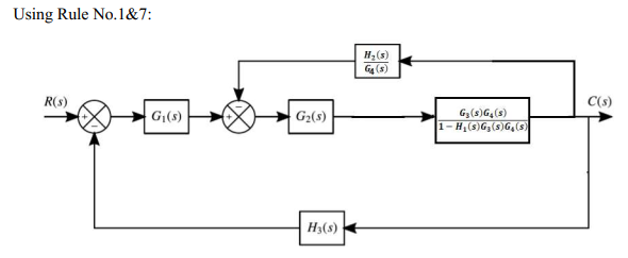

然后使用第一条，把级联的块合并成一个块

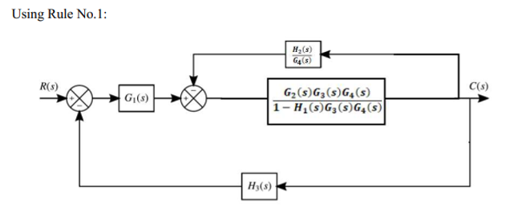

类似的，使用第七条，消除剩下的反馈回路

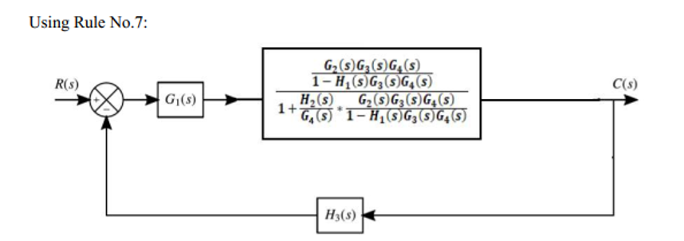

类似的，使用第一条和第七条，解决掉剩下的级联块和反馈回路

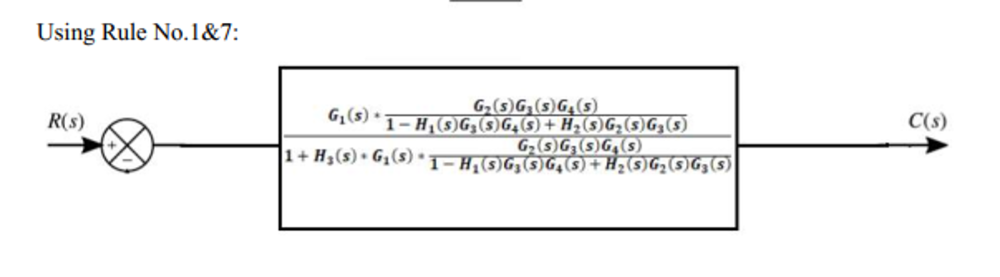

然后把这个叠了四层的东西化简，注意保持 san 值稳定

$$
F(s) = \frac{C(s)}{R(s)} = \frac{
  G_1(s) G_2(s) G_3(s) G_4(s)
}{
  1 - H_1(s) G_3(s) G_4(s)
  + H_2(s) G_2(s) G_3(s) +
  H_3(s) G_1(s) G_2(s) G_3(s) G_4(s)
}
$$

## 叠加原理

对于一个受扰动的闭环控制系统，为了抑制工厂稳态运行中的扰动，可以通过拆分传递函数来纳入对工厂的扰动。

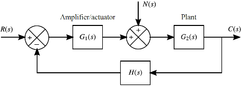

对于上图中的系统， $N(s)$ 是扰动输入， $C(s)$ 是系统的输出， $R(s)$ 是系统的参考输入， $H(s)$ 是系统的反馈传递函数， $G_1(s)$ 是放大器的传递函数， $G_2(s)$ 是设备的传递函数。

对于一个线性系统，叠加原理 (Superposition Principle) 成立，也就是如果需要同时响应输入和扰动，可以分别计算它们的响应，然后把它们叠加起来得到总响应。

:::note
叠加原理 (Superposition Principle) 表示，系统对多个输入的响应等于系统对每个输入单独响应的和。这个适用于线性系统，也就是说系统的输出与输入成正比，并且满足叠加和齐次性质。
:::

对于分别分析的情况，也就是分别认为 N(s) 和 R(s) 是系统的唯一输入，我们可以得到两个单独的传递函数：

对于只考虑参考输入 $R(s)$ 的情况，系统的输出 $C(s)$ 与 $R(s)$ 的关系可以表示为：

$$
\frac{C(s)}{R(s)} = \frac{G_1(s) G_2(s)}{1+ H(s) G_1(s) G_2(s)}
$$

化简后的框图如图所示：

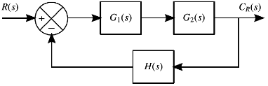

而对于只考虑扰动输入 $N(s)$ 的情况，系统的输出 $C(s)$ 与 $N(s)$ 的关系可以表示为：

$$
\frac{C(s)}{N(s)} = \frac{G_2(s)}{1 + H(s) G_1(s) G_2(s)}
$$

化简后的框图如图所示：

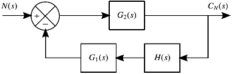

为了获得整体的响应，使用式子 $C(s) = C_R(s) + C_N(s)$，我们可以把两个单独的响应叠加起来：

$$
\begin{aligned}
  C(s) &= \frac{G_1(s) G_2(s)}{1+ H(s) G_1(s) G_2(s)} R(s) + \frac{G_2(s)}{1 + H(s) G_1(s) G_2(s)} N(s) \\
  &= \frac{(G_1(s) + G_2(s) )R(s) + G_2(s) N(s)}{1 + H(s) G_1(s) G_2(s)}
\end{aligned}
$$

---

> 俗话说得好，只要肯做题，就有做不完的题，但是我其实可以选择不做

但是如果你想要的话……

尝试着计算出这个系统的等效传递函数

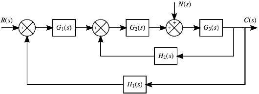

是的，没有答案（暂时）

