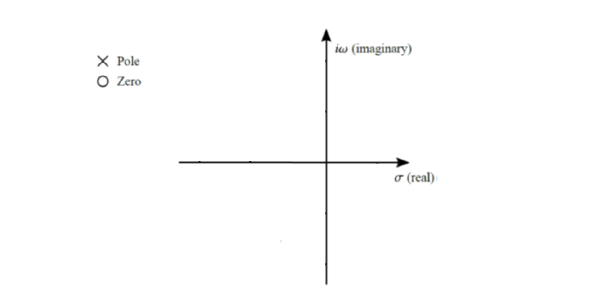
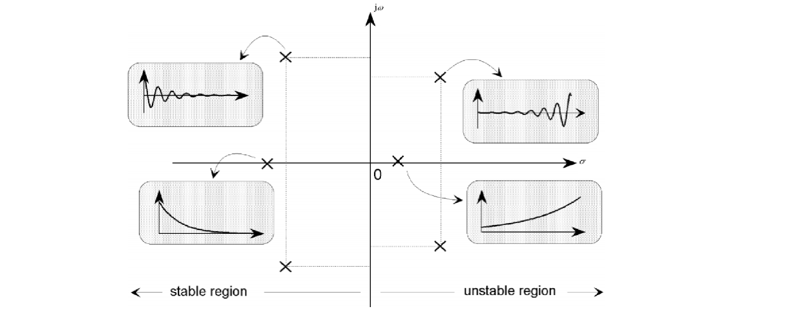
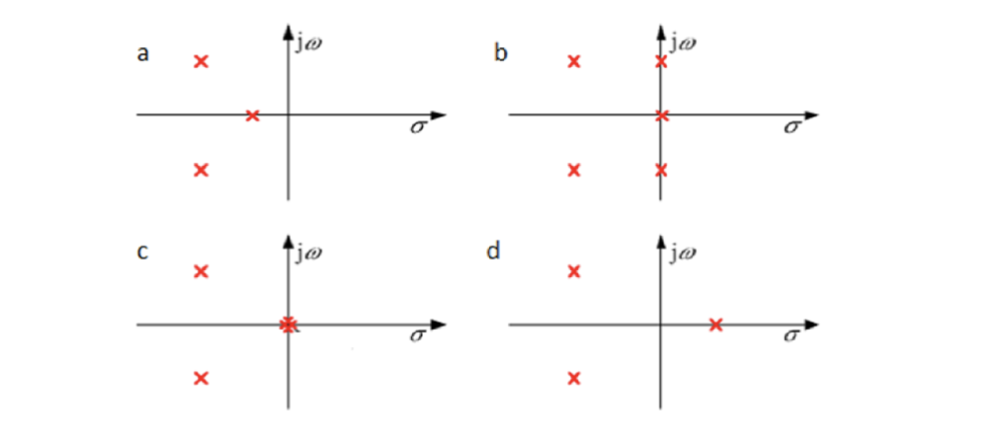
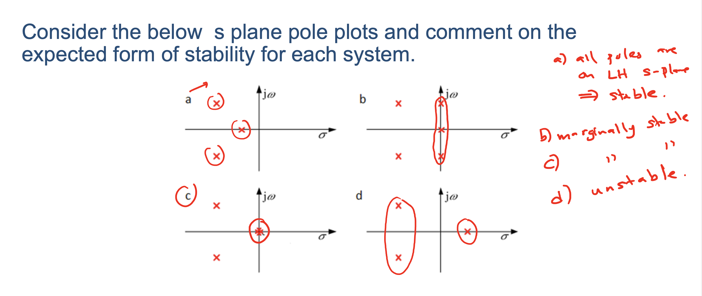

> Title : **Control System Stability**
>
> Lecture @ 2026-4-13

## 传递函数性质

传递函数指的是系统的输入与输出之间的关系，通常表示为一个分式，其中分子和分母都是多项式。它分离了一个系统的输入和输出，用代数的方法描述了系统的动态行为，并且提供了可组合性。

换句话说，一般的形式是

$$
\begin{aligned}
  G(s) & = \frac{C(s)}{R(s)} \\
  & = \frac{
    b_m s^m + b_{m-1} s^{m-1} + \cdots + b_1 s + b_0
  }{
    a_n s^n + a_{n-1} s^{n-1} + \cdots + a_1 s + a_0
  }
\end{aligned}
$$

对于一个传递函数，我们关注的有这么几个特性

- **零点 (Zeros)**：传递函数分子多项式的根，即使系统输出为零的输入值。
- **极点 (Poles)**：传递函数分母多项式的根，即使系统输出趋于无穷大的输入值。
- **特征方程 (Characteristic Equation)**：由传递函数的分母多项式等于零得到的方程，极点就是特征方程的根。

这里是考虑复数和重根的情况，所以对于一个 n 次多项式方程，它应该有 n 个根（包括复数根和重根）。这些根的位置对于系统的稳定性和动态响应有重要影响。我们可以把这些根画在复平面 (s-plane) 上：

一般用圈表示零点，用叉表示极点。

## 系统稳定性

### 所谓 “稳定”

对于一个 **线性时不变系统 (LTI)** ，系统稳定性，指的是一个系统遇到一个瞬态响应是否会衰减。具体到我们刚刚提到的复平面上，指的就是极点的位置的横坐标——也就是实部的影响。

实部 $\sigma$ 的符号决定了系统的稳定性：小于 $0$ 的系统是稳定的，等于 $0$ 的系统是临界稳定的，大于 $0$ 的系统是不稳定的。

做不完的题

考虑以下 s 平面极点图，并对每个系统的稳定性情况进行评估。

答案

- 对于 a，所有极点的实部都小于 $0$，因此系统是稳定的。
- 对于 b，有三个极点位于虚轴上，实部为 $0$，因此系统是临界稳定的。
- 对于 c，有一个极点的实部大于 $0$，因此系统是不稳定的。
- 对于 d，同样的，有一个极点的实部大于 $0$，因此系统也是不稳定的。

### 劳斯稳定判据 (Routh's Stability Criterion)

劳斯稳定判据是一种允许在不求解 ~~很恶心的~~ 高阶方程的根的情况下判断系统的稳定性

$$
s^n + a_{n-1} s^{n-1} + \cdots + a_1 s + a_0 = 0
$$

稳定性的一个必要 （但是不充分）条件是特征多项式的所有系数都是正数，也就是这里的

$$
\begin{cases}
  a_{n-1} > 0 \\
  a_{n-2} > 0 \\
  \cdots \\
  a_1 > 0 \\
  a_0 > 0
\end{cases}
$$

劳斯稳定判据则是指：**当且仅当劳斯阵列的第一列的所有元素都为正数时，系统是稳定的。**

> 理论上接下来就该讲劳斯阵列的构建了，但是确实没有，逻辑上卡在这里了
>
> 如果想要了解的话这有个 [CSDN 链接](https://blog.csdn.net/qq_34539334/article/details/119576387) 讲的很清楚
