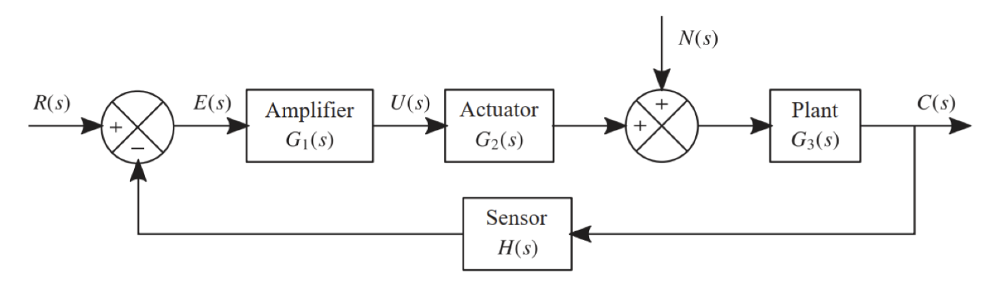
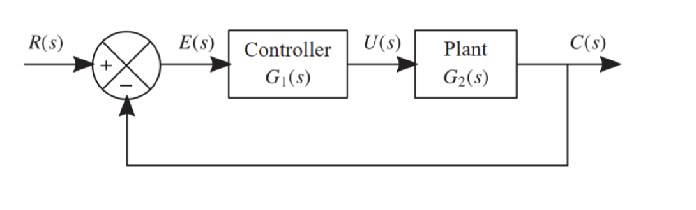
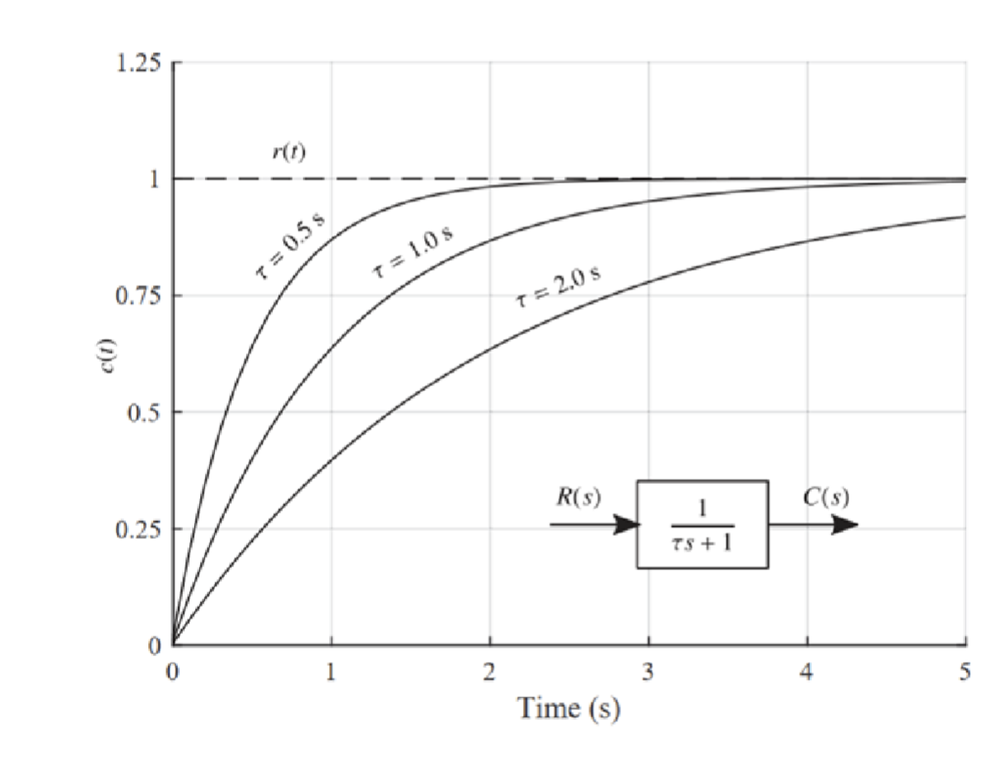
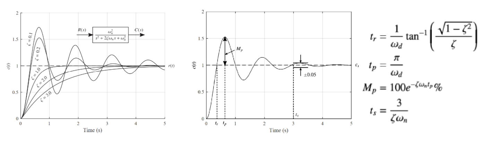
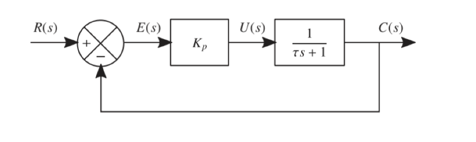
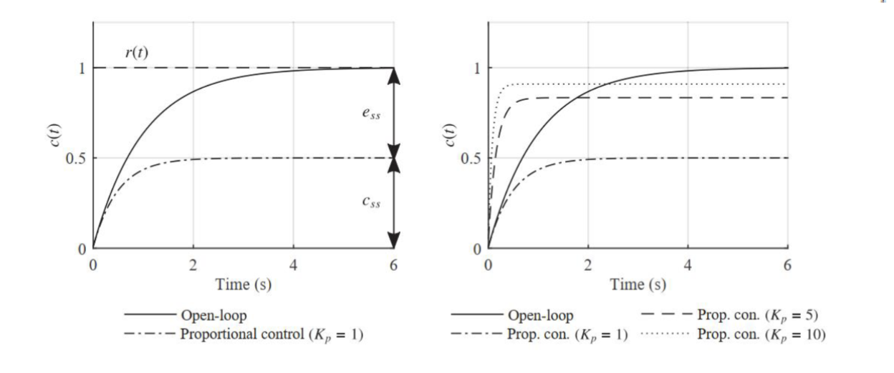
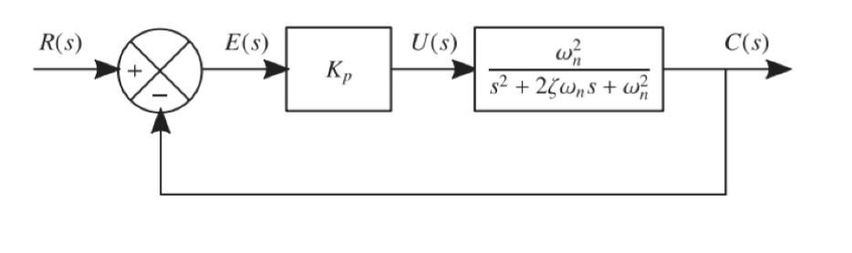
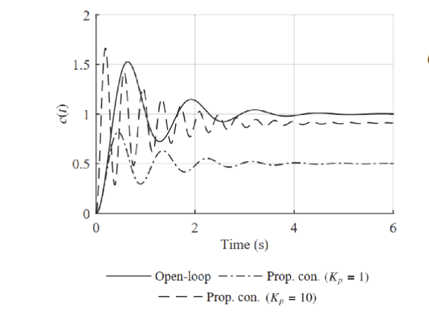
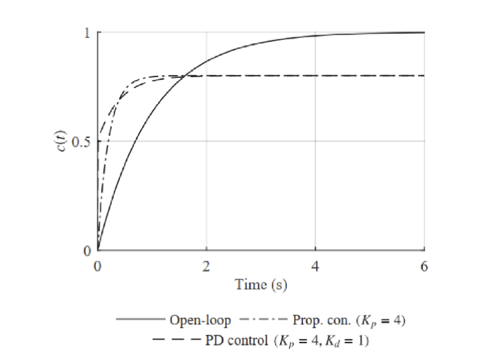
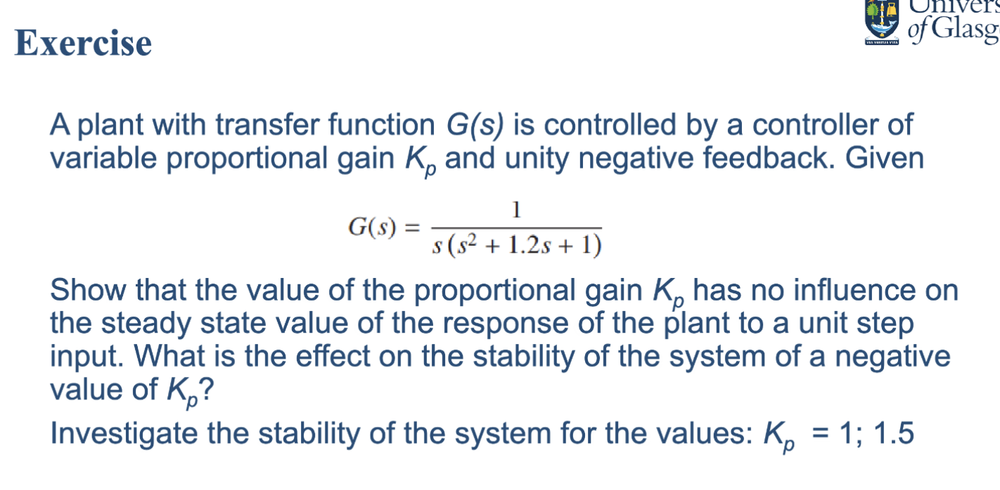

> Title: **Characteristics and Performance of Feedback Control Systems - I**
>
> Lecture @ 2026-4-13

## 基本控制动作

基本控制作用 (Basic Control Actions) 指的是控制系统中常见的几种控制策略，主要包括比例控制 (P)、导数控制 (D)、积分控制 (I) 以及它们的组合（如 PD、PI、PID）。这些控制策略通过不同的方式处理系统的误差（即期望输出与实际输出之间的差异），以实现对系统的稳定和性能优化。

对于反馈控制系统来说，基本控制作用的作用如下：

- 控制器将实际输出（O/P）与期望输出进行比较
- 产生控制信号以减小偏差
- 执行器、被控对象（Plant）和传感器的传递函数具有不同形式

### 比例控制 (P, Proportional)

比例控制是一种最简单的控制策略，其中控制信号与误差成正比。比例控制器的输出可以表示为：

$$
u(t) = K_p e(t)
$$

这里的 $u(t)$ 是控制信号，$K_p$ 是比例增益，$e(t)$ 是误差，即期望输出与实际输出之间的差值。比例控制可以快速响应系统的误差，但可能会导致稳态误差（steady-state error），即系统无法完全达到期望输出。

### 导数控制 (D, Derivative)

为了提高闭环系统的稳定性，加快瞬态响应，我们可以引入导数控制。导数控制器的输出与误差的变化率成正比，可以表示为：

$$
u(t) = K_d \frac{de(t)}{dt}
$$

这通常是比例控制的增强，倾向于放大噪声，同时引入反馈路径以消除对输入信号的响应。

### 积分控制 (I, Integral)

积分控制指的是控制信号与误差的积分成正比，可以表示为：

$$
u(t) = K_i \int e(t) dt
$$

这个部分的目的是最小化稳态误差，减少输出对扰动的响应，在稳态下具有优越的性能。这可以让恒定扰动被零误差的消除。

### 比例微分控制 (PD)

多种基本控制作用的组合可以提供更好的性能。例如，比例微分控制 (PD) 结合了比例控制和导数控制的优点，可以快速响应系统的误差并提高系统的稳定性。

$$
u(t) = K_p e(t) + K_d \frac{de(t)}{dt}
$$

这里，导数作用可以加速比例作用的结果。

### 比例积分控制 (PI)

类似的，比例作用会给系统的响应添加一个稳态偏移，添加一个积分作用可以消除这个偏移：

$$
u(t) = K_p e(t) + K_i \int e(t) dt
$$

### 比例积分微分控制 (PID)

然后把所有的三个基本控制作用结合起来，就得到了比例积分微分控制 (PID)，它是最常用的控制策略之一：

$$
u(t) = K_p e(t) + K_i \int e(t) dt + K_d \frac{de(t)}{dt}
$$

也就是这样的一个控制器：

## 闭环控制

如果有输出接入到输入端，我们就称之为闭环系统 (Closed-loop System)，反之则称之为开环系统 (Open-loop System)。

---

在没有受控的情况下，一个一阶系统的开环响应是如图所示的

$$
\frac{C(s)}{R(s)} = \frac{1}{\tau s + 1}
$$

而一个二阶系统类似，未受控的开环响应如下：

$$
\frac{C(s)}{R(s)} = \frac{\omega_n^2}{s^2 + 2 \zeta \omega_n s + \omega_n^2}
$$

### P

如果对示例的一阶系统施加比例控制，则得到的系统如图所示

得到的结果如下

最终系统整体的闭环响应是

$$
c(t) = \frac{K_p}{K_p+1}(1 - e^{-\frac{t}{\tau/(K_p+1)}})
$$

---

类似的，对于二阶系统有

得到的响应是

最终系统整体的闭环响应是

$$
\begin{aligned}
  c(t) &= \frac{K_p}{K_p+1}\left[
    e-\exp{-\zeta \omega_n t} \left (
      \cos \omega_{d,cl} t + \frac{\zeta}{\sqrt{
        K_p + 1 - \zeta^2
      }} \sin \omega_{d,cl} t
    \right)
  \right] \\
  \omega_{d,cl} & = \omega_n \sqrt{K_p + 1 - \zeta^2}
\end{aligned}
$$

### PD

类似的，如果对示例的一阶系统施加比例微分控制，则得到的系统如图所示

得到的结果如下

最终系统整体的闭环响应是

$$
c(t) = \frac{K_p}{K_p+1}\left[
  1-\frac{K_p\tau - K_d}{K_p(\tau+K_d)} e^{-\frac{t}{(\tau + K_D)/{K_p + 1}}}
\right]
$$

---

练习

答案

被控的是一个三阶系统，传递函数为

$$
G(s) = \frac{1}{s(s^2 + 1.2s + 1)}
$$

对于这个传递函数，没有零点，在原点处有极点，即是一个[临界稳定](./lec4.md#系统稳定性)的系统

输入是一个单位阶跃响应，接入的是一个比例控制加单位负反馈。因此有闭环传递函数

$$
T(s) = \frac{K_p G(s)}{1 + K_p G(s)} = \frac{K_p}{s(s^2 + 1.2s + 1) + K_p}
$$

> 这里使用了负反馈的传递函数公式

对于这个系统，比例增益 $K_p$ 的数值对单位阶跃响应无影响，因为根据终值定理，系统的稳态值为

$$
c_{ss} = \lim_{s \to 0} s T(s) \frac{1}{s} = \lim_{s \to 0} T(s) = 1
$$

---

当 K_p 为负值时，特征方程是

$$
s^3 + 1.2s^2 + s + K_p = 0
$$

根据 [Routh-Hurwitz 稳定性判据的必要条件](./lec4.md#劳斯稳定判据-rouths-stability-criterion)，只有全部是正数的时候系统才可能是稳定的，因此 K_p 必须大于 0。

---

列[劳斯表](https://blog.csdn.net/qq_34539334/article/details/119576387)：

|       |                         |       |
| ----- | ----------------------- | ----- |
| $s^3$ | 1                       | 1     |
| $s^2$ | 1.2                     | $K_p$ |
| $s^1$ | $\frac{1.2 - K_p}{1.2}$ | 0     |
| $s^0$ | $K_p$                   |       |

此处的稳定条件为

- $K_p > 0$
- $\frac{1.2 - K_p}{1.2} > 0 \Rightarrow K_p < 1.2$

进而得出

- **$K_p = 1$**：$0 < 1 < 1.2$，系统**稳定**
- **$K_p = 1.5$**：$1.5 > 1.2$，劳斯表第一列出现负值，系统**不稳定**（会发散振荡）

这说明比例控制虽然能消除稳态误差但增益过大会导致系统失稳。

