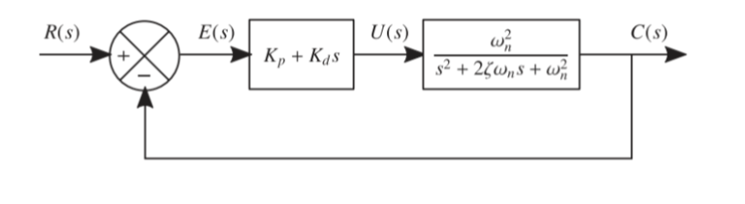
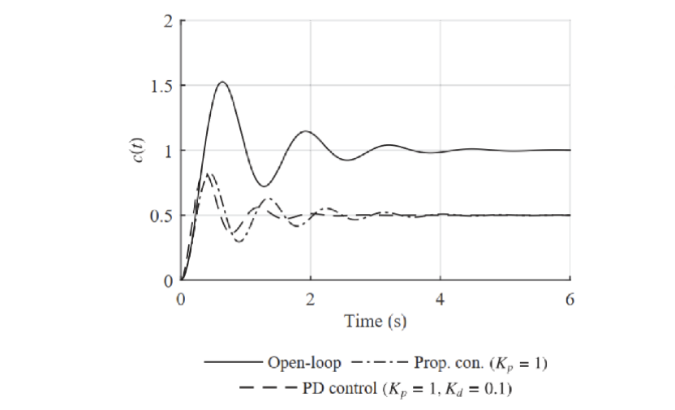
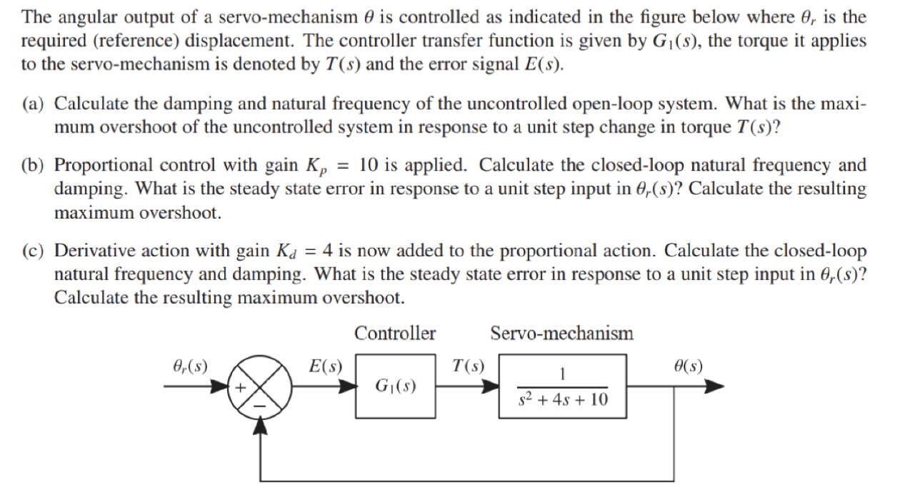

> Title: **Characteristics and Performance of Feedback Control Systems - II**
>
> Lecture @ 2026-4-14

## 闭环控制

### PD

> 上接 [Lec.5](./lec5.md#pd)

类似的，把 PD 反馈接入之前提到的二阶系统，则有

最终得到的输出如下

这里有

$$
s^2 + 2 \zeta_{cl} \omega_{n,cl}^2 = 0
$$

传递函数是

$$
c(t) = \frac{K_p}{K_p + 1}\left[
    1 - \exp{-\zeta_{cl} \omega_{n,cl} t} \left(
      \cos\omega_{d,cl} t + \frac{
        K_p\zeta_{cl} - K_d \omega_{n,cl}
      }{
        K_p \sqrt{1-\zeta_{cl}^2}
      }\sin \omega_{d,cl} t
    \right)
  \right]
$$

其中有

$$
\begin{aligned}
  \omega_{n,cl} &= \omega_n \sqrt{K_p + 1} \\
  \zeta_{cl} &= \frac{\zeta + \frac{1}{2}K_d \omega_n}{\sqrt{K_p + 1}}
\end{aligned}
$$

 做不完的题 

 大概是答案 

### I

> [!NOTE]
>
> WORK IN PROGRESS

### PI

### PID
