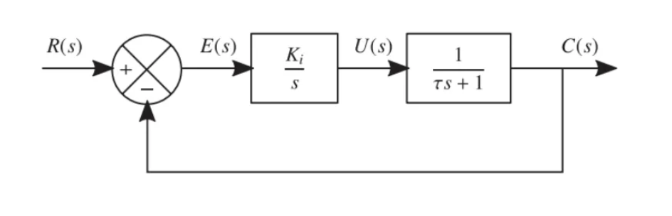
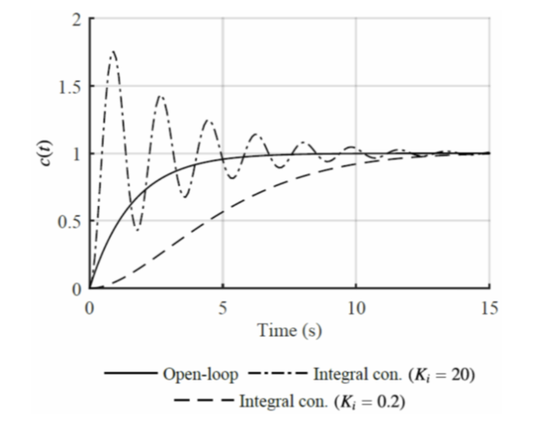
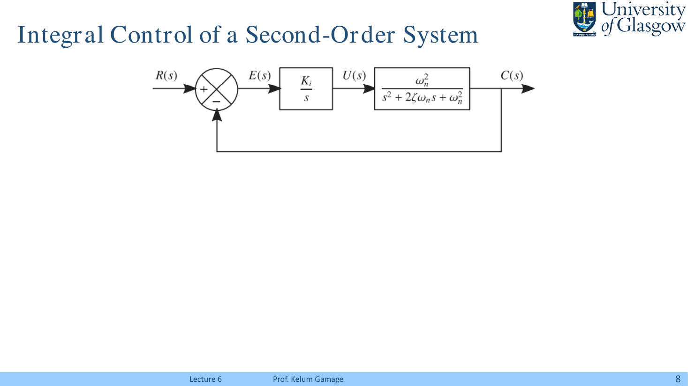
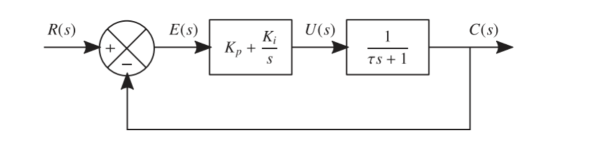
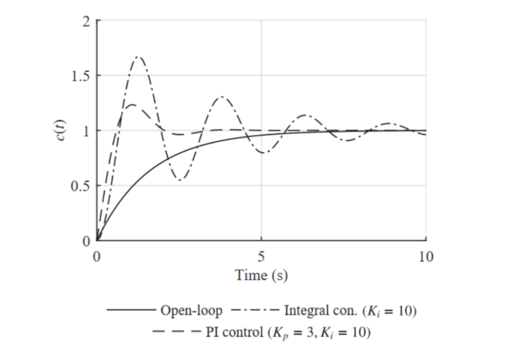
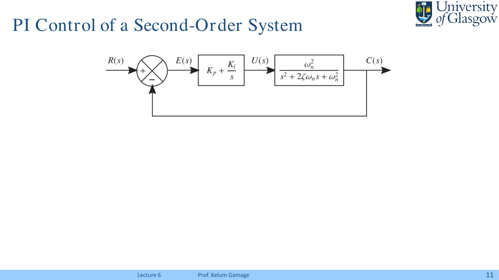
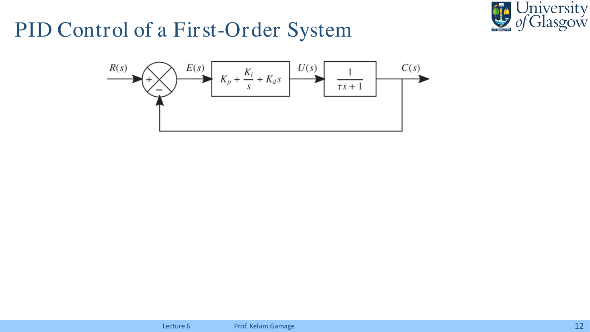
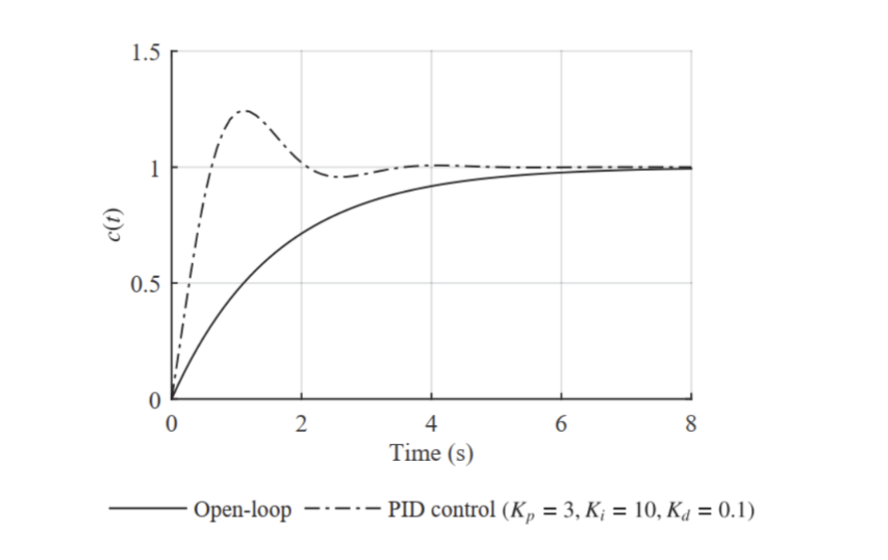
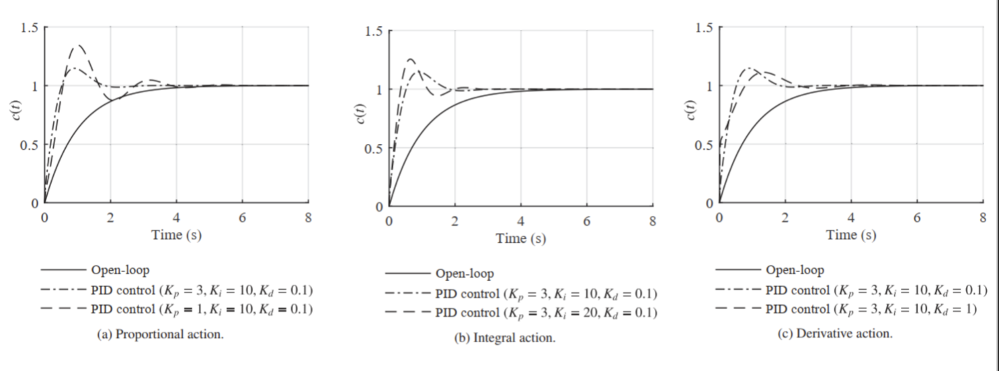
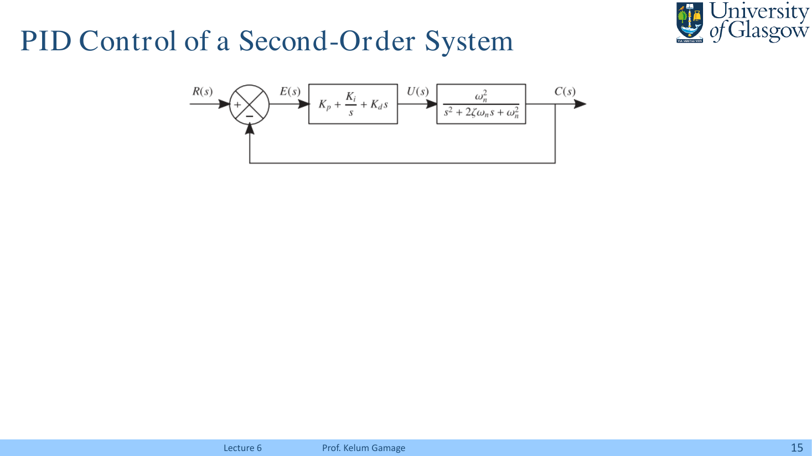

> **_Characteristics and Performance of Feedback Control Systems - II_**
>
> Lecture @ 2026-4-14

## 闭环控制

### PD

> 上接 [Lec.5](./lec5.md#pd)

类似的，把 PD 反馈接入之前提到的二阶系统，则有

最终得到的输出如下

这里有

$$
s^2 + 2 \zeta_{cl} \omega_{n,cl}s + \omega_{n,cl}^2 = 0
$$

单位阶跃响应为

$$
c(t) = \frac{K_p}{K_p + 1}\left[
    1 - \exp{-\zeta_{cl} \omega_{n,cl} t} \left(
      \cos\omega_{d,cl} t + \frac{
        K_p\zeta_{cl} - K_d \omega_{n,cl}
      }{
        K_p \sqrt{1-\zeta_{cl}^2}
      }\sin \omega_{d,cl} t
    \right)
  \right]
$$

其中有

$$
\begin{aligned}
  \omega_{n,cl} &= \omega_n \sqrt{K_p + 1} \\
  \zeta_{cl} &= \frac{\zeta + \frac{1}{2}K_d \omega_n}{\sqrt{K_p + 1}}
\end{aligned}
$$

做不完的题：PD 参数如何影响二阶响应

### I

积分控制 (Integral Control) 的核心是把误差累积起来：

$$
u(t) = K_i \int e(t)dt
$$

在拉普拉斯域中，控制器就是 $K_i/s$。这意味着只要系统长期存在非零误差，积分项就会一直累加，直到控制量把误差压下去。

> 也就是说，积分控制的精神状态是：你可以一时有误差，但你不能一直有误差。

对于一个一阶系统，接入积分控制后的结构如下：

原本被控对象是

$$
G(s) = \frac{1}{\tau s + 1}
$$

控制器是 $K_i/s$，所以开环传递函数为

$$
G_{ol}(s) = \frac{K_i}{s(\tau s + 1)}
$$

单位负反馈下，闭环传递函数为

$$
\frac{C(s)}{R(s)} = \frac{K_i}{\tau s^2 + s + K_i}
$$

把分母整理成标准二阶形式，有

$$
s^2 + 2\zeta_{cl}\omega_{n,cl}s + \omega_{n,cl}^2 = 0
$$

其中

$$
\begin{aligned}
  \omega_{n,cl} &= \sqrt{\frac{K_i}{\tau}} \\
  \zeta_{cl} &= \frac{1}{2\sqrt{\tau K_i}}
\end{aligned}
$$

$K_i$ 增大时，自然频率提高，响应变快；但阻尼比下降，系统更容易振荡和超调。

从图里也能看出来，$K_i=20$ 的情况快是快了，但是也更能蹦。

---

对于二阶系统，接入积分控制后则变成：

如果原系统是

$$
G(s)=\frac{\omega_n^2}{s^2 + 2\zeta\omega_n s + \omega_n^2}
$$

则接入积分控制后的闭环传递函数为

$$
\frac{C(s)}{R(s)} = \frac{K_i\omega_n^2}{s^3 + 2\zeta\omega_n s^2 + \omega_n^2s + K_i\omega_n^2}
$$

是的，一阶系统接个积分变二阶，二阶系统接个积分就变三阶。它能消除稳态误差，但稳定性分析也会跟着变麻烦。

总结一下积分控制：能消除阶跃输入下的稳态误差，但会提高系统阶数；$K_i$ 太大会把阻尼压下去，响应跟着振荡加剧。对稳定性的影响不能只看直觉，最后还是得回到特征方程或者劳斯判据。

### PI

比例积分控制 (PI Control) 则是在积分控制的基础上加入比例项：

$$
u(t) = K_p e(t) + K_i \int e(t)dt
$$

在拉普拉斯域中，控制器为

$$
G_c(s)=K_p + \frac{K_i}{s}=\frac{K_ps+K_i}{s}
$$

对于一阶系统，结构如下：

闭环传递函数为

$$
\frac{C(s)}{R(s)} = \frac{K_ps + K_i}{\tau s^2 + (K_p+1)s + K_i}
$$

其特征方程仍然可以写成二阶标准形式：

$$
s^2 + 2\zeta_{cl}\omega_{n,cl}s + \omega_{n,cl}^2 = 0
$$

其中

$$
\begin{aligned}
  \omega_{n,cl} &= \sqrt{\frac{K_i}{\tau}} \\
  \zeta_{cl} &= \frac{K_p + 1}{2\sqrt{\tau K_i}}
\end{aligned}
$$

这里的分工就很清楚了：$K_i$ 主要影响自然频率，$K_p$ 主要提高阻尼。

和单纯积分控制相比，PI 控制通常可以在保持零稳态误差的同时，让振荡没那么离谱。

---

对于二阶系统，结构如下：

闭环传递函数会变成三阶：

$$
\frac{C(s)}{R(s)} = \frac{(K_ps + K_i)\omega_n^2}{s^3 + 2\zeta\omega_n s^2 + (K_p+1)\omega_n^2s + K_i\omega_n^2}
$$

PI 能消除稳态误差，代价是系统阶数高了一级，稳定性得重算。

### PID

最后，把比例、积分、微分三个部分都打包在一起，就是比例积分微分控制 (PID Control)：

$$
u(t)=K_pe(t)+K_i\int e(t)dt+K_d\frac{de(t)}{dt}
$$

拉普拉斯域下的控制器为

$$
G_c(s)=K_p+\frac{K_i}{s}+K_ds=\frac{K_ds^2+K_ps+K_i}{s}
$$

对于一阶系统，有

闭环传递函数为

$$
\frac{C(s)}{R(s)} = \frac{K_ds^2 + K_ps + K_i}{(\tau + K_d)s^2 + (K_p+1)s + K_i}
$$

对应的二阶参数为

$$
\begin{aligned}
  \omega_{n,cl} &= \sqrt{\frac{K_i}{\tau + K_d}} \\
  \zeta_{cl} &= \frac{K_p + 1}{2\sqrt{K_i(\tau + K_d)}}
\end{aligned}
$$

这时三个参数的效果可以粗略理解为：

- $K_p$：提高比例作用，影响响应速度和阻尼
- $K_i$：消除稳态误差，但太大容易振荡
- $K_d$：增加预测/阻尼效果，让响应更稳，但也更容易放大噪声

> 典中典之 PID 调参噩梦

PPT 给了不同参数组合下的响应对比：

从图上大致可以看到，合理的 $K_d$ 可以把响应压稳，参数组合不当时超调、振荡、响应速度都会明显恶化。

---

对于二阶系统，PID 控制结构如下：

闭环传递函数可以写成

$$
\frac{C(s)}{R(s)} = \frac{(K_ds^2 + K_ps + K_i)\omega_n^2}{s^3 + (2\zeta\omega_n + K_d\omega_n^2)s^2 + (K_p+1)\omega_n^2s + K_i\omega_n^2}
$$

PID 接入二阶系统同样产生三阶特征方程。它是工程上非常常用的控制器，但不是“套上就好”的万能药，最终仍要回到闭环极点、稳定裕度和实际响应上判断。

> 到此，时域响应和基本控制动作就差不多了。后面全是频域的活了。
