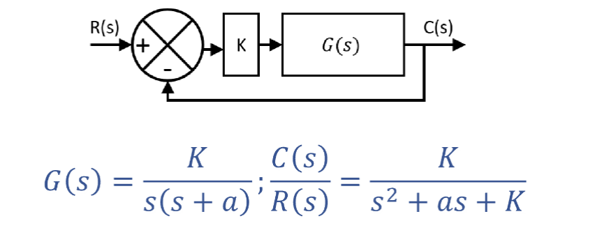
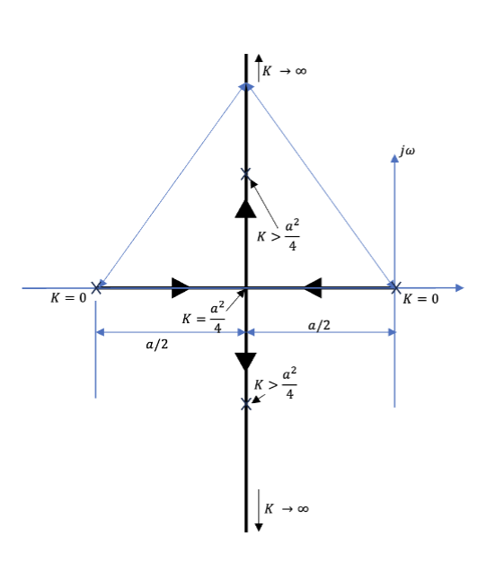
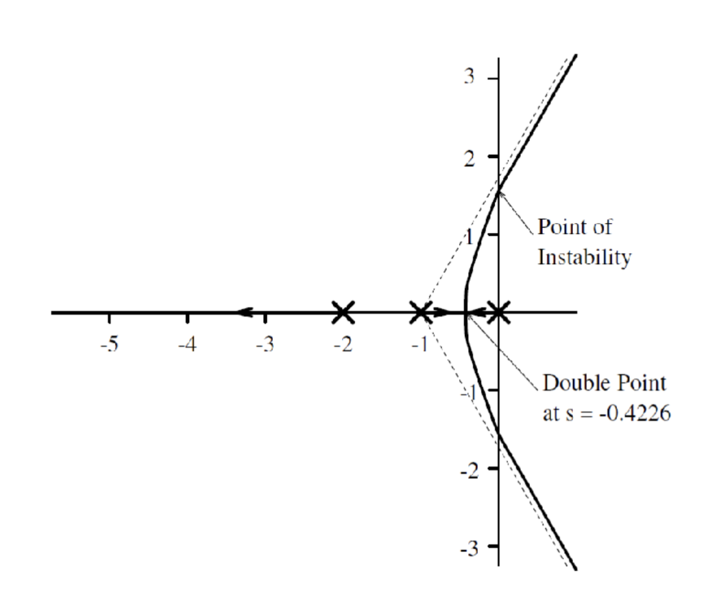
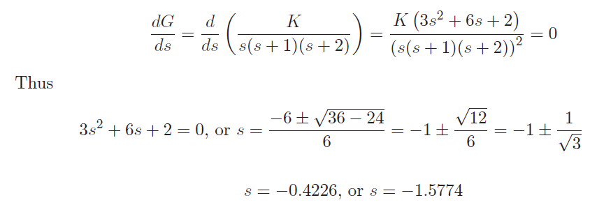
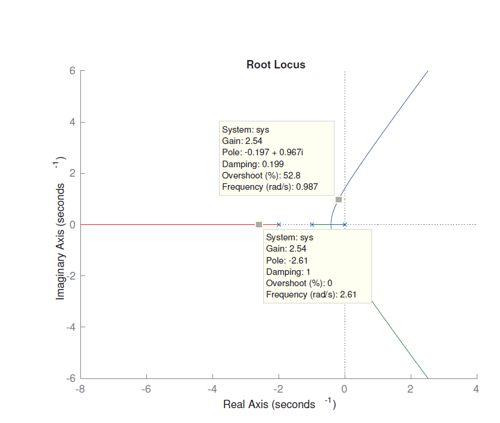
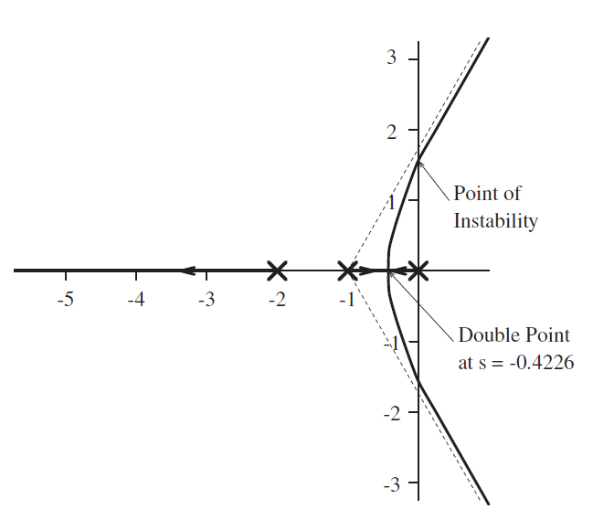

> **_Root Locus Analysis - I_**


## 稳定性 (Stability)

稳定性在系统里主要指的是 BIBO 稳定性 (Bounded-Input Bounded-Output Stability)，也就是系统的输入和输出都是有界的。对于线性系统来说，系统的稳定性可以通过系统的极点来判断，如果系统的极点都在左半平面，那么系统是稳定的；如果有极点在右半平面或者在虚轴上，那么系统是不稳定的。这一点在[之前](../part.1/lec4.md#系统稳定性)提到过。

稳定性的重要性在于：

- 性能保证： 稳定的系统能够可靠一致地实现期望的控制目标
- 稳健性：稳定性通常是稳健性的前提，前者指的是系统在面对不确定性、变化或者扰动的时候维持性能的能力。
- 安全性：稳定性确保系统在安全范围内运行，避免不受控的行为。
- 可预测性：稳定系统的行为更可预测，便于分析、设计、预测其对不同输入和条件的响应
- 易于实现：稳定系统更易于设计、实现和调整。

其中，稳定性分为绝对稳定性和相对稳定性。绝对稳定性可以通过[劳斯稳定判据 (Routh-Hurwitz Criterion)](../part.1/lec4.md#劳斯稳定判据-rouths-stability-criterion)来判断，指的是系统是否稳定。相对稳定性指的是系统的峰值超调、调节时间等参数，需要通过根轨迹分析来判断。

## 根轨迹分析 (Root Locus Analysis)

根轨迹分析对于判断系统的相对稳定性十分重要，包括

- 系统稳定性分析： 确定反馈控制系统的稳定性以及系统变化如何影响稳定性
- 设计参数选择：阻尼比等设计参数如何影响系统的闭环行为
- 极点配置： 用于获取控制器的参数值以调整极点位置
- 理解系统行为： 根据极点变化提供系统响应的直观理解
- 系统优化： 提供系统性能和稳定性之间的权衡分析

---

具体的做法从这个简单的例子开始：



在开环情况下，这个系统的极点是 $s(s+a)=0$ 的解，也就是 $s=0$ 和 $s=-a$。引入一个负反馈后，整个系统的闭环响应的极点是 $s^2+as+K=0$ 的解，也就是 $\frac{-a \pm \sqrt{a^2 - 4K}}{2}$。

当 $a >0$ 和 $K>0$ 时，所有的极点都在左半平面，所以系统是稳定的，

$K$ 和 $a$ 的相对大小则进一步决定了系统性质。
$K < \frac{a^2}{4}$ 时，系统是过阻尼的；$K = \frac{a^2}{4}$ 时，系统是临界阻尼的；$K > \frac{a^2}{4}$ 时，系统是欠阻尼的。

画成图的话长下面这样



---

根据上面的例子，系统的响应取决于描述该系统的传递函数的闭环极点位置。开环极点的位置我们认定保持不变，系统增益改变时，闭环极点的位置会发生变化。



根轨迹图 (Root-locus diagram) 是一种系统的闭环极点随着参数 (主要是前向路径增益 (forward-path gain)) 变化而变化的图示，从 0 到 $\infty$。

对于一个简单的闭环系统，假设开环增益是 $G(s)$ ，则闭环增益为

$$
\frac{C(s)}{R(s)} = \frac{K G(s)}{1+KG(s)} = \frac{KB(s)}{A(s) + KB(s)}
$$

进而可以证明：

1. 闭环和开环的零点相同
2. 特征方程 ($F(s)  = 0$) 定义了闭环极点的位置

如果 $G(s)=B(s)/A(s)$，那么

$$
1+KG(s)=0 \Leftrightarrow A(s)+KB(s)=0
$$

因此可以把闭环特征多项式写成

$$
F(s)=A(s)+KB(s)
$$

它的阶数和 $A(s)$ 的阶数相同，都是 $n$。当 $n\ge m$ 时，存在 $n$ 个闭环极点。

$F(s) = 0$ 方程等效于 $G(s) = -\frac{1}{K}$，而我们把 $\left| G(s) \right| = \frac{1}{K}$ 叫做校准方程 (calibration equation)。

## 根轨迹构造 (Root Locus Construction)

根轨迹的核心问题是：当 $K$ 从 $0$ 增加到 $\infty$ 时，闭环极点会沿着哪里移动？

对于单位负反馈系统，特征方程是

$$
1 + K G(s) = 0
$$

因此根轨迹上的点必须满足

$$
K G(s) = -1
$$

也就是同时满足两个条件：

$$
\begin{aligned}
  \angle G(s) &= (2q+1)180^\circ \\
  |G(s)| &= \frac{1}{K}
\end{aligned}
$$

第一个叫 **角度条件** (Angle Criterion)，用来判断一个点在不在根轨迹上；第二个叫 **幅值条件** 或者校准方程，用来算这个点对应的 $K$。

> 说人话：先用角度条件找“这条路能不能走”，再用幅值条件算“走到这里的时候油门踩了多少”。

课上用一个标准负反馈框图来说明这些规则。图本身不重要，重要的是把闭环特征方程写出来。

### 实轴上的根轨迹

根轨迹在实轴上的判断规则是：在实轴上取一点，如果它右侧的开环极点和零点总数是奇数，那么该点就在根轨迹上。

这个规则来自角度条件。实轴右侧的每个极点/零点都会给这个点贡献 $180^\circ$ 或 $0^\circ$ 的角度，所以最后只需要数奇偶性。

### 起点和终点

根轨迹的分支数量等于开环极点的数量 $n$。

当 $K=0$ 时，闭环特征方程退化成开环分母，所以根轨迹从开环极点出发。

当 $K \to \infty$ 时，分支会走向开环零点。如果极点数量 $n$ 大于零点数量 $m$，那么多出来的 $n-m$ 条分支会走向无穷远。

也就是：

- 根轨迹从开环极点开始
- 根轨迹在开环零点结束
- 如果零点不够，剩下的分支去无穷远

### 渐近线

当 $n > m$ 时，有 $n-m$ 条分支趋于无穷远，这些分支会沿着渐近线 (Asymptote) 走。

渐近线的角度为

$$
\theta_q = \frac{(2q+1)180^\circ}{n-m}, \quad q=0,1,\ldots,n-m-1
$$

渐近线的交点，也就是重心 (Centroid)，为

$$
\sigma_a = \frac{\sum p_i - \sum z_i}{n-m}
$$

其中 $p_i$ 是开环极点，$z_i$ 是开环零点。

### 分离点 (Breakaway Point)

当两条或多条根轨迹分支在实轴上相遇后离开实轴，这个点就叫分离点。

一种常用做法是先由特征方程整理出 $K$ 关于 $s$ 的表达式，然后求

$$
\frac{dK}{ds}=0
$$

满足这个方程的候选点再代回根轨迹规则检查。



## MATLAB 绘制

手画根轨迹的意义是理解结构，但真到工程里一般不会硬画，MATLAB 里直接：

```matlab
num = [...];
den = [...];
sys = tf(num, den);
rlocus(sys);
```

比如 PPT 中的例子就给出了这样的结果：



## 例题

<details>
<summary>三极点系统的根轨迹</summary>

考虑开环传递函数

$$
G(s)=\frac{K}{s(s+1)(s+2)}
$$

它有三个开环极点：$0$、$-1$、$-2$，没有开环零点。所以根轨迹有三条分支，并且三条分支最后都会趋向无穷远。

渐近线角度为

$$
\theta_q = \frac{(2q+1)180^\circ}{3}=60^\circ,180^\circ,300^\circ
$$

重心为

$$
\sigma_a = \frac{0-1-2}{3} = -1
$$

根据实轴规则，$(-\infty,-2)$ 和 $(-1,0)$ 在根轨迹上。



对于分离点，由

$$
1+\frac{K}{s(s+1)(s+2)}=0
$$

可得

$$
K=-s(s+1)(s+2)
$$

因此

$$
\frac{dK}{ds}=-(3s^2+6s+2)=0
$$

解得

$$
s=-1\pm\frac{1}{\sqrt{3}}
$$

其中 $s=-0.4226$ 在 $(-1,0)$ 上，是有效的分离点；另一个 $s=-1.5774$ 不在对应根轨迹段上。


根轨迹图最后大概长这样：


</details>

## 小结

根轨迹分析可以把“调增益 $K$ 会发生什么”这件事画出来。构造时优先记住几件事：

- 分支从开环极点出发，到开环零点结束
- 分支数量等于开环极点数
- 实轴上根轨迹靠右侧极点/零点数量的奇偶性判断
- 多出来的分支沿渐近线去无穷远
- 分离点可以通过 $dK/ds=0$ 找候选点
- 最后仍然要结合闭环极点位置判断稳定性和响应品质
