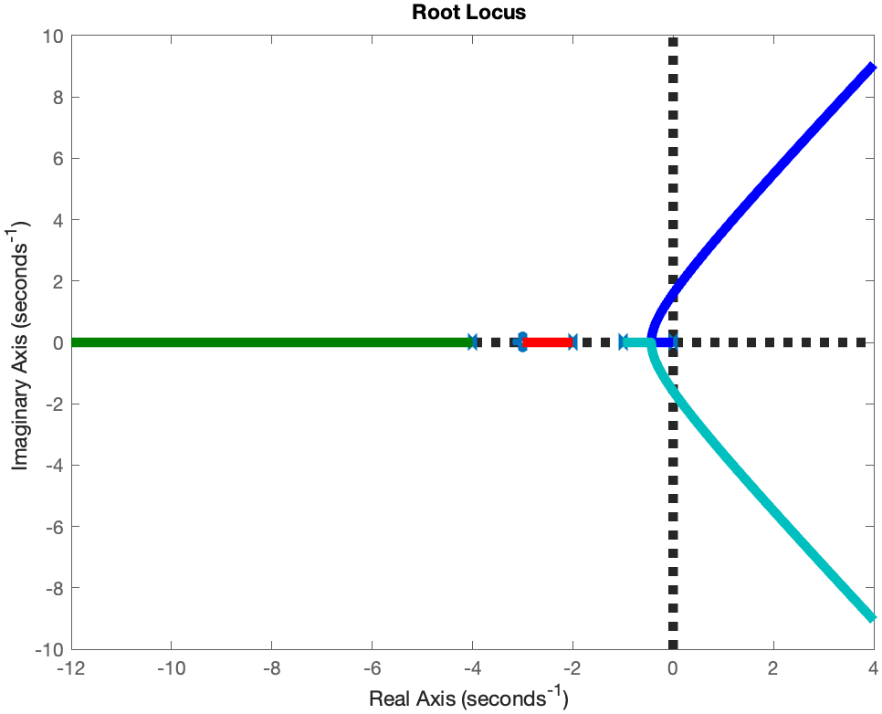
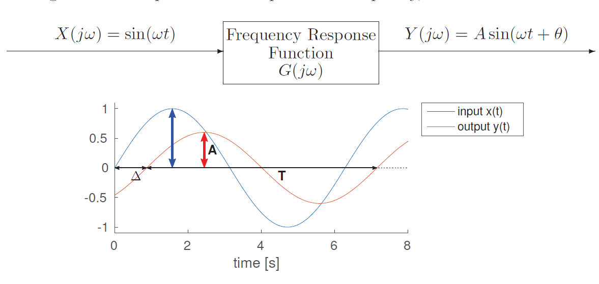
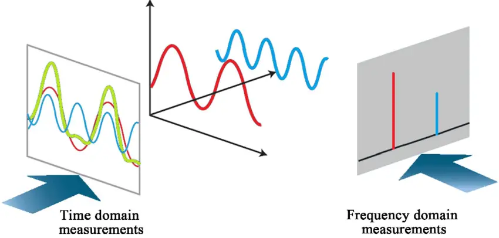
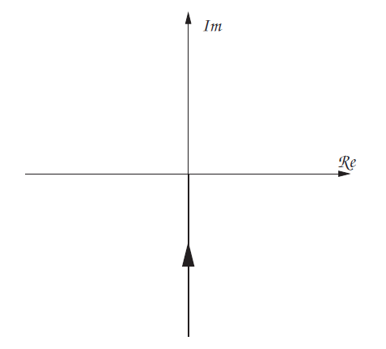
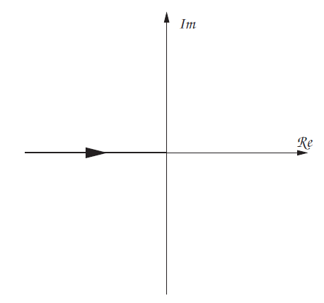
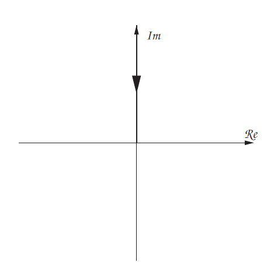
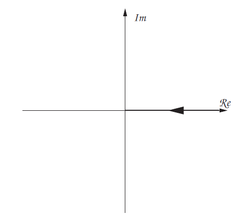
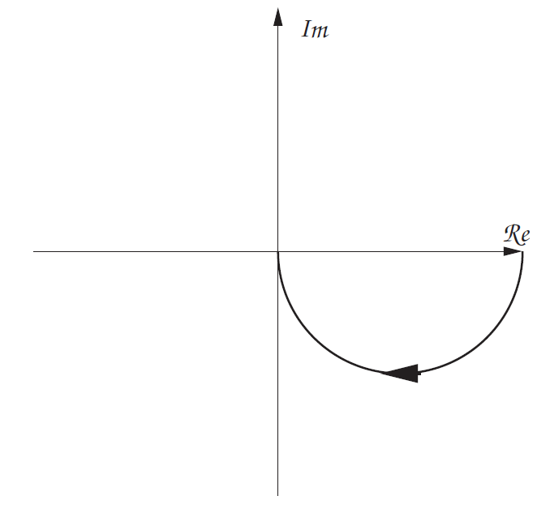
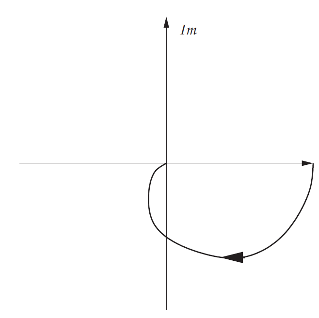
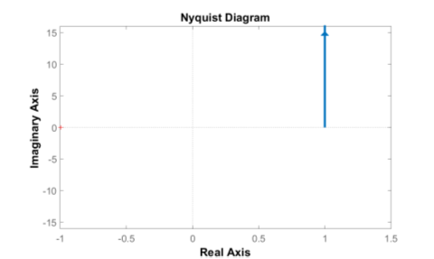

> **_Root Locus Analysis - II & Nyquist Plot_**


## 根轨迹分析 (续)

开头接着 [Lec.1](./lec1.md) 的根轨迹，课上来了个随堂练习。



如果一个系统有 $n$ 个开环极点和 $m$ 个开环零点，那么根轨迹有 $n$ 条分支，其中 $m$ 条终止于零点，剩下的 $n-m$ 条会走向无穷远。

对于例子中的情况：

$$
n_{poles}=4, \quad n_{zeros}=1
$$

所以

$$
n_{asymptote}=n_p-n_z=3
$$

对应的三条渐近线方向为

$$
180^\circ, \quad 60^\circ, \quad -60^\circ
$$

根轨迹的手算流程还是那几个：

1. 画出开环极点和零点
2. 判断实轴上哪些区间属于根轨迹
3. 计算渐近线数量、角度和交点
4. 判断有没有分离点
5. 必要时用角度条件和幅值条件算特殊点

> 到这里其实已经很像画玄学符了，但是每一笔都能从特征方程里推回来。

<details>
<summary>随堂例题：四极点一零点系统的根轨迹</summary>

课上练习的系统可以写成

$$
G(s)=\frac{s+3}{s(s+1)(s+2)(s+4)}
$$

因此有四个极点和一个零点：

$$
n_p=4, \quad n_z=1
$$

三条渐近线的交点为

$$
\sigma_a=\frac{\sum p_i-\sum z_i}{n_p-n_z}=\frac{(0-1-2-4)-(-3)}{3}=-\frac{4}{3}
$$

渐近线方向为

$$
180^\circ,\quad 60^\circ,\quad -60^\circ
$$

分离点可以通过 $dK/ds=0$ 求候选点。PPT 中化简后的方程为

$$
3s^4+26s^3+77s^2+84s+24=0
$$

有效分离点约为

$$
s=-0.43
$$

最终根轨迹大概如下：


</details>

## 频率响应 (Frequency Response)

频率响应 (Frequency Response) 指的是系统对正弦输入的稳态响应。对于线性时不变系统 (LTI System)，输入一个正弦信号，输出仍然是同频率的正弦信号，只是幅值和相位发生变化。

也就是输入

$$
x(t)=A\sin(\omega t)
$$

输出可以写成

$$
y(t)=A|G(j\omega)|\sin(\omega t+\phi)
$$

其中 $|G(j\omega)|$ 是幅值增益，$\phi=\angle G(j\omega)$ 是相位变化。



频率响应分析的意义在于：它可以给出系统对不同频率输入的表现，与稳定性、鲁棒性、带宽都直接相关。

时间域和频率域看的东西不同：

- 时间域关注单位阶跃响应、超调、调节时间、稳态误差
- 频率域关注增益、相位、带宽、增益裕度和相位裕度

课堂图里接着用标准二阶系统说明频率响应。闭环传递函数写成：

$$
\frac{C(s)}{R(s)}=\frac{\omega_n^2}{s^2+2\zeta\omega_n s+\omega_n^2}
$$

其中 $\zeta$ 是阻尼比 (damping factor)，$\omega_n$ 是无阻尼自然频率 (undamped natural frequency)。图里还给了时间域和频域下的开环传递函数对应关系：

$$
G_t(s)=\frac{K_v}{s(\tau s+1)},\qquad
G_f(s)=\frac{\omega_n^2}{s^2+2\zeta\omega_n s},\qquad
G_t(s)\equiv G_f(s)
$$

令 $s=j\omega$，二阶系统的频率响应为：

$$
\frac{C(j\omega)}{R(j\omega)}=T(j\omega)
=\frac{\omega_n^2}{(j\omega)^2+2\zeta\omega_n(j\omega)+\omega_n^2}
=\frac{1}{1-u^2+j2\zeta u}
$$

这里

$$
u=\frac{\omega}{\omega_n}
$$

是归一化输入频率 (normalised driving signal frequency)。因此幅值和相位可以写成：

$$
|T(j\omega)|=M=\frac{1}{\sqrt{(1-u^2)^2+(2\zeta u)^2}}
$$

$$
\angle T(j\omega)=\phi=-\tan^{-1}\left(\frac{2\zeta u}{1-u^2}\right)
$$

这里 $M$ 表示幅值 (magnitude)，$\phi$ 表示相位 (phase)。

对于二阶系统，频域里还会出现 **共振峰** (Resonant Peak) 和 **共振频率** (Resonant Frequency)。当阻尼比较小时，系统会在某个频率附近把输入放大得更明显。

最大幅值就是共振峰，它出现在共振频率 $\omega=\omega_r$ 处，可以由幅值对 $u$ 求导得到：

$$
\left.\frac{dM}{du}\right|_{u=u_r}=0
$$

对应方程为：

$$
4u_r^3-4u_r+8\zeta^2u_r=0
$$

所以

$$
u_r=\sqrt{1-2\zeta^2},\qquad
\omega_r=\omega_n\sqrt{1-2\zeta^2}
$$

共振峰为：

$$
M_r=\frac{1}{2\zeta\sqrt{1-\zeta^2}}
$$

共振频率处的相位为：

$$
\phi_r=-\tan^{-1}\left(\frac{\sqrt{1-2\zeta^2}}{\zeta}\right)
$$

注意这里的 $u_r$ 和 $\omega_r$ 要是实数，需要 $1-2\zeta^2>0$，也就是 $\zeta<1/\sqrt{2}$。阻尼越小，$M_r$ 越大，共振峰越明显。

这也是为什么频域分析能看稳定性：如果某个频率附近系统增益很大、相位又接近危险区域，反馈一接上就可能开始发癫。

### 频域中的几个概念

频域里后面会反复出现两个概念：

- **增益裕度 (Gain Margin)**：系统增益还可以增加多少，才会到达不稳定边界
- **相位裕度 (Phase Margin)**：系统还可以额外增加多少相位滞后，才会到达不稳定边界



这两个裕度会在后面的 Bode 图和 Nyquist 判据里反复出现。现在先记住一句话：稳定裕度是在问系统离 $-1+j0$ 这个危险点还有多远。

## 奈奎斯特图 (Nyquist Plot)

奈奎斯特图 (Nyquist Plot)，也叫极坐标轨迹 (Polar Locus)，画的是频率响应 $G(j\omega)$ 在复平面上的轨迹。

当 $\omega$ 从 $0$ 增加到 $\infty$ 时，每个频率都会对应一个复数：

$$
G(j\omega)=|G(j\omega)|\angle \phi(\omega)
$$

把这些点连起来，就得到了 Nyquist 图。

### 怎么手画

手画极坐标轨迹时，PPT 给的步骤大致是：

1. 判断 $\omega \to 0$ 时的幅值和相位
2. 判断 $\omega \to \infty$ 时的幅值和相位
3. 找 lead / lag 项的 corner frequency
4. 在关键频率处计算幅值和相位
5. 特别关注轨迹是否穿过负实轴，以及离 $-1+j0$ 有多远

> 这东西如果完全手画会很抽象，所以 PPT 后面直接给了一堆基本模块的图。

### 基本环节的 Nyquist 图

单积分环节

$$
G(s)=\frac{1}{s}
$$

代入 $s=j\omega$ 后得到

$$
G(j\omega)=\frac{1}{j\omega}=-\frac{j}{\omega}
$$

所以轨迹在负虚轴上，从无穷远向原点靠近。



双积分环节：

$$
G(s)=\frac{1}{s^2}\Rightarrow G(j\omega)=-\frac{1}{\omega^2}
$$

轨迹在负实轴上。



三积分和四积分则会继续每多一个积分项就多 $-90^\circ$ 相位：





### Lag 与 Lead 环节

一阶滞后环节 (Single Lag) 通常形如

$$
G(s)=\frac{1}{1+Ts}
$$

它的 Nyquist 轨迹会从实轴上的 $1$ 出发，逐渐向原点靠近，并向下绕出一个弧线。



两个 lag 串联时，轨迹会更弯，相位滞后也更大。



一阶超前环节 (Single Lead) 则会提供正相位，轨迹方向与 lag 的直觉相反：



### MATLAB 绘图

和根轨迹一样，Nyquist 图手画主要是为了理解。真要画图，MATLAB 里通常直接：

```matlab
sys = tf(num, den);
nyquist(sys);
```

> 根轨迹告一段落，频域开始。频率响应 $G(j\omega)$ 的幅值给增益、相位给相移；Nyquist 图是这条轨迹在复平面上的样子。后面稳定性全围着 $-1+j0$ 转。
