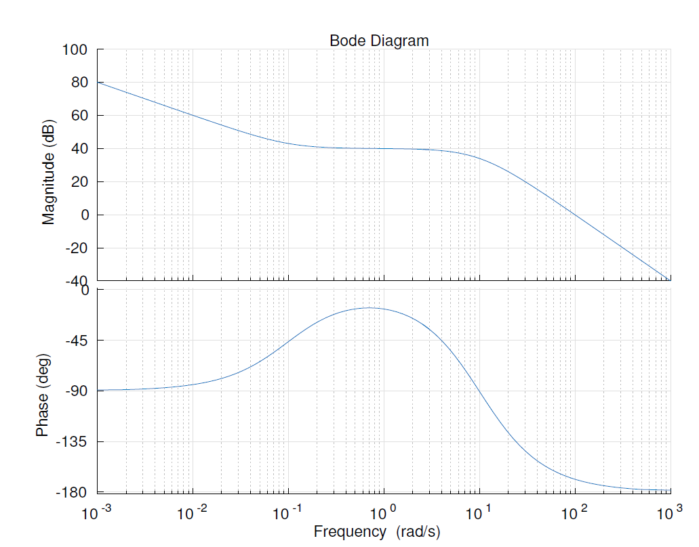
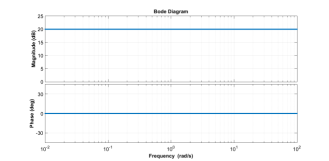
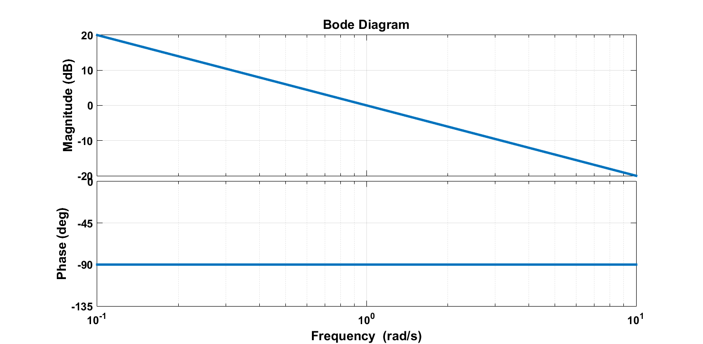
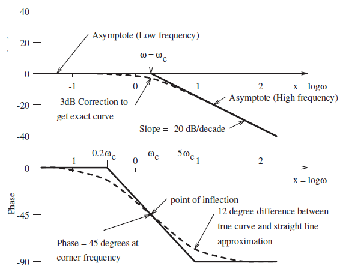
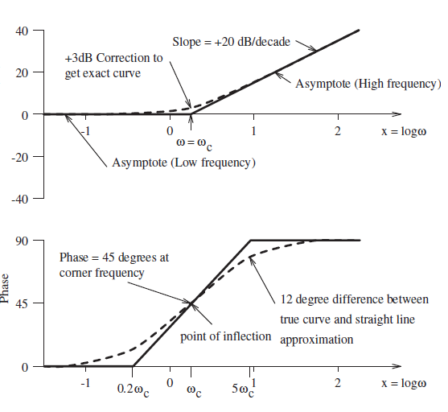
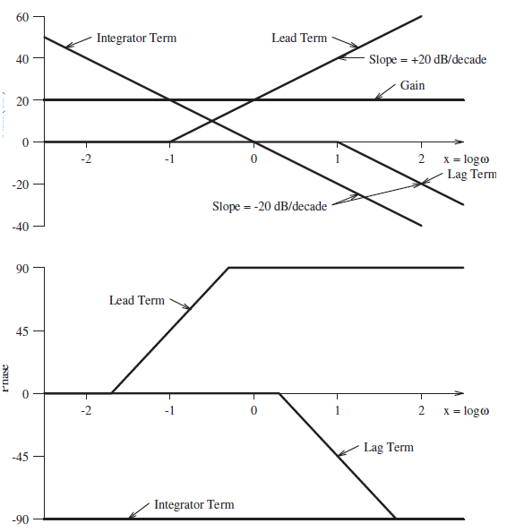
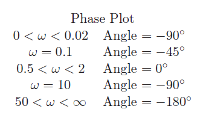
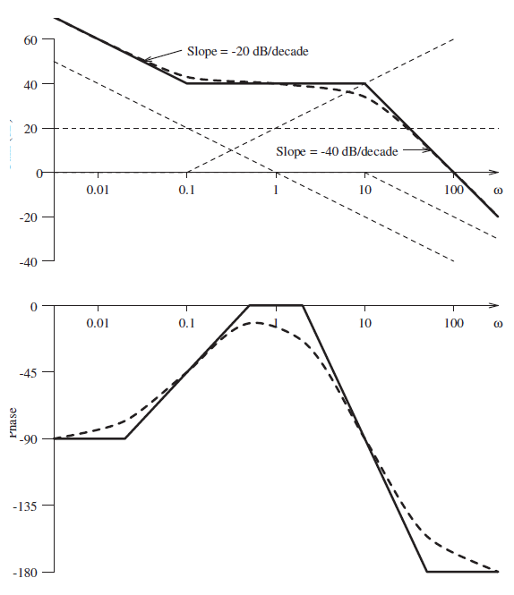
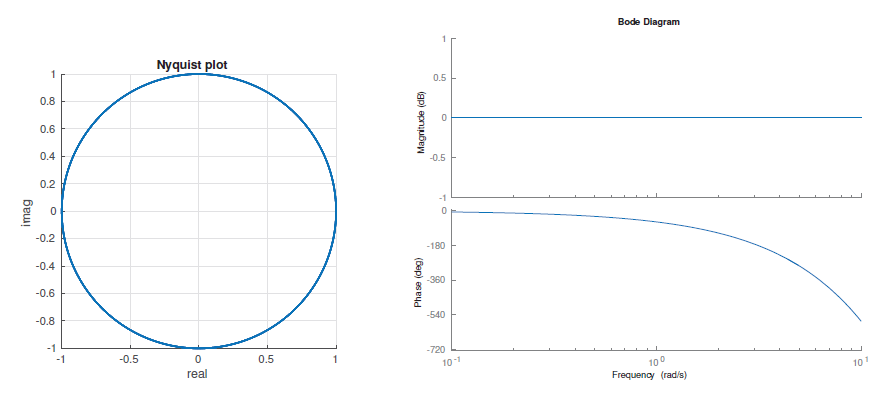

> **_Bode Plots - I_**

## 从 Nyquist 到 Bode

上一讲的 Nyquist 图把 $G(j\omega)$ 直接画在复平面上。它当然很强，但是对于复杂系统来说，手画会比较折磨。

Bode 图 (Bode Plot / Bode Diagram) 则换了一种表达方式：不用一张复平面图，而是拆成两张图：

- 幅值图 (Magnitude Plot)
- 相位图 (Phase Plot)

横轴都是频率 $\omega$，并且通常使用对数坐标。纵轴分别是增益的 dB 值和相位角。

复习例题：从 Nyquist 图过渡过来

这一讲开头还先复习了两个 Nyquist 图例子。第一个是

$$
H(s)=\frac{10}{s(s+2)}
$$

代入 $s=j\omega$ 后，分母为

$$
j\omega(j\omega+2)=-\omega^2+j2\omega
$$

所以可以把 $H(j\omega)$ 写成实部和虚部，再画极坐标轨迹。

第二个是

$$
H(s)=\frac{1}{(s-3)(s-4)}
$$

这个例子故意把极点放在右半平面，用来提醒：画频率响应之前，先看开环极点在哪里，不然 Nyquist 判据里的 $P$ 会直接算错。

> 也就是：图可以画得很漂亮，但极点数数错了还是白搭。

也就是说，对于

$$
G(j\omega)=|G(j\omega)|\angle \phi
$$

Bode 图画的是

$$
20\log_{10}|G(j\omega)|
$$

和

$$
\angle G(j\omega)
$$

---

为什么要这么画？因为复杂传递函数通常是一堆因子的乘积，而对数可以把乘法变成加法。

$$
20\log_{10}|G_1G_2| = 20\log_{10}|G_1| + 20\log_{10}|G_2|
$$

相位也可以直接相加：

$$
\angle(G_1G_2)=\angle G_1 + \angle G_2
$$

所以 Bode 图的画法本质上就是：拆因子，分别画，再叠加。

## 时间常数形式 (Time Constant Form)

为了方便画 Bode 图，传递函数通常先写成 **时间常数形式** (Time Constant Form)。常见因子包括：

- 常数增益 $K$
- 积分项 $1/s$
- 一阶超前项 $1+s/\omega_c$
- 一阶滞后项 $1/(1+s/\omega_c)$
- 二阶共轭项

比如

$$
G(s)=\frac{10(1+10s)}{s(1+s/10)^2}
$$

可以直接看成：

- 一个增益 $10$
- 一个积分项 $1/s$
- 一个 lead 项 $1+10s$，corner frequency 为 $0.1$
- 两个 lag 项 $1/(1+s/10)$，corner frequency 为 $10$

这种拆法后面会非常省事。

## Bode 图基本组件

### 常数增益

对于常数增益 $K$，幅值是常数：

$$
20\log_{10}K
$$

相位为 $0^\circ$。例如 $K=10$ 时，幅值为 $20\text{ dB}$。

### 积分项

对于积分项

$$
G(s)=\frac{1}{s}
$$

有

$$
G(j\omega)=\frac{1}{j\omega}
$$

幅值为 $1/\omega$，所以幅值图斜率为 $-20\text{ dB/dec}$；相位恒为 $-90^\circ$。

### 一阶滞后项

一阶滞后项形如

$$
G(s)=\frac{1}{1+s/\omega_c}
$$

当 $\omega\ll\omega_c$ 时，幅值约为 $0\text{ dB}$，相位约为 $0^\circ$。

当 $\omega\gg\omega_c$ 时，幅值斜率为 $-20\text{ dB/dec}$，相位趋向 $-90^\circ$。

在转折频率 $\omega_c$ 处，相位约为 $-45^\circ$。

### 一阶超前项

一阶超前项形如

$$
G(s)=1+\frac{s}{\omega_c}
$$

其幅值在 $\omega_c$ 之后以 $+20\text{ dB/dec}$ 上升，相位从 $0^\circ$ 增加到 $+90^\circ$。

### 组件叠加

因为 Bode 幅值使用 dB，相位也可以直接相加，所以复杂系统可以把每个组件画出来以后叠加。

> 这也是为什么 Bode 图比 Nyquist 图更适合手画：它把复数乘法拆成了若干条直线相加。

## 画 Bode 图的流程

PPT 给的步骤可以整理成：

1. 把开环传递函数写成 $G(j\omega)H(j\omega)$
2. 化成时间常数形式
3. 找出所有 corner frequency
4. 选择频率范围，通常要覆盖最低和最高转折频率之外的区域
5. 分别画每个因子的幅值渐近线和相位变化
6. 把幅值和相位贡献相加

对于幅值图，常见斜率变化为：

- 积分项：$-20\text{ dB/dec}$
- 微分/lead 零点：$+20\text{ dB/dec}$
- 一阶 lag 极点：$-20\text{ dB/dec}$
- 二阶 lag 极点：$-40\text{ dB/dec}$

对于相位图，一阶项通常在 $0.1\omega_c$ 到 $10\omega_c$ 附近完成相位变化。也就是说，不是到了 $\omega_c$ 才突然变，而是会提前开始、延后结束。

## 例题

Bode 图组件叠加例题

考虑

$$
G(s)=\frac{10(1+10s)}{s(1+s/10)^2}
$$

写成频率响应：

$$
G(j\omega)=\frac{10(1+10j\omega)}{j\omega(1+j\omega/10)^2}
$$

各个组件为：

| 组件                  | 幅值贡献                              | 相位贡献               |
| --------------------- | ------------------------------------- | ---------------------- |
| $10$                  | $20\text{ dB}$                        | $0^\circ$              |
| $1/j\omega$           | $-20\text{ dB/dec}$                   | $-90^\circ$            |
| $1+10j\omega$         | $\omega_c=0.1$ 后 $+20\text{ dB/dec}$ | $0^\circ\to90^\circ$   |
| $(1+j\omega/10)^{-2}$ | $\omega_c=10$ 后 $-40\text{ dB/dec}$  | $0^\circ\to-180^\circ$ |

对应的幅值和相位草图如下：

实际叠加后的结果：

## 延迟环节 (Delay)

延迟 $T$ 秒的拉普拉斯变换为

$$
H(s)=e^{-sT}
$$

代入 $s=j\omega$：

$$
H(j\omega)=e^{-j\omega T}
$$

因此延迟环节的幅值为

$$
|H(j\omega)|=1
$$

相位为

$$
\angle H(j\omega)=-\omega T
$$

这里的单位是弧度；如果要画成 Bode 图里常用的角度，则是

$$
\angle H(j\omega)=-\omega T\frac{180^\circ}{\pi}
$$

也就是说，纯延迟不会改变幅值，但是会不断增加相位滞后。

这就是延迟在控制系统里很危险的原因：它不一定让幅值变大，但会把相位往不稳定边界推。

随堂练习：一个一阶零极点系统的 Bode 图

PPT 最后给了一个练习，要求画

$$
H(s)=\frac{10(s+0.5)}{s+10}
$$

的 Bode 图。

先化成时间常数形式：

$$
H(s)=\frac{10\cdot0.5(1+s/0.5)}{10(1+s/10)}=0.5\frac{1+s/0.5}{1+s/10}
$$

因此它包含：

- 一个 $-6.02\text{ dB}$ 的常数增益
- 一个 $\omega_c=0.5$ 的 lead 零点
- 一个 $\omega_c=10$ 的 lag 极点

剩下就是把两个转折频率处的幅值斜率和相位变化叠加。

## 小结

这一讲主要是 Bode 图的基本画法：

- Bode 图由幅值图和相位图组成
- 幅值用 $20\log_{10}|G(j\omega)|$ 表示
- 复杂系统可以拆成基本组件后叠加
- 时间常数形式能直接读出 corner frequency
- 积分项、lead、lag、二阶项都有固定的渐近线规律
- 延迟项幅值不变，但会带来持续增加的相位滞后
