> **_Bode Plots - II: Examples and Experimental Identification_**


## Bode 图复习

接着 [Lec.3](./lec3.md) 继续 Bode 图。这次加了二阶共轭项、延迟项，还有个新活：从实验频率响应反推传递函数。

PPT 开头把常见组件重新列了一遍：

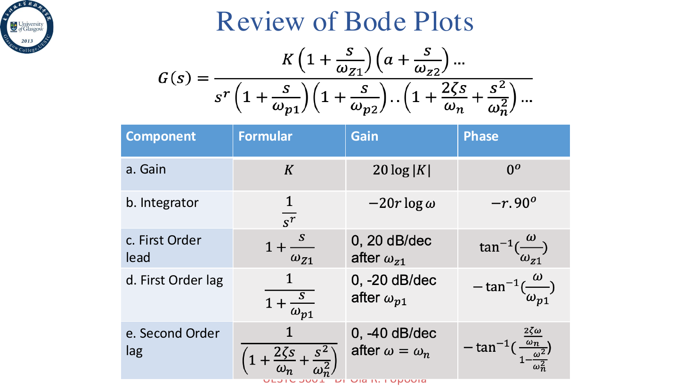

构造 Bode 图的通用流程仍然是：

1. 将传递函数写成时间常数形式
2. 找出每个因子的 corner frequency
3. 在半对数坐标上选取频率范围
4. 计算增益和系统类型
5. 分别画各个因子的斜率贡献并相加

## 例题

<details>
<summary>例题 1</summary>

考虑传递函数

$$
G(s)=\frac{10(1+10s)}{s(1+s/10)^2}
$$

它包含：

- 一个简单增益 $10$
- 一个超前项 $1+10s$
- 一个积分项 $1/s$
- 两个滞后项 $1/(1+s/10)$

写成频域形式：

$$
G(j\omega)=\frac{10(1+10j\omega)}{j\omega(1+j\omega/10)^2}
$$

各组件和对应 corner frequency 如下：

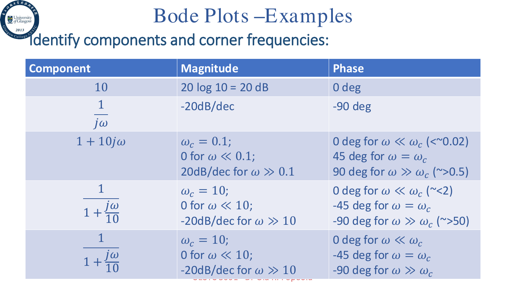

由于两个 lag 项的转折频率相同，合并后在 $\omega=10$ 之后贡献 $-40\text{ dB/dec}$，相位总共趋向 $-180^\circ$。

幅值渐近线：

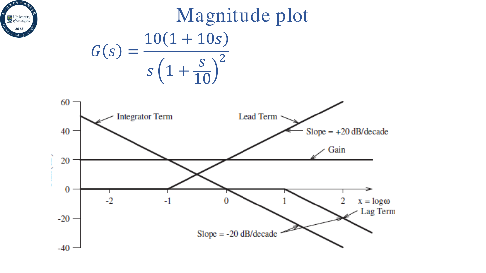

相位渐近线：

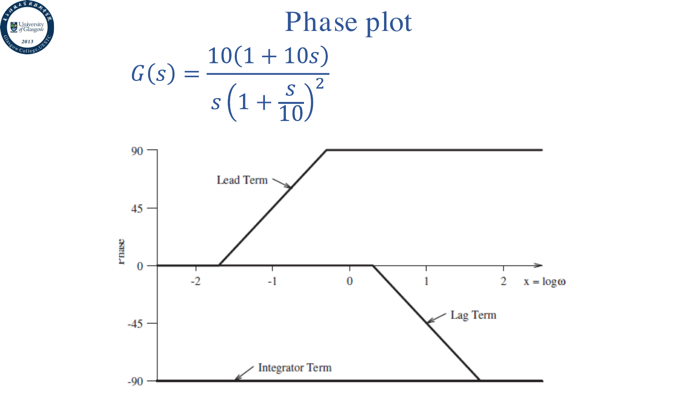

最终叠加结果大概如下：

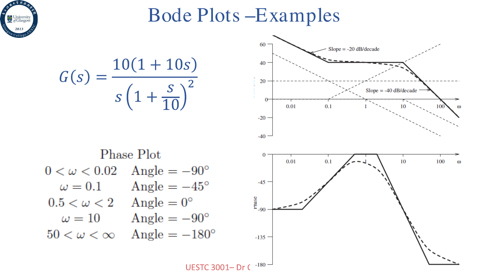

MATLAB 里可以写成

```matlab
sys = tf([100 10], [1/100 1/5 1 0]);
bodeplot(sys)
```

> 当然，考试如果让你手画，MATLAB 就只是精神安慰。

</details>

<details>
<summary>例题 2</summary>

考虑

$$
H(s)=\frac{10(s+0.5)}{s(s+10)}
$$

先写成时间常数形式：

$$
\begin{aligned}
H(j\omega)
&=\frac{10(j\omega+0.5)}{j\omega(j\omega+10)} \\
&=\frac{0.5(1+j\omega/0.5)}{j\omega(1+j\omega/10)}
\end{aligned}
$$

所以它包含：

- 增益 $0.5$，即 $20\log_{10}(0.5)=-6.02\text{ dB}$
- 一个积分项 $1/j\omega$
- 一个 lead 项，$\omega_c=0.5$
- 一个 lag 项，$\omega_c=10$

对应组件表：

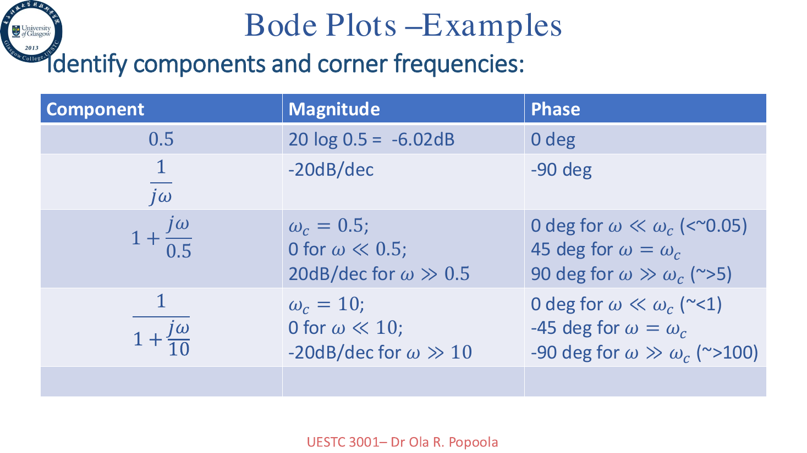

最终 Bode 图如下：

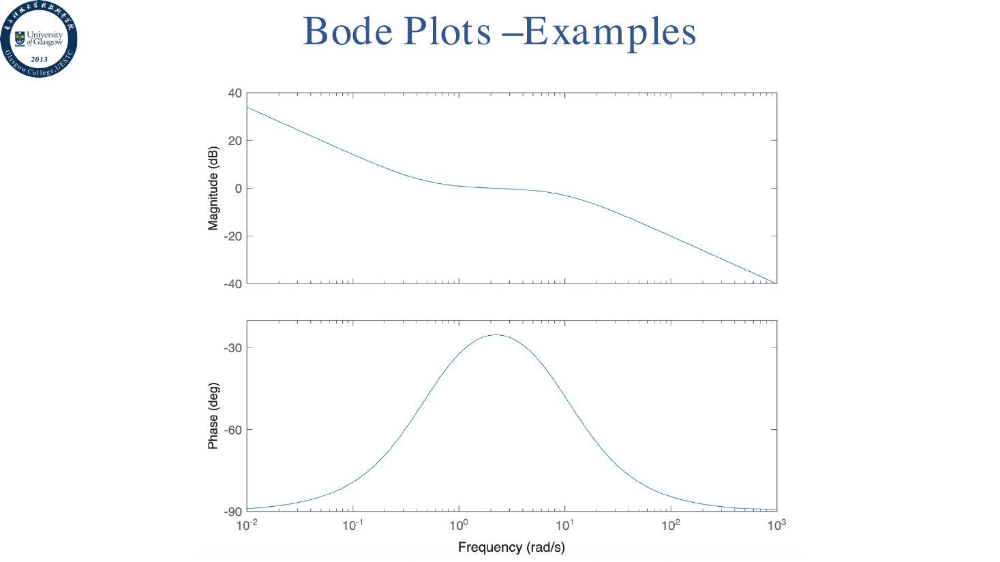

</details>

## 二阶共轭项

二阶共轭项通常写成

$$
G(s)=s^2+2\zeta\omega_ns+\omega_n^2
$$

代入 $s=j\omega$：

$$
G(j\omega)=-\omega^2+j2\zeta\omega_n\omega+\omega_n^2
$$

写成归一化的时间常数形式，需要把 $\omega_n^2$ 提出来：

$$
G(j\omega)=\omega_n^2\left[1+j\frac{2\zeta\omega}{\omega_n}-\left(\frac{\omega}{\omega_n}\right)^2\right]
$$

如果只讨论该二阶项相对于低频的形状，通常看括号里的归一化部分。

它的 corner frequency 为 $\omega_n$。

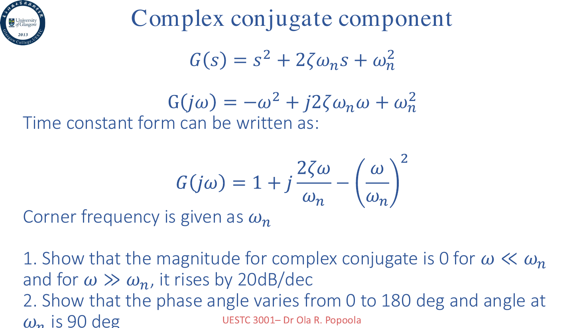

二阶项大概是这么个规律：

- 当 $\omega \ll \omega_n$ 时，幅值约为 $0\text{ dB}$
- 当 $\omega \gg \omega_n$ 时，幅值以 $\pm40\text{ dB/dec}$ 的斜率变化，符号取决于它在分子还是分母
- 相位变化总量为 $\pm180^\circ$
- 在 $\omega=\omega_n$ 附近，相位约变化到一半

<details>
<summary>例题 3</summary>

考虑

$$
G(s)=\frac{64(s+2)}{s(s+0.5)(s^2+3.2s+64)}
$$

写成时间常数形式：

$$
G(s)=\frac{4(1+s/2)}{s(1+s/0.5)(1+3.2s/64+s^2/64)}
$$

代入 $s=j\omega$：

$$
G(j\omega)=\frac{4(1+j\omega/2)}{j\omega(1+j\omega/0.5)(1+j0.4\omega/8-(\omega/8)^2)}
$$

组件表如下：

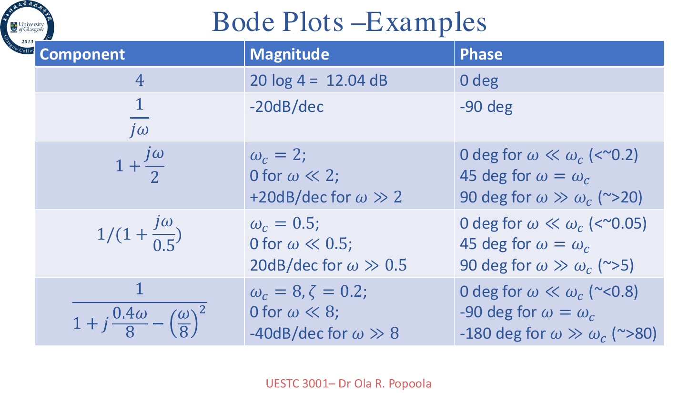

最后得到的 Bode 图：

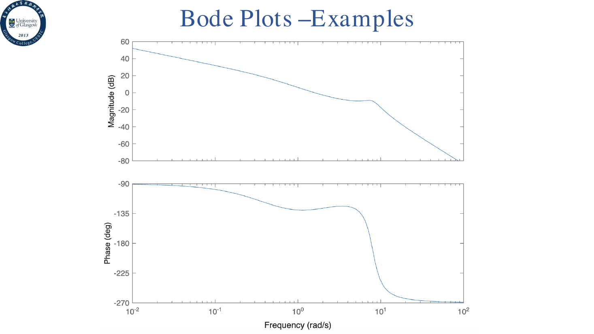

这个例子里，二阶项的阻尼比是 $\zeta=0.2$，所以在自然频率附近的相位和幅值变化都更明显。

</details>

## 延迟环节

延迟 $T$ 秒的传递函数为

$$
H(s)=e^{-sT}
$$

代入频域：

$$
H(j\omega)=e^{-j\omega T}
$$

于是

$$
|H(j\omega)|=1
$$

$$
\angle H(j\omega)=-\omega T
$$

这里的单位是弧度；换成角度就是 $-\omega T\cdot180^\circ/\pi$。

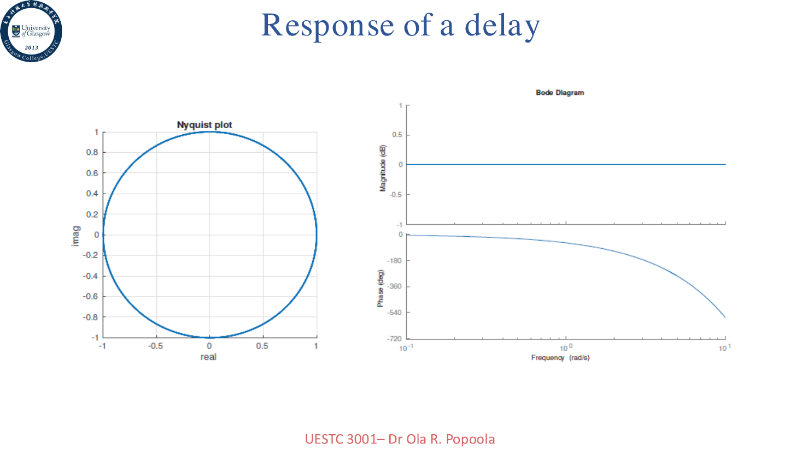

也就是说，延迟不会改变幅值，但会持续增加相位滞后。对于闭环系统，这经常是稳定性的隐形杀手。

## 实验辨识传递函数

有些时候，系统的解析传递函数并不知道，但可以通过实验扫频得到频率响应数据。

此时 Bode 图就非常有用：我们可以把实验得到的幅值和相位曲线画出来，再用渐近线去拟合，从而近似得到传递函数。

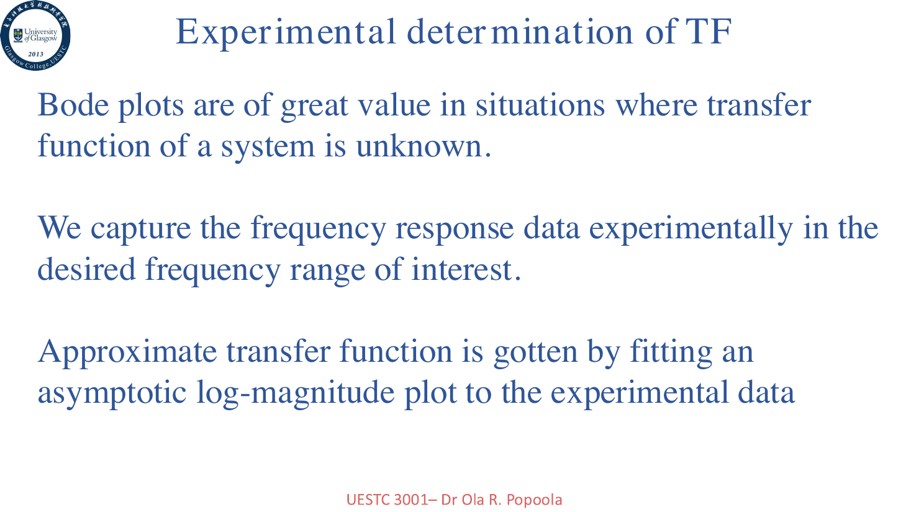

大致步骤是：

1. 用实验数据画出幅值和相位随频率变化的曲线
2. 画出 $20\text{ dB/dec}$ 倍数的渐近线
3. 根据斜率变化判断对应因子
4. 根据低频段斜率判断系统类型和增益
5. 得到近似传递函数后，再画相位图与实验数据比较

如果在某个转折频率 $\omega_1$ 处斜率变化 $-20m\text{ dB/dec}$，通常对应一个

$$
\left(\frac{1}{1+j\omega/\omega_1}\right)^m
$$

如果斜率变化 $-40m\text{ dB/dec}$，则可能是双重极点或者二阶共轭极点。

低频段还可以用来估计增益 $K$：

- 如果低频渐近线是水平线，那么 $20\log_{10}K=x$，所以 $K=10^{x/20}$
- 如果低频斜率是 $-20\text{ dB/dec}$，通常有 $K/(j\omega)$，渐近线与 $0\text{ dB}$ 的交点频率可用于读出 $K$
- 如果低频斜率是 $-40\text{ dB/dec}$，通常有 $K/(j\omega)^2$，渐近线与 $0\text{ dB}$ 的交点对应 $\sqrt{K}$

最后得到近似传递函数后，还需要画相位曲线和实验相位对比。只拟合幅值不看相位，很容易拟合出一个“看起来像但其实不是”的系统。

## 练习

<details>
<summary>题目与结果</summary>

PPT 最后给了一个二阶系统频域指标反推参数的题：

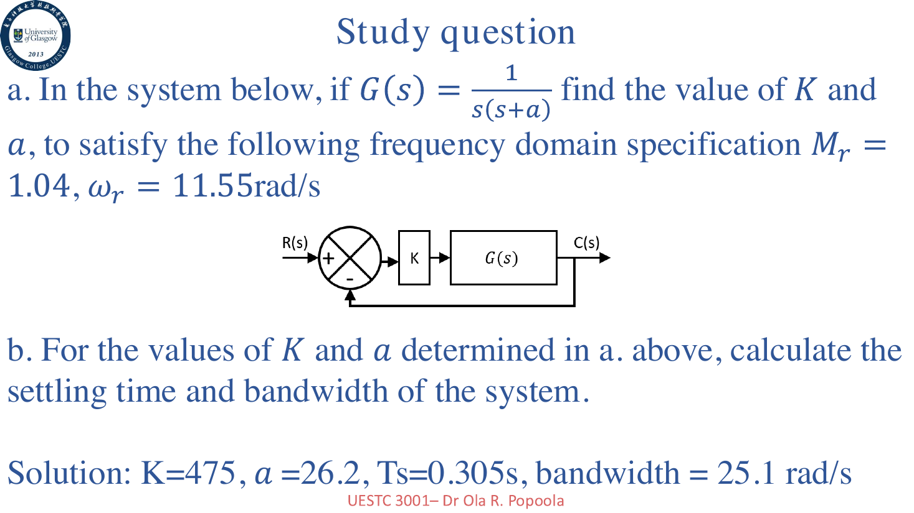

要求根据

$$
M_r=1.04, \quad \omega_r=11.55\text{ rad/s}
$$

求系统参数 $K$ 和 $a$，并进一步计算调节时间和带宽。

PPT 给出的结果是：

$$
K=475, \quad a=26.2
$$

$$
T_s=0.305s, \quad \omega_b=25.1\text{ rad/s}
$$

</details>

> 这讲主要是把 Bode 图从“会画组件”推到“能做题”。关键点：时间常数形式先化再拆；重极点斜率相位都叠；二阶共轭 corner 是 $\omega_n$；延迟只吃相位不吃幅值；实验数据用渐近线拟合反推传递函数。
