> **_Stability and Stability Margins - I_**

## 稳定性的概念 (Concept of Stability)

对于 LTI 系统，稳定性可以从两个角度理解：

1. 对于有界输入，系统输出也必须有界
2. 在没有输入的情况下，输出应该随时间趋向零，也就是渐近稳定 (Asymptotic Stability)

写成数学形式，如果输入满足

$$
|r(t)|\le M_1 < \infty
$$

那么输出也应该满足

$$
|c(t)|\le M_2 < \infty
$$

其中 $M_1$ 和 $M_2$ 都是有限常数。

### 极点位置与冲激响应

如果输入是冲激信号，那么 $R(s)=1$，此时输出就是

$$
C(s)=G(s)
$$

所以可以把传递函数本身看作冲激响应的拉普拉斯形式。系统极点的位置决定了冲激响应会衰减、振荡还是发散。

比如

$$
G(s)=\frac{1}{s+1}
$$

对应的冲激响应为

$$
g(t)=e^{-t}
$$

极点在 $s=-1$，也就是左半平面，响应会衰减，所以系统稳定。

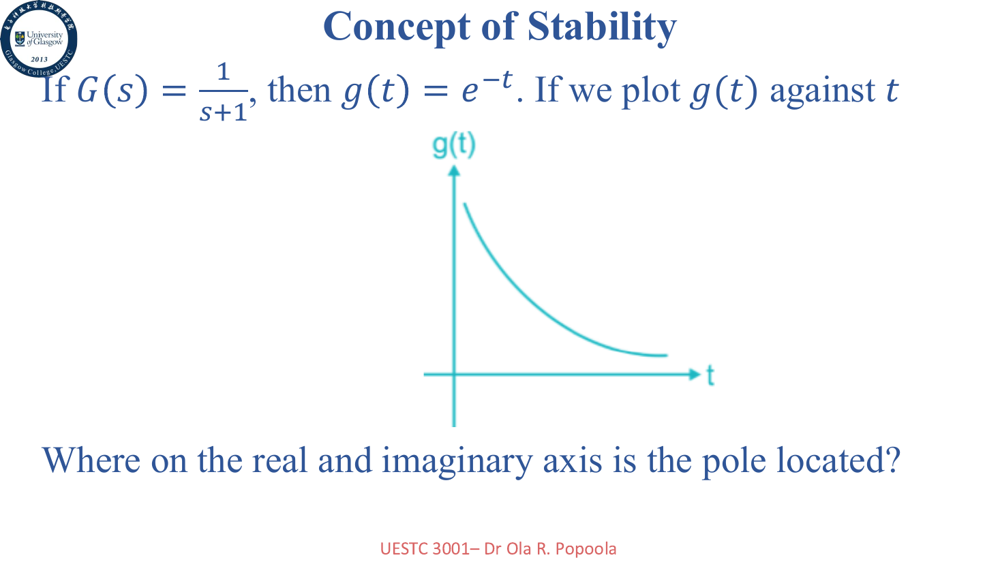

而

$$
G(s)=\frac{1}{s-1}
$$

对应的响应是 $e^t$，极点在右半平面，响应会发散，所以不稳定。

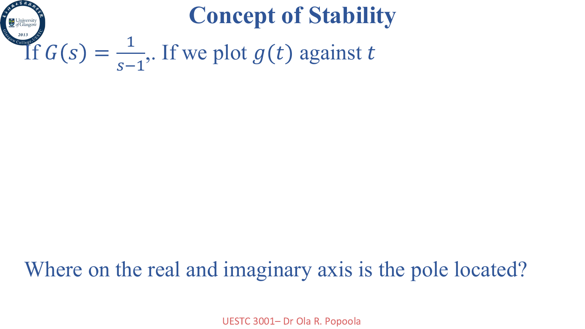

更一般地：

- 极点在左半平面：稳定
- 极点在右半平面：不稳定
- 单个极点或一对极点在虚轴上：零输入响应意义下是临界稳定，但不是渐近稳定，也不是严格的 BIBO 稳定
- 虚轴上有重复极点：不稳定
- 原点处的极点也要小心，具体要看阶数和输入类型

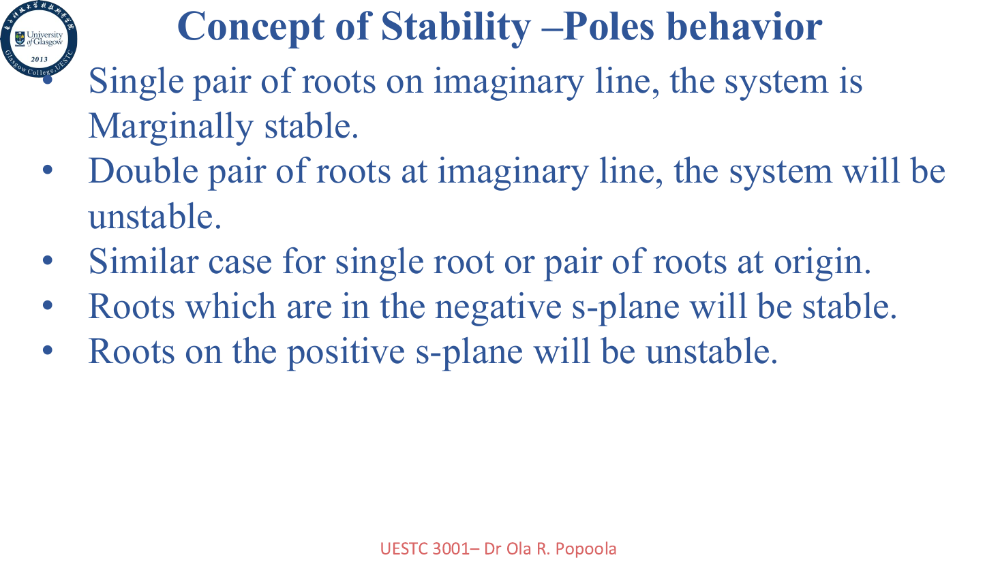

## 劳斯-赫尔维茨判据 (Routh-Hurwitz Criteria)

劳斯-赫尔维茨判据 (Routh-Hurwitz Criteria) 用来在不直接求根的情况下判断系统稳定性。

我们关注的是闭环特征方程，也就是传递函数分母：

$$
q(s)=a_ns^n+a_{n-1}s^{n-1}+\cdots+a_1s+a_0
$$

通过构造劳斯表，可以判断右半平面极点数量。

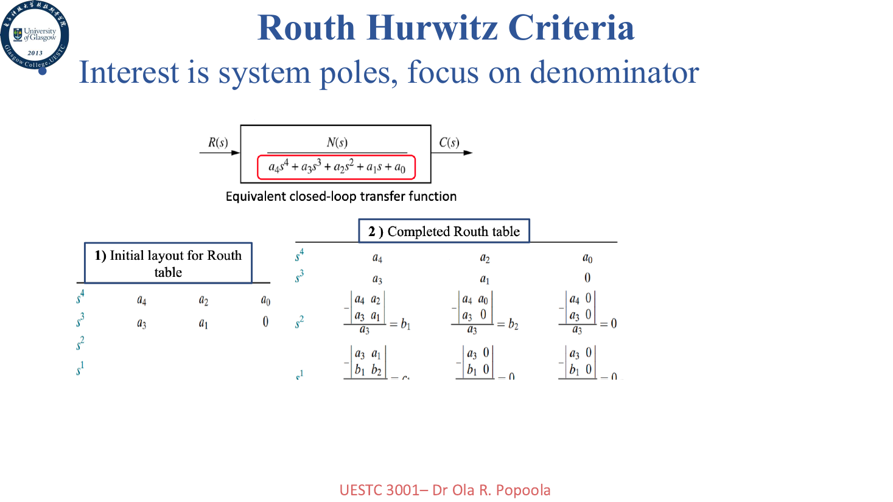

核心结论是：如果劳斯表第一列元素全部同号，系统没有右半平面极点；如果第一列出现符号变化，符号变化次数就是右半平面极点数量。

> 换句话说，不用真的把多项式根解出来，也能知道系统稳不稳。工程数学有时候还是很仁慈的。

劳斯判据的三种典型情况

### Case 1：第一列没有零

最普通的情况是第一列没有零，直接构造劳斯表即可。

PPT 中的例子是

$$
q(s)=s^3+s^2+2s+24
$$

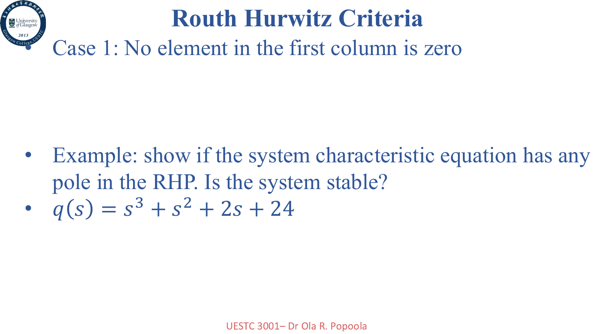

如果第一列出现符号变化，就说明存在右半平面极点，系统不稳定。

### Case 2：第一列出现零，但该行其他元素不全为零

第二种情况是第一列出现零，但该行其他元素不全为零，例如

$$
q(s)=s^5+2s^4+2s^3+4s^2+11s+10
$$

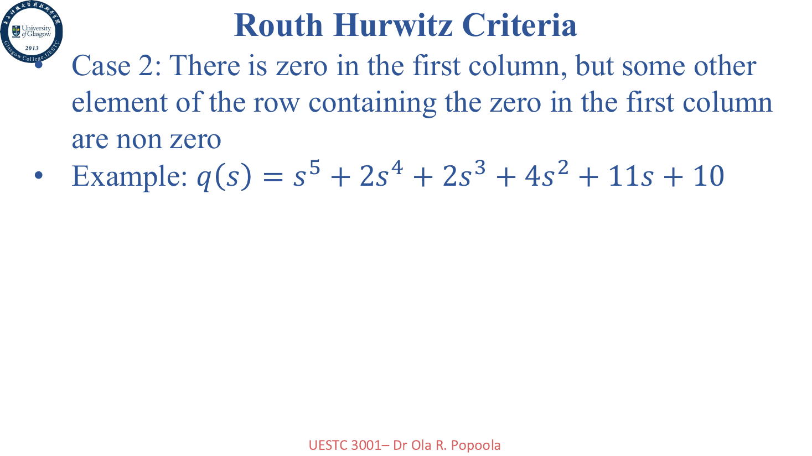

这种情况通常用一个很小的正数 $\epsilon$ 代替第一列的零，再继续构造劳斯表，最后令 $\epsilon\to0^+$ 判断符号变化。

### Case 3：整行变成零

第三种情况是某一整行都变成零，例如

$$
q(s)=s^3+2s^2+4s+k
$$

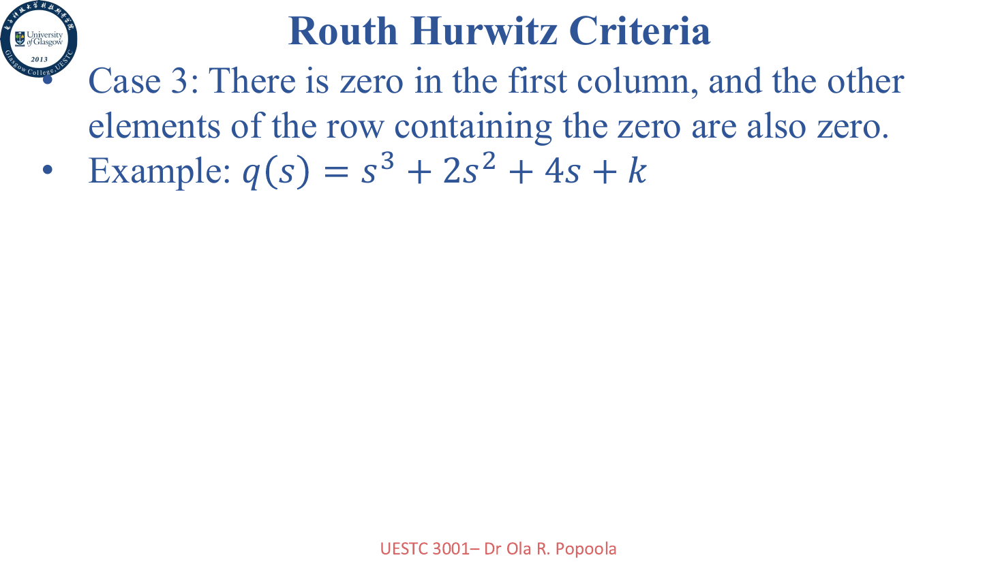

这通常意味着存在关于原点对称的根，例如纯虚根或者成对出现的根。处理方法是使用上一行构造辅助多项式 (Auxiliary Polynomial)，对其求导后替换零行。

## 频域稳定性 (Stability in Frequency Domain)

前面看稳定性主要是在 $s$ 平面看极点。频域稳定性则通过开环频率响应来判断闭环稳定性。

对于单位负反馈系统，闭环传递函数为

$$
G_{cl}(j\omega)=\frac{G(j\omega)}{1+G(j\omega)}
$$

因此幅值为

$$
|G_{cl}(j\omega)|=\frac{|G(j\omega)|}{|1+G(j\omega)|}
$$

当

$$
1+G(j\omega)\to0
$$

时，闭环幅值会趋向无穷大，也就是系统到达不稳定边界。

所以危险条件是

$$
G(j\omega)=-1
$$

也就是

$$
|G(j\omega)|=1, \quad \angle G(j\omega)=-180^\circ
$$

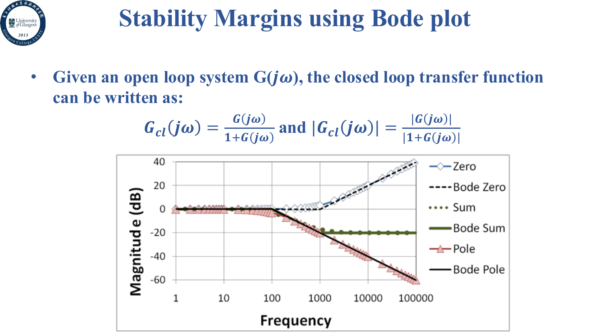

## Bode 图中的稳定裕度

稳定裕度 (Stability Margin) 用来描述系统离不稳定边界还有多远。频域里主要看两个指标：

- 相位裕度 (Phase Margin, PM)
- 增益裕度 (Gain Margin, GM)

### 相位裕度

增益交越频率 (Gain Crossover Frequency) $\omega_{gc}$ 是满足

$$
|G(j\omega_{gc})|=1
$$

的频率，也就是 Bode 幅值图中的 $0\text{ dB}$ 交点。

相位裕度定义为在这个频率处，距离 $-180^\circ$ 还差多少：

$$
PM = 180^\circ + \angle G(j\omega_{gc})
$$

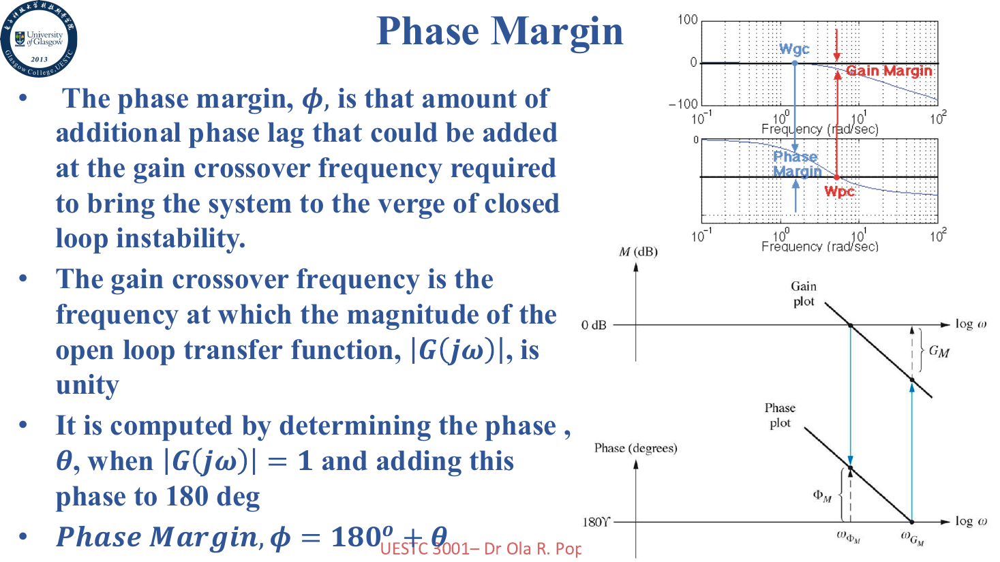

相位裕度越小，系统越接近振荡；相位裕度接近零时，系统就在不稳定边缘。

### 增益裕度

相位交越频率 (Phase Crossover Frequency) $\omega_{pc}$ 是满足

$$
\angle G(j\omega_{pc})=-180^\circ
$$

的频率。

如果此时幅值为

$$
\lambda=|G(j\omega_{pc})|
$$

那么增益裕度为

$$
GM=\frac{1}{\lambda}
$$

用 dB 表示则为

$$
GM[dB]=20\log_{10}\frac{1}{\lambda}
$$

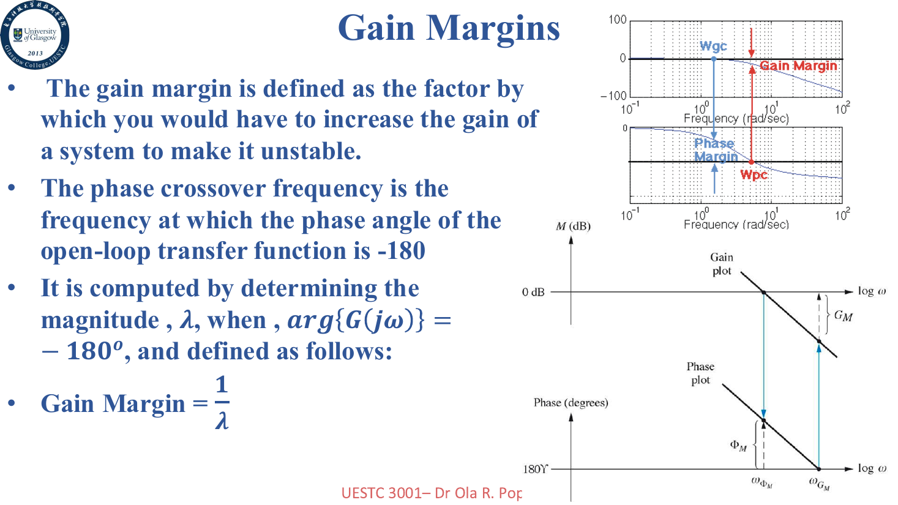

### 例子

Bode 图读取稳定裕度

PPT 中给了一个 Bode 图读裕度的例子：

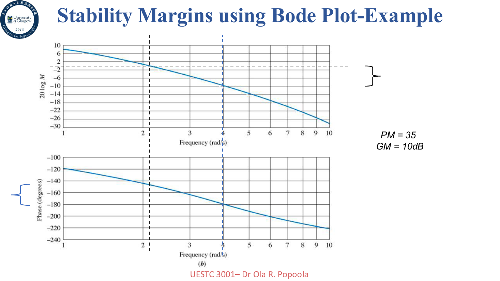

可以读出大约

$$
PM=35^\circ, \quad GM=10\text{ dB}
$$

有时候裕度也可能未定义，比如没有 $0\text{ dB}$ 交点，或者相位从来没有到 $-180^\circ$。

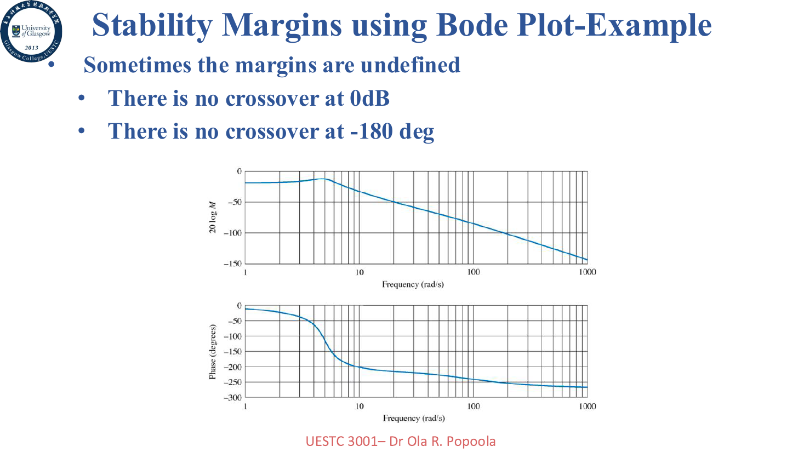

## 一些经验值

PPT 最后强调了一点：这些裕度通常只对开环稳定系统比较直接有效。

一些工程上的参考值：

- 较大的 GM/PM 通常意味着系统更稳定，但响应也可能更慢
- GM 接近 $1$ 或 PM 接近 $0^\circ$ 时，系统往往高度振荡
- 工程中常见的目标是 $GM\approx6\text{ dB}$ 或 $PM\approx30^\circ\sim35^\circ$
- 大多数情况下，好的 GM 往往也对应好的 PM，但不是绝对

> 稳定性进了频域。核心：极点左半平面稳；Routh-Hurwitz 不求解就能点右半平面极点数；频域危险点是 $G(j\omega)=-1$；相位裕度在 0 dB 处量离 $-180^\circ$ 多远；增益裕度在 $-180^\circ$ 处量离 1 多远。
