> **_Nyquist Stability Criterion and Stability Examples_**

## 稳定裕度复习

这一讲前半部分先复习了 [Lec.5](./lec5.md) 中的稳定裕度：

- 相位裕度 (Phase Margin, PM)
- 增益裕度 (Gain Margin, GM)

对于开环频率响应 $G(j\omega)H(j\omega)$，闭环系统接近不稳定的危险点仍然是

$$
G(j\omega)H(j\omega)=-1
$$

也就是 Nyquist 平面上的 $(-1,j0)$。

## Nyquist 稳定判据

对于 SISO 负反馈系统，闭环传递函数为

$$
M(s)=\frac{G(s)}{1+H(s)G(s)}
$$

闭环极点来自特征方程

$$
1+H(s)G(s)=0=\Delta(s)
$$

Nyquist 判据的意义在于：我们可以通过开环频率响应 $G(s)H(s)$ 的图形，判断闭环极点是否跑到了右半平面。

### 判据形式

令

$$
D(s)=1+G(s)H(s)
$$

如果画 $D(s)$ 的 Nyquist 图，就需要看它对原点的环绕情况。等价地，如果画 $G(s)H(s)$ 的 Nyquist 图，就看它对 $(-1,j0)$ 的环绕情况。

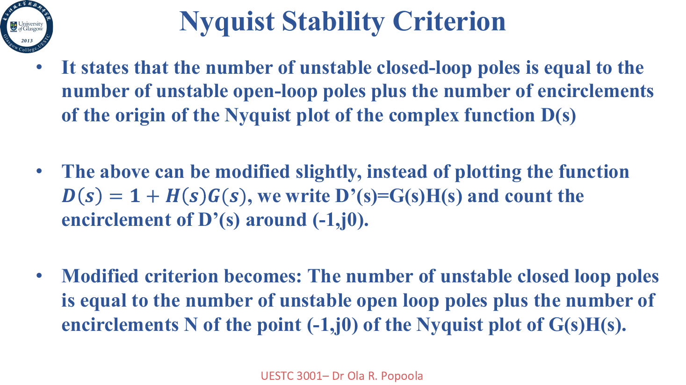

计数规则为

$$
Z=P+N
$$

其中：

- $Z$ 是闭环系统右半平面极点数量
- $P$ 是开环系统右半平面极点数量
- $N$ 是 Nyquist 图对 $(-1,j0)$ 的顺时针环绕次数

如果逆时针环绕，则 $N$ 取负值。

> 注意不同教材的符号约定可能会反过来。这里跟 PPT 一样：顺时针为正，逆时针为负。

实际步骤可以写成：

1. 画出 $G(s)H(s)$ 的 Nyquist 图
2. 数它对 $(-1,j0)$ 的顺时针环绕次数 $N$
3. 找开环右半平面极点数量 $P$
4. 计算 $Z=P+N$
5. 如果 $Z=0$，闭环稳定；否则闭环不稳定

例题：Nyquist 判据稳定性判断

PPT 中给了两个直接通过 Nyquist 图判断稳定性的例子。

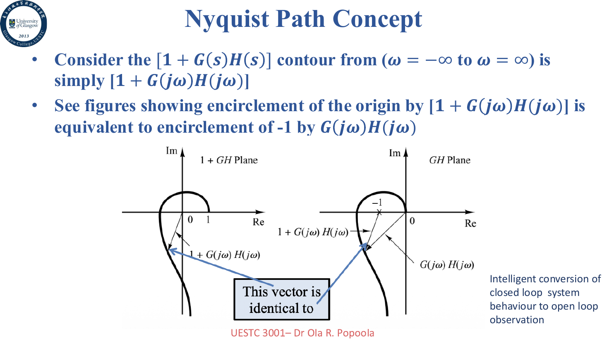

第一个例子中，开环传递函数为

$$
G(s)=\frac{2s^2+5s+1}{s^2-2s+3}, \quad H(s)=1
$$

开环系统有两个右半平面极点，所以 $P=2$。Nyquist 图对 $(-1,j0)$ 的环绕数为 $N=-2$，因此

$$
Z=P+N=2-2=0
$$

闭环系统稳定。

第二个例子：

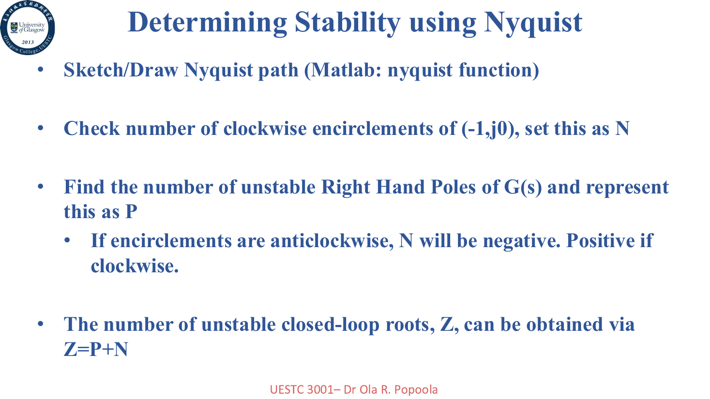

根据 PPT 的图和结果，最终有

$$
Z=N+P=1
$$

所以闭环系统存在一个右半平面极点，不稳定。

## Nyquist 图上的稳定裕度

Nyquist 图上的稳定裕度，本质上仍然是在问轨迹离 $(-1,j0)$ 有多远。

考虑开环传递函数

$$
G(j\omega)H(j\omega)=\frac{K}{j\omega(j\omega T_1+1)(j\omega T_2+1)}
$$

我们关心它和负实轴的交点，因为那里对应相位 $-180^\circ$。

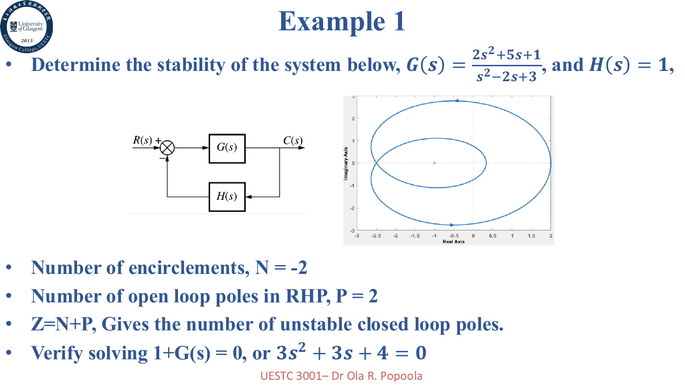

把 $G(j\omega)H(j\omega)$ 写成实部和虚部：

$$
G(j\omega)H(j\omega)=u+jv
$$

令虚部为零，可以求出负实轴交点频率

$$
\omega_2=\frac{1}{\sqrt{T_1T_2}}
$$

此时实部为

$$
u=-\frac{KT_1T_2}{T_1+T_2}
$$

为了不穿过 $-1$ 点，需要满足

$$
\frac{KT_1T_2}{T_1+T_2}<1
$$

也就是

$$
K<\frac{T_1+T_2}{T_1T_2}
$$

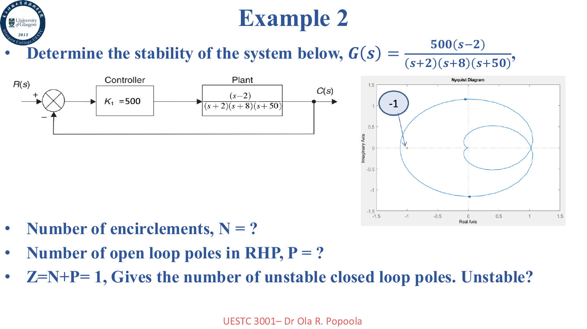

Nyquist 图中的相位裕度和增益裕度仍然可以写成：

$$
PM=180^\circ+\arg\{G(j\omega_{gc})H(j\omega_{gc})\}
$$

$$
GM[dB]=20\log_{10}\frac{1}{|G(j\omega_{pc})H(j\omega_{pc})|}
$$

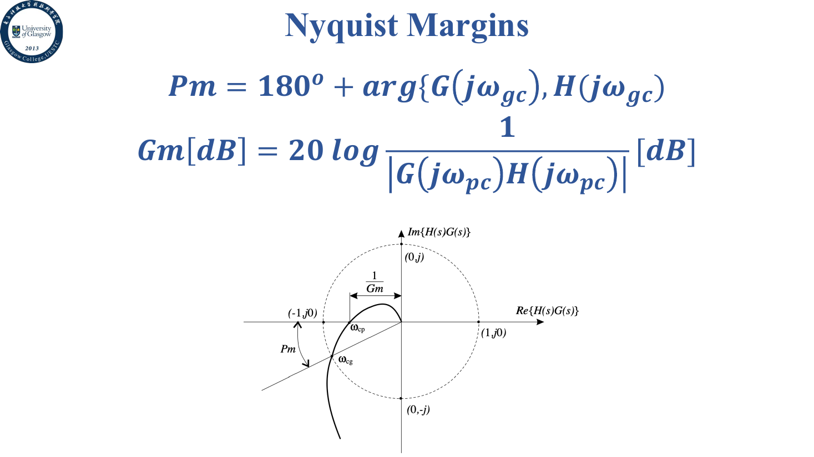

## 失稳点的三种求法

PPT 总结了求系统失稳点的三种方法：

1. 用 Routh-Hurwitz 判据求临界 $K$
2. 用根轨迹角度条件找虚轴交点，再用幅值条件求 $K$
3. 令 $s=j\omega$，结合 Nyquist 判据求穿越频率

这三种方法本质上应该得到同一个结果，只是视角不同。

例题：三种方法求失稳点

考虑

$$
G(s)=\frac{K}{s(s+1)(s+2)}
$$

闭环特征方程为

$$
F(s)=s^3+3s^2+2s+K=0
$$

### 方法 1：Routh-Hurwitz

劳斯表为

|       |                 |     |
| ----- | --------------- | --- |
| $s^3$ | $1$             | $2$ |
| $s^2$ | $3$             | $K$ |
| $s^1$ | $\frac{6-K}{3}$ | $0$ |
| $s^0$ | $K$             |     |

稳定条件是

$$
0<K<6
$$

所以临界失稳点为 $K=6$。

### 方法 2：根轨迹角度条件

在虚轴交点 $s=jx$ 上使用角度条件，可以得到

$$
x^2=2
$$

也就是

$$
s=\pm j\sqrt{2}
$$

再用幅值条件：

$$
K=|s||s+1||s+2|=2\times3=6
$$

PPT 的几何图如下：

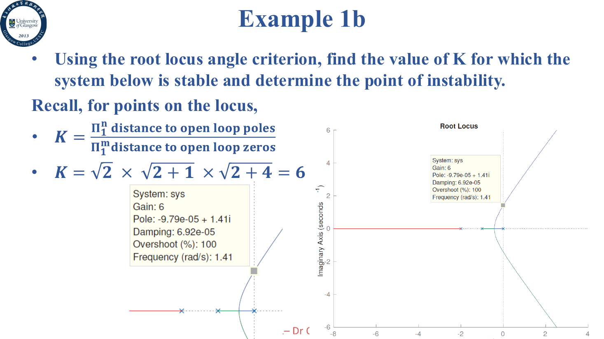

### 方法 3：Nyquist 判据

令 $s=j\omega$：

$$
G(j\omega)=\frac{K}{j\omega(j\omega+1)(j\omega+2)}
$$

通过令虚部为零，得到穿过负实轴的频率。最终同样得到

$$
\omega=\sqrt{2}, \quad K=6
$$

Nyquist 和 Bode 验证图如下：

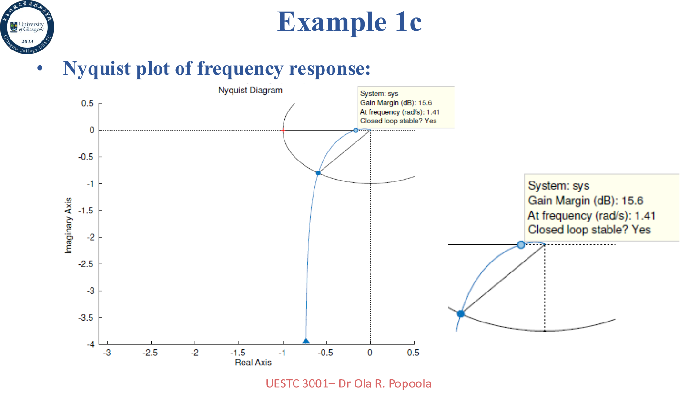

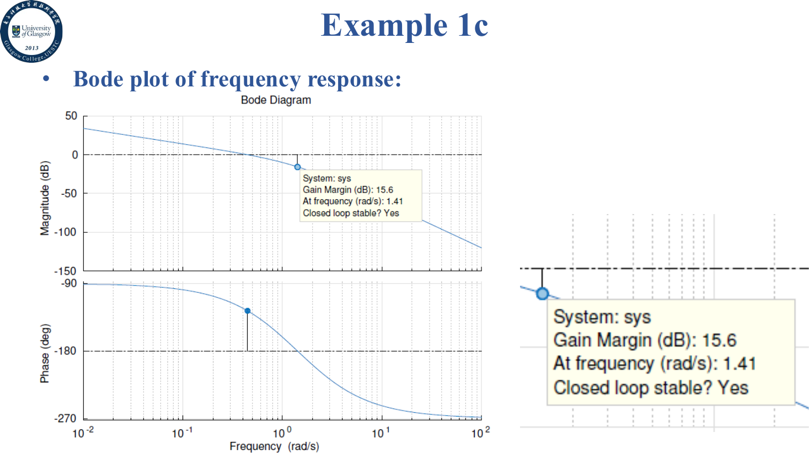

例题：其他 Nyquist 失稳点

例题 2：

$$
G(s)H(s)=\frac{K}{s(s+1)(2s+1)}
$$

令虚部为零可以得到临界频率，最终临界值为

$$
K=1.5
$$

稳定范围是

$$
0<K<1.5
$$

例题 3：

$$
G(s)=\frac{K}{(s^2+2s+2)(s+2)}
$$

临界振荡频率为

$$
\omega=\sqrt{6}
$$

临界增益为

$$
K=20
$$

所以 $K<20$ 稳定，$K=20$ 临界稳定，$K>20$ 不稳定。

例题 4 是带延迟的系统：

$$
G(s)=\frac{Ke^{-0.8s}}{s+1}
$$

PPT 中求得

$$
\omega\approx2.4482, \quad K\approx2.65
$$

对应的 Nyquist 图如下：

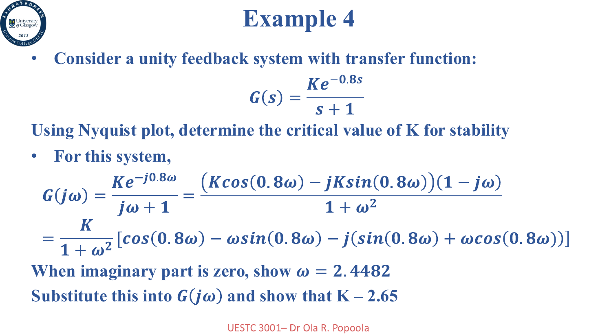

## Bode 稳定裕度例题

例题：不同增益下的 GM/PM

PPT 给了一个系统，要求分别在 $K=10$ 和 $K=100$ 时，从 Bode 图中读取增益裕度和相位裕度。

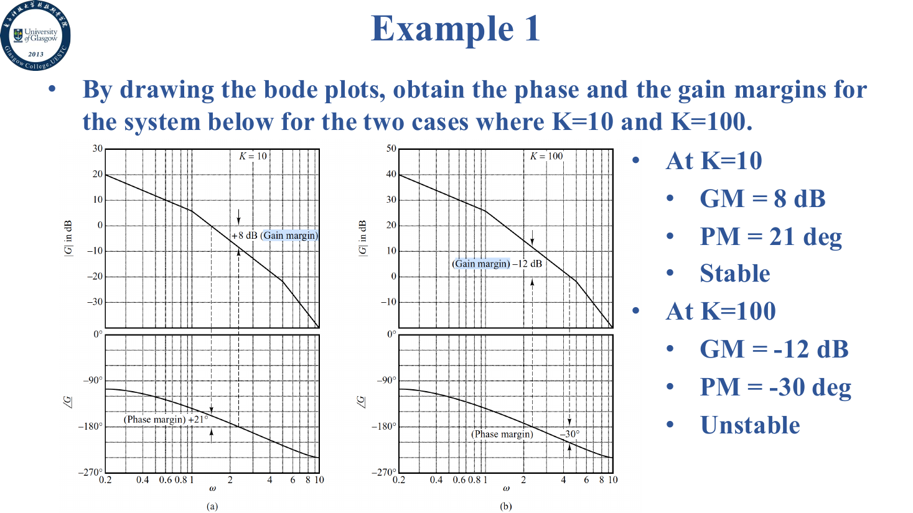

根据图上结果：

- 当 $K=10$ 时，$GM=8\text{ dB}$，$PM=21^\circ$，系统稳定
- 当 $K=100$ 时，$GM=-12\text{ dB}$，$PM=-30^\circ$，系统不稳定

这也很直观：增益太大以后，交越频率右移，相位滞后更多，系统更容易越过稳定边界。

例题：空间飞行器系统

题目要求选择 $K$，使得系统的相位裕度为 $50^\circ$。

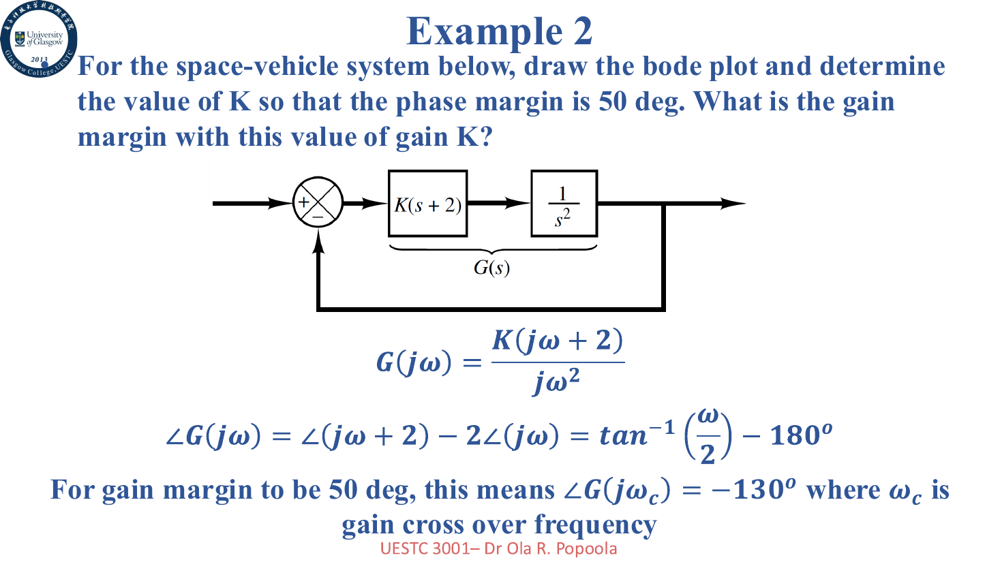

开环频率响应可以写成

$$
G(j\omega)=\frac{K(j\omega+2)}{(j\omega)^2}
$$

相位为

$$
\angle G(j\omega)=\tan^{-1}\frac{\omega}{2}-180^\circ
$$

为了让相位裕度为 $50^\circ$，需要在增益交越频率处有

$$
\angle G(j\omega_c)=-130^\circ
$$

所以

$$
\tan^{-1}\frac{\omega_c}{2}=50^\circ
$$

解得

$$
\omega_c=2.3835\text{ rad/s}
$$

再令 $|G(j\omega_c)|=1$，可得

$$
K=1.8259
$$

由于相位曲线不会穿过 $-180^\circ$，因此增益裕度为无穷大。

例题：标准二阶系统带宽

标准二阶闭环系统为

$$
\frac{C(s)}{R(s)}=\frac{\omega_n^2}{s^2+2\zeta\omega_ns+\omega_n^2}
$$

带宽 $\omega_b$ 按 $-3\text{ dB}$ 点定义，即

$$
\left|\frac{C(j\omega_b)}{R(j\omega_b)}\right|=0.707
$$

推导后可得

$$
\omega_b=\omega_n\sqrt{1-2\zeta^2+\sqrt{4\zeta^4-4\zeta^2+2}}
$$

这个公式看起来很恶心，但它的意义很简单：二阶系统带宽由自然频率和阻尼比共同决定。

## 自测题

Exercise 1

对于单位反馈系统

$$
G(s)=\frac{K}{(s+2)(s+4)(s+6)}
$$

画 Nyquist 图，并求稳定的 $K$ 范围。

PPT 给出的答案是

$$
480 > K > -48
$$

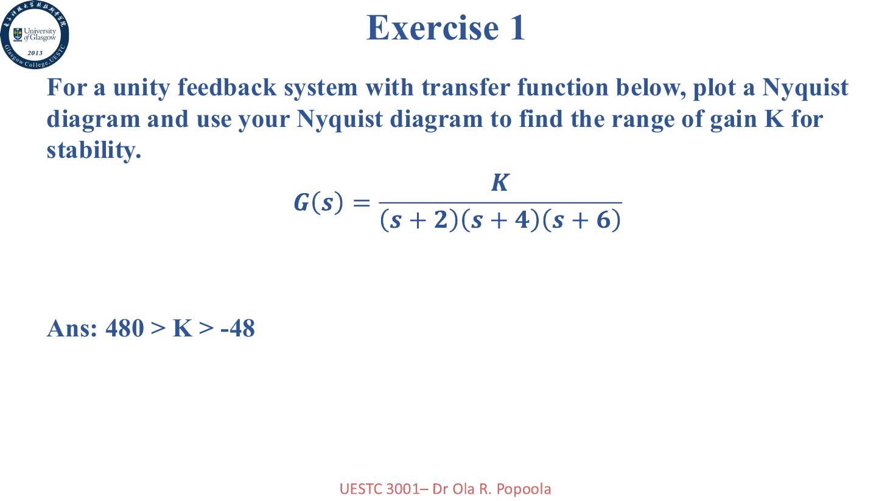

Exercise 2

对于同一个系统，当 $K=6$ 时，求增益裕度和相位裕度。

PPT 给出的答案是

$$
GM=38.1\text{ dB}, \quad PM=\infty
$$

Exercise 3

对于单位反馈系统

$$
G(s)=\frac{K}{(s+5)(s+20)(s+50)}
$$

要求画 Bode 幅值和相位图，求稳定范围，并在 $K=10000$ 时求 $GM$、$PM$、$\omega_{cg}$ 和 $\omega_{cp}$。

PPT 图上给出的结果如下：

$$
96250>K>-5000
$$

$$
GM=99.7\text{ dB}, \quad PM=\infty
$$

$$
\omega_{cg}=36.7, \quad \omega_{cp}\text{ 不存在}
$$

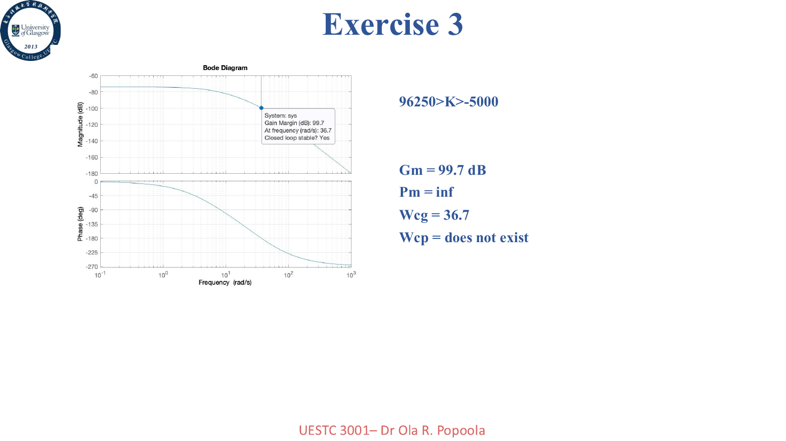

不过这里 PPT 的标注疑似把几个量写反了。按

$$
G(s)=\frac{10000}{(s+5)(s+20)(s+50)}
$$

直接计算，稳定临界增益仍然是 $K=96250$，因此

$$
GM=\frac{96250}{10000}=9.625\approx19.7\text{ dB}
$$

相位交越频率存在，约为

$$
\omega_{pc}=\sqrt{1350}\approx36.7\text{ rad/s}
$$

增益交越频率约为

$$
\omega_{gc}\approx7.74\text{ rad/s}
$$

相位裕度约为

$$
PM\approx92.9^\circ
$$

也就是说，这一页可以当作“PPT 也会有 typo”的经典案例。

## 小结

这一讲把频域稳定性推进到了 Nyquist 判据：

- 闭环稳定性可以通过开环 Nyquist 图判断
- 判据核心是 $Z=P+N$
- 关注点从原点平移到 $(-1,j0)$
- Nyquist 图也可以读相位裕度和增益裕度
- 求失稳点可以用 Routh、根轨迹或 Nyquist，最后应该得到一致结果
