> **_Compensator Design_**

## 控制系统设计与补偿器

控制系统设计 (Control System Design) 的目标，是让系统满足指定的性能指标。这些指标可能来自时域，也可能来自频域，比如：

- 峰值超调 (Peak Overshoot)
- 调节时间 (Settling Time)
- 增益裕度 (Gain Margin)
- 相位裕度 (Phase Margin)
- 带宽 (Bandwidth)

在频域中，相对稳定性通常可以用共振峰 $M_r$ 或相位裕度 $\phi_{pm}$ 描述；响应速度则可以用共振频率 $\omega_r$ 或带宽 $\omega_b$ 描述。

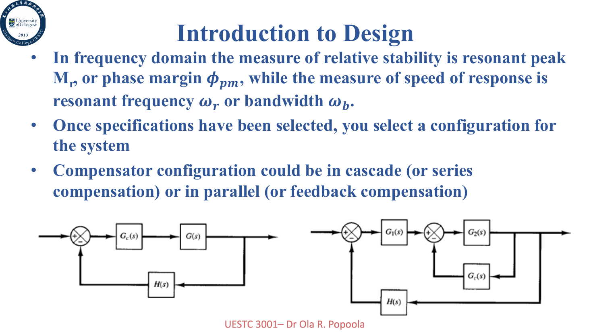

补偿器配置可以是串联补偿 (Cascade / Series Compensation)，也可以是反馈补偿 (Feedback Compensation)。本讲主要讨论串联补偿器。

### 控制器与补偿器

对于闭环系统，控制器 $H(s)$ 可以是：

- 简单比例增益 $K_p$
- 积分器 $K_i/s$
- 微分器 $K_ds$
- PID 控制器

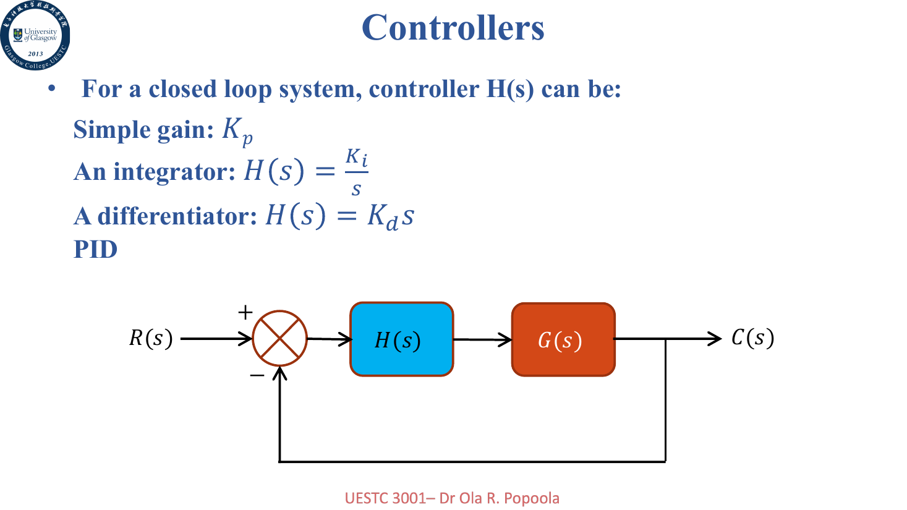

补偿器 (Compensator) 则更强调“修改系统动态特性”，让系统满足给定规格。它可以被看作控制器的一部分，专门用来调整稳定性、瞬态响应、稳态误差等。

> 粗暴理解：controller 负责管，compensator 负责调得更像人能接受的样子。

### 补偿器类型

本讲主要讨论三类补偿器：

- 超前补偿器 (Lead Compensator)：改善瞬态响应，提高相位裕度和带宽
- 滞后补偿器 (Lag Compensator)：改善稳态性能，但通常会让响应变慢
- 超前-滞后补偿器 (Lead-Lag Compensator)：两者结合

如果系统本身不稳定，通常需要补偿器先把它稳定下来，再谈性能。如果系统已经稳定，则补偿器主要用于改善响应和裕度。

## 超前补偿器 (Lead Compensator)

超前补偿器的传递函数可以写成

$$
G_c(s)=K\frac{1+s/\omega_c}{1+s/(\alpha\omega_c)}=K\alpha\frac{s+\omega_c}{s+\alpha\omega_c}
$$

其中

$$
\alpha>1
$$

零点和极点分别为

$$
s=-\omega_c, \quad s=-\alpha\omega_c
$$

所以极点比零点更靠左。

低频增益为 $K$，高频增益为 $\alpha K$。

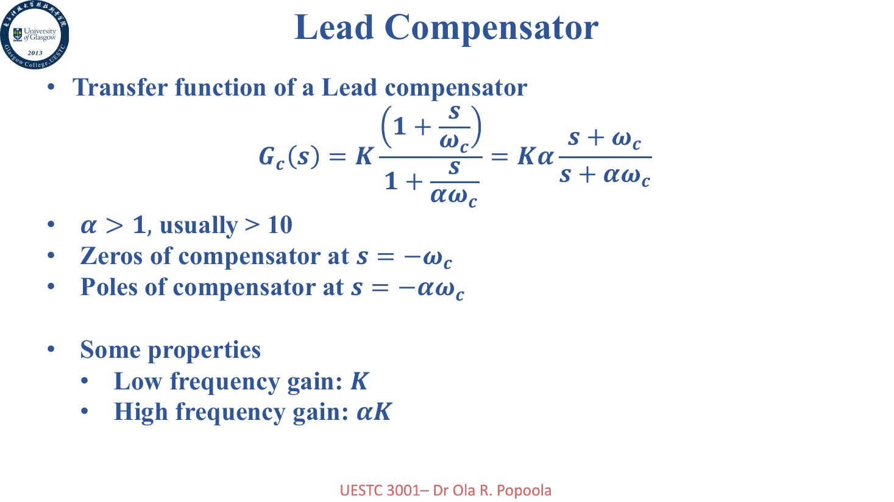

### 相位性质

代入 $s=j\omega$ 后，相位为

$$
\angle G_c(j\omega)=\tan^{-1}\frac{\omega}{\omega_c}-\tan^{-1}\frac{\omega}{\alpha\omega_c}
$$

因为 $\alpha>1$，所以这个相位是正的，也就是提供相位超前。

最大相位超前发生在两个 break frequency 的几何中点：

$$
\omega_m=\sqrt{\alpha}\omega_c
$$

最大相位为

$$
\phi_m=\tan^{-1}\frac{\alpha-1}{2\sqrt{\alpha}}
$$

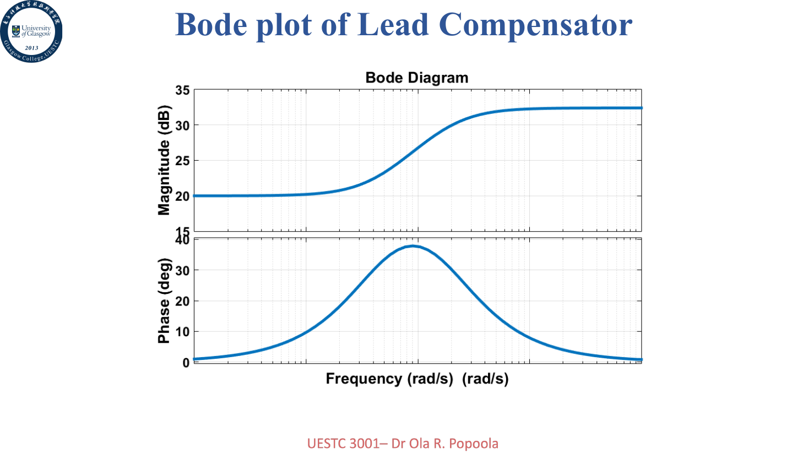

超前补偿器的作用主要是改善高频行为，提高带宽，让系统更快，并增加相位裕度。

例题：超前补偿器的 Nyquist 图

考虑

$$
C(s)=\frac{10+s}{100+s}
$$

PPT 给出的 Nyquist 图如下：

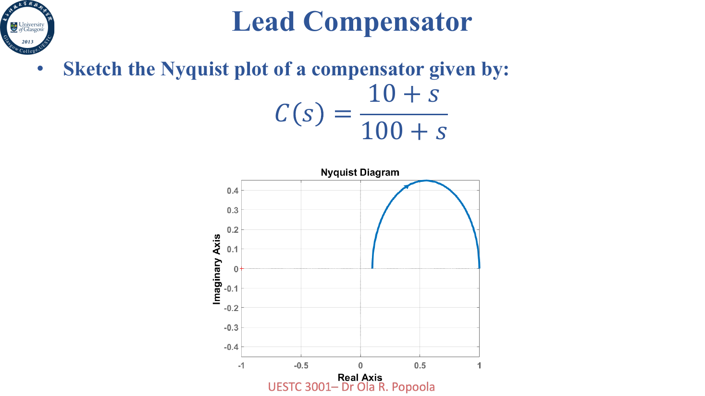

超前补偿器的极坐标轨迹通常呈半圆形，且提供正相位。

例题：超前补偿器的影响

给定系统和补偿器：

$$
G(s)=\frac{4}{s(s+2)}, \quad C_s(s)=40\frac{s+4}{s+20}
$$

PPT 中比较了补偿前后的 Bode 图、Nyquist 图和阶跃响应：

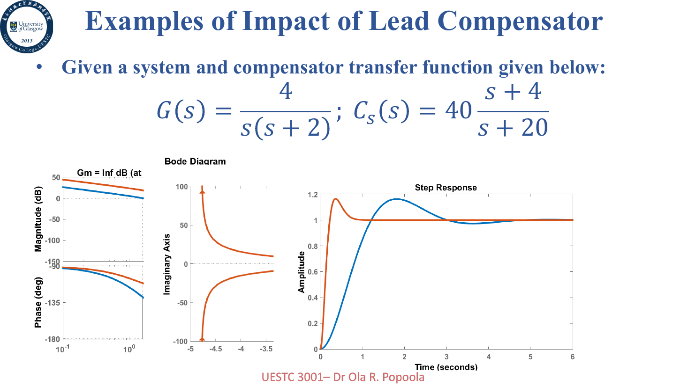

可以看到 lead 补偿器通常会提高交越频率和带宽，让响应更快，同时增加相位裕度。

## 滞后补偿器 (Lag Compensator)

滞后补偿器的传递函数可以写成

$$
G_c(s)=K\alpha\frac{1+s/(\alpha\omega_c)}{1+s/\omega_c}=K\frac{s+\alpha\omega_c}{s+\omega_c}
$$

其中

$$
\alpha>1
$$

零点和极点分别为

$$
s=-\alpha\omega_c, \quad s=-\omega_c
$$

低频增益为 $\alpha K$，高频增益为 $K$。

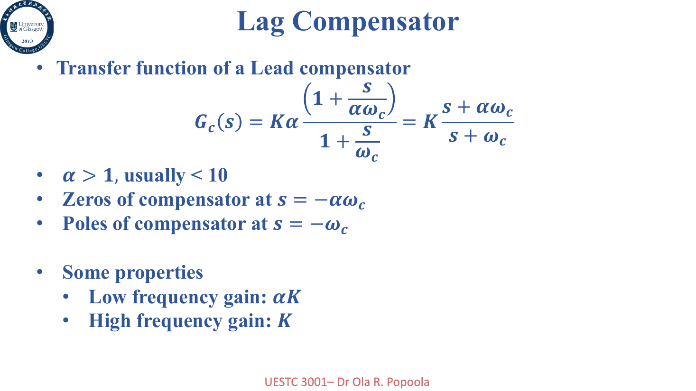

### 相位性质

滞后补偿器的相位为

$$
\angle G_c(j\omega)=\tan^{-1}\frac{\omega}{\alpha\omega_c}-\tan^{-1}\frac{\omega}{\omega_c}
$$

因为前一项小于后一项，所以相位为负，也就是引入相位滞后。

最大相位滞后同样出现在

$$
\omega_m=\sqrt{\alpha}\omega_c
$$

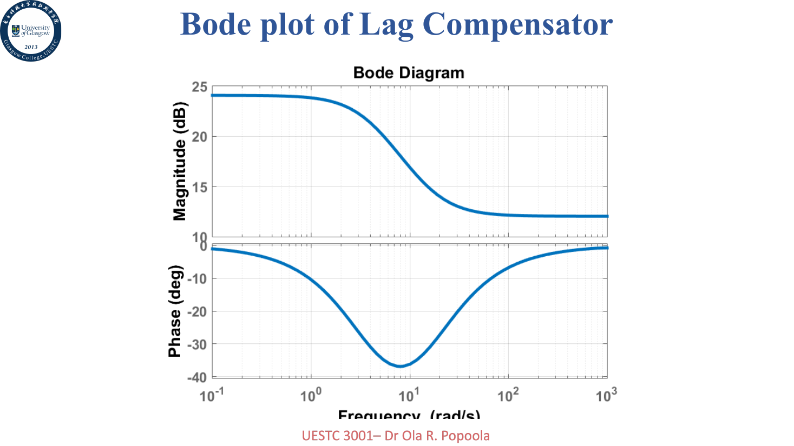

滞后补偿器的主要作用是改善低频行为，提高低频增益，从而改善稳态误差；代价通常是降低带宽，让响应变慢。

例题：滞后补偿器的 Nyquist 图

考虑

$$
C(s)=4\frac{16+s}{4+s}
$$

PPT 给出的 Nyquist 图如下：

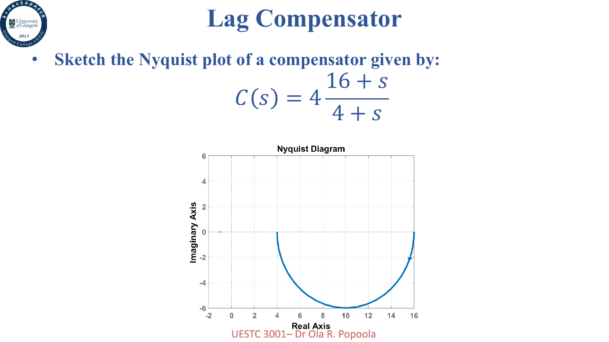

滞后补偿器会给系统带来负相位，因此设计时要避免把相位裕度吃得太多。

例题：滞后补偿器的影响

给定系统和补偿器：

$$
G(s)=\frac{4}{s(s+1)(0.5s+1)}, \quad C_s(s)=\frac{0.1s+0.1}{s+0.05}
$$

补偿前后的效果如下：

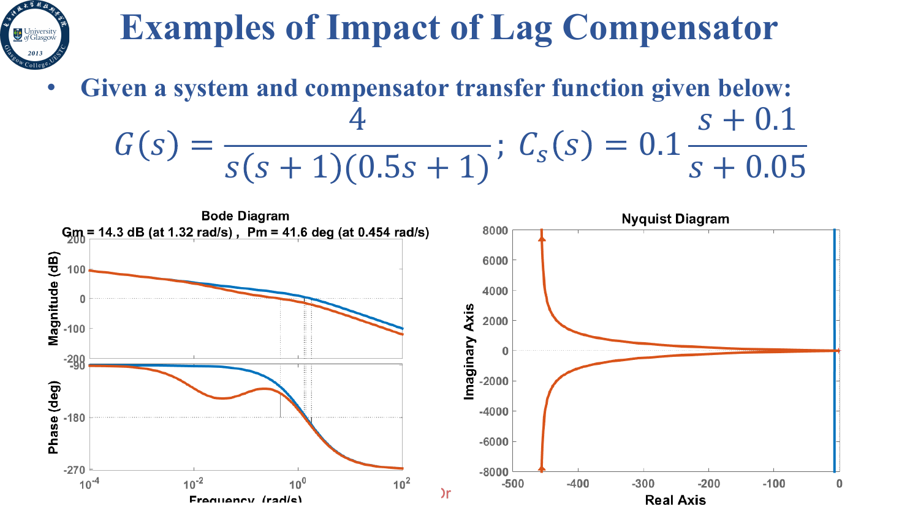

可以看到 lag 补偿器更偏向稳态性能和低频增益的改善，而不是让系统变快。

## 超前-滞后补偿器

如果只用 lag，系统低频性能变好了，但会引入慢模态；如果只用 lead，响应变快了，但稳态性能可能不够。于是就有了超前-滞后补偿器。

一种形式是

$$
C(s)=\frac{(1+s/\omega_2)(1+s/\omega_3)}{(1+s/\omega_1)(1+s/\omega_4)}
$$

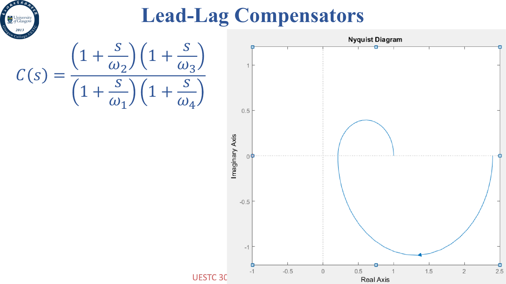

Lead 和 Lag 的对比如下：

| Lead Compensator | Lag Compensator |
| ---------------- | --------------- |
| 高通特性         | 低通特性        |
| 近似 PD 控制     | 近似 PI 控制    |
| 提供相位超前     | 在高频衰减      |
| 提高交越频率     | 降低交越频率    |
| 增大带宽         | 减小带宽        |

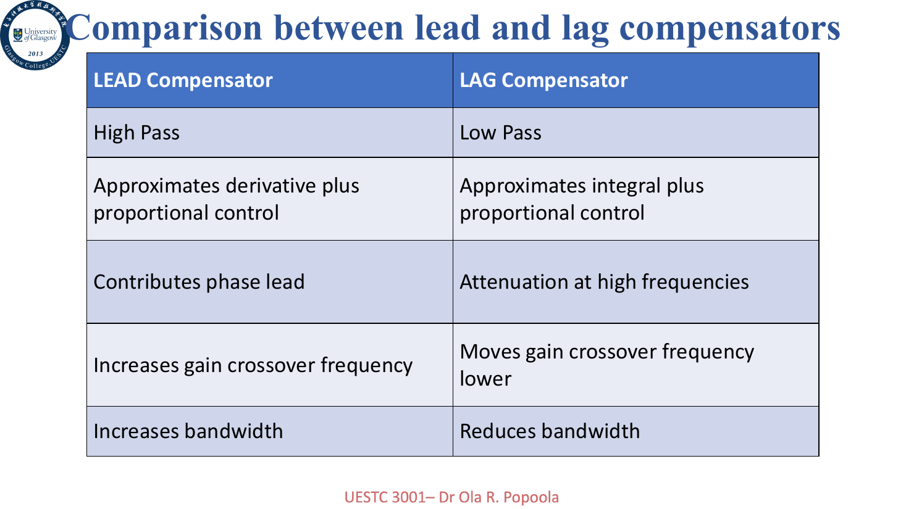

## 频域中的超前补偿器设计

设计步骤

超前补偿器的频域设计步骤大致是：

1. 根据稳态误差要求确定 loop gain $K$
2. 用这个 $K$ 画未补偿系统的 Bode 图，求当前相位裕度
3. 计算需要增加的相位：

   $$
   \phi_l=\phi_s-\phi_u+\epsilon
   $$

   其中 $\phi_s$ 是目标相位裕度，$\phi_u$ 是未补偿系统相位裕度，$\epsilon$ 是安全裕度

4. 令 $\phi_m=\phi_l$，确定补偿器参数
5. 找新的交越频率 $\omega_m$
6. 计算上下 corner frequency
7. 画补偿后 Bode 图，检查是否满足要求

这里 PPT 切换到了另一种常见约定：用 $\alpha<1$ 表示 lead 网络。此时

$$
\alpha=\frac{1-\sin\phi_m}{1+\sin\phi_m}
$$

并且

$$
\omega_1=\omega_m\sqrt{\alpha}, \quad \omega_2=\frac{\omega_m}{\sqrt{\alpha}}
$$

> 这里的 $\alpha$ 和前面 $\alpha>1$ 的写法是互为倒数的约定。控制教材：同一个东西，换个符号，给你一点小小的震撼。

例题：超前补偿器设计

题目给定单位反馈系统，未补偿对象可以写成类似

$$
G_f(s)=\frac{K_v}{s(s+1)}
$$

并要求

$$
K_v=12s^{-1}, \quad PM=40^\circ
$$

未补偿系统的相位裕度为 $15^\circ$。取 $5^\circ$ 的安全裕度，则需要的相位超前为

$$
\phi_l=40^\circ-15^\circ+5^\circ=30^\circ
$$

所以

$$
\alpha=\frac{1-\sin30^\circ}{1+\sin30^\circ}=0.333
$$

补偿器在 $\omega_m$ 处提供的幅值为

$$
10\log_{10}\frac{1}{0.333}=4.8\text{ dB}
$$

从未补偿 Bode 图上找到幅值为 $-4.8\text{ dB}$ 的频率，得到

$$
\omega_m=4.6\text{ rad/s}
$$

于是

$$
\omega_1=\omega_m\sqrt{\alpha}=2.65\text{ rad/s}
$$

$$
\omega_2=\frac{\omega_m}{\sqrt{\alpha}}=8\text{ rad/s}
$$

补偿网络为

$$
\frac{1+s/2.65}{1+s/8}=\frac{0.377s+1}{0.125s+1}
$$

如果使用未归一化的极零点形式 $(s+\omega_1)/(s+\omega_2)$，它的低频增益不是 $1$，需要额外放大

$$
A=\frac{1}{\alpha}=3
$$

如果直接使用上面这种时间常数归一化形式，低频增益已经是 $1$，就不要再把这个 $A$ 乘第二遍。这里最容易因为符号约定切换把自己绕进去。

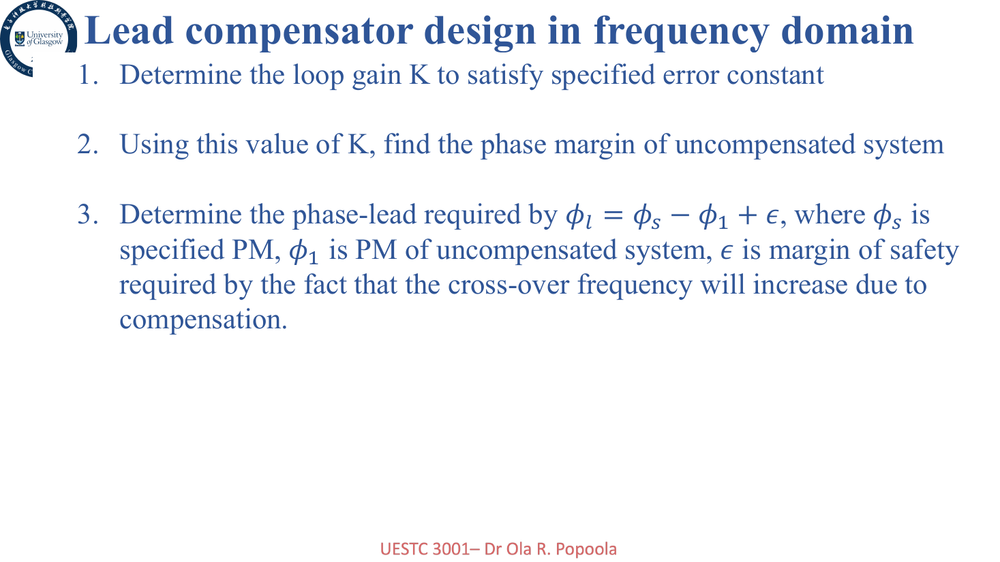

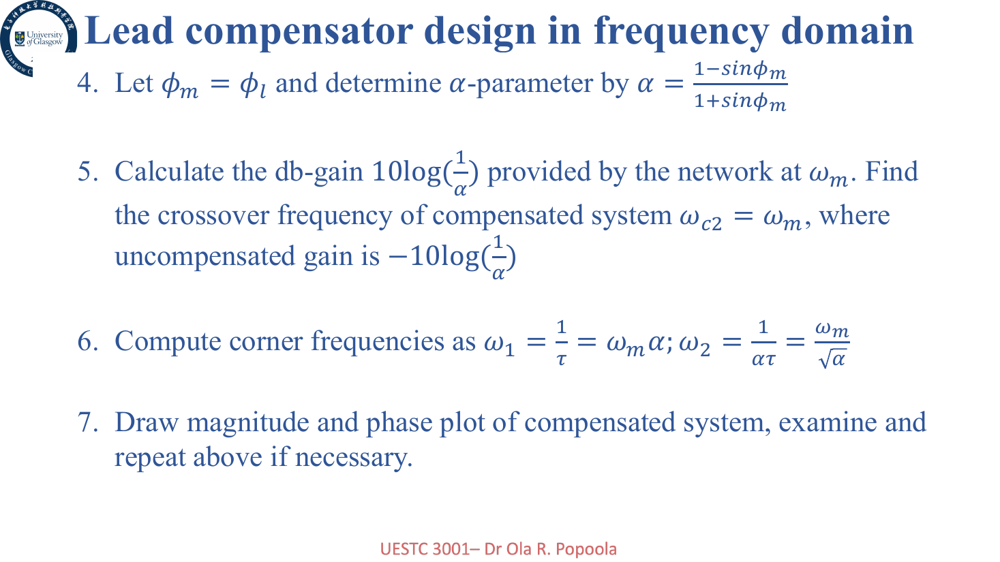

## 频域中的滞后补偿器设计

设计步骤

滞后补偿器的频域设计大致是：

1. 根据稳态误差要求确定 loop gain $K$
2. 找到未补偿系统在目标相位裕度附近的频率 $\omega_{gc}$
3. 测量该频率处的未补偿幅值，并把它等同于 lag 网络的高频衰减
4. 选择 lag 网络的 corner frequency，通常放在 $\omega_{gc}$ 低一个 octave 到一个 decade 的地方
5. 画补偿后频率响应，检查相位裕度
6. 如果不满足规格，调整安全裕度并重复

Lag 补偿器通常会降低带宽，但改善稳态误差和信噪比。

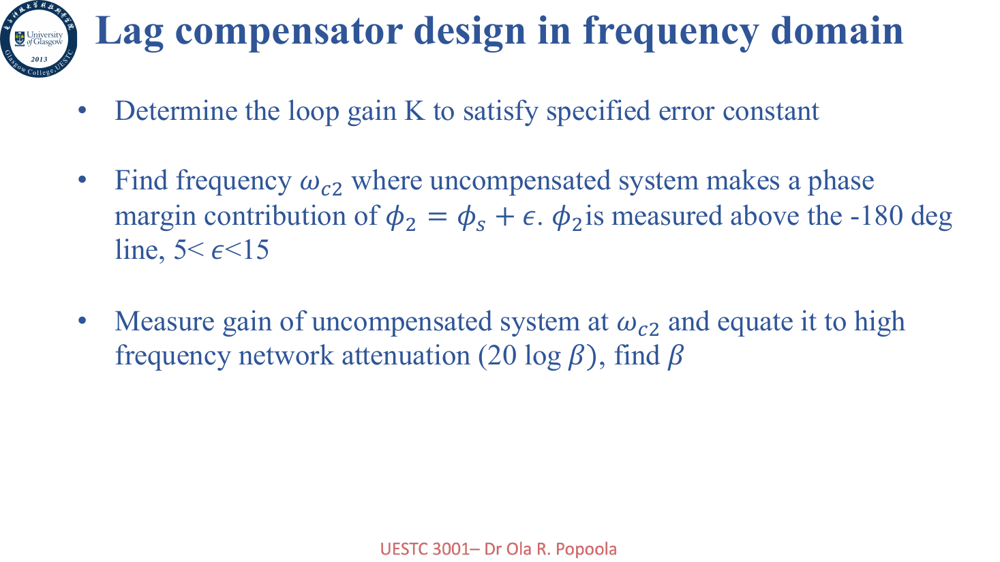

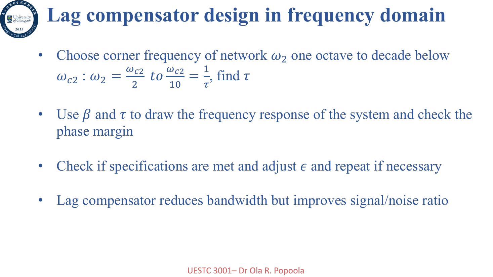

## 小结

这一讲讲的是频域设计里的三个补偿器：

- Lead：提供正相位，提高相位裕度和带宽，让系统更快
- Lag：提高低频增益，改善稳态误差，但通常让响应变慢
- Lead-Lag：同时兼顾瞬态和稳态性能

补偿器设计的本质不是背公式，而是看系统哪里不够：相位裕度不够就想办法补相位，稳态误差不够就提高低频增益，带宽不够就调整交越频率。公式只是把这些意图落到参数上。
