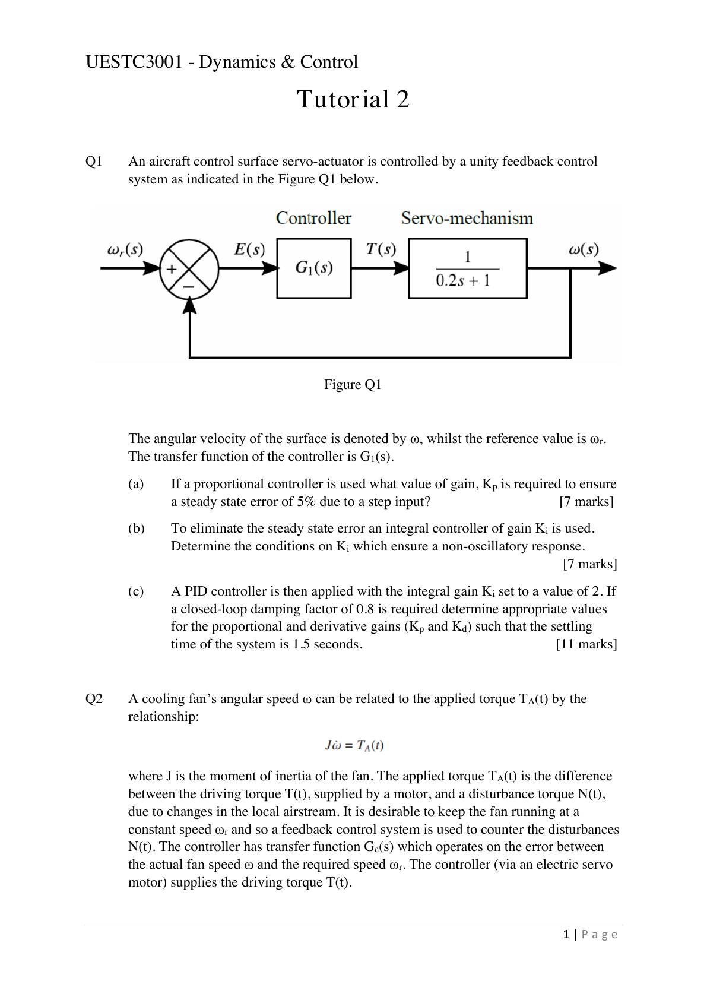
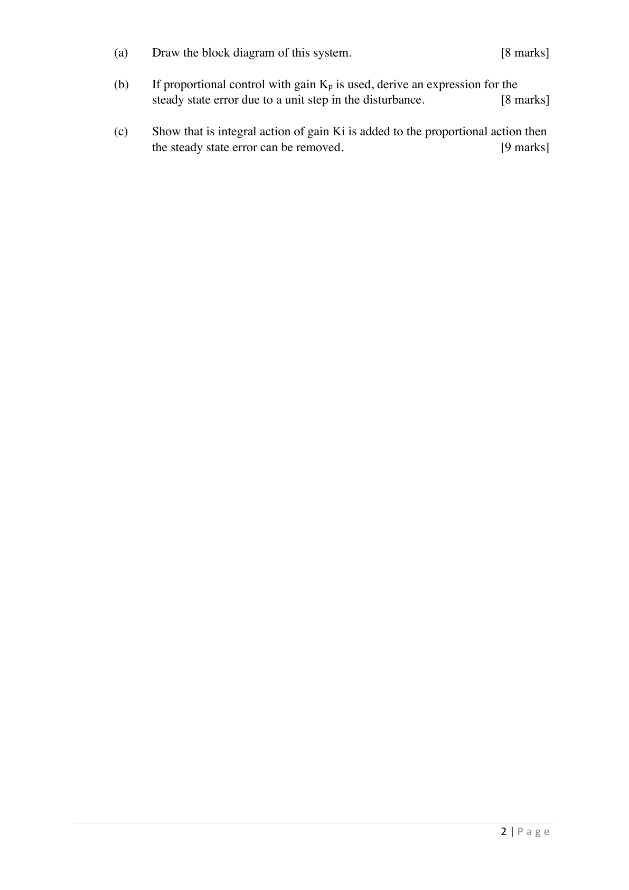

> 题源：`slides/raw/part1/Tutorial and Answers-20260617/Tutorial 2.pdf`。
>
> 这一份对应 [Lec.5](../part.1/lec5.md) 和 [Lec.6](../part.1/lec6.md)：P、I、PI/PID 控制如何影响稳态误差、阻尼比和调节时间。

## Q1 Aircraft Control Surface Servo-actuator

### 做题顺序

Q1(a) 用比例控制器时，核心是用终值定理算 step input 下的 steady-state error。题目要求误差为 `5%`，所以先写出闭环误差传递函数，再令

$$
e_{ss}=0.05
$$

反推 $K_p$。

Q1(b) 换成积分控制后，稳态误差可以被消除，但闭环特征方程阶数提高。题目要求 non-oscillatory response，本质是在要求闭环极点为实极点，或等价地让阻尼比满足非振荡条件。

Q1(c) 给定 $K_i=2$、阻尼比和调节时间，需要把闭环分母整理成标准二阶形式，再用

$$
T_s \approx \frac{4}{\zeta\omega_n}
$$

确定 $\omega_n$，最后匹配系数求 $K_p$ 和 $K_d$。

Q1 解题提醒

这题不要把 $K_p$、$K_i$、$K_d$ 的效果背成口号。考试里真正要做的是：

1. 写出控制器 $G_1(s)$。
2. 写出闭环传递函数或误差传递函数。
3. 对稳态误差使用终值定理。
4. 对瞬态指标使用标准二阶系统参数匹配。

如果最后得到的闭环分母能写成

$$
s^2+2\zeta\omega_ns+\omega_n^2
$$

那么后面的计算就很直接了。

## Q2 Cooling Fan Disturbance Rejection

### 做题顺序

Q2 的重点是 disturbance input。不要只画参考输入 $\omega_r$ 到输出 $\omega$ 的通道，还要把扰动转矩 $N(t)$ 作为另一个输入放进框图。

Q2 解题提醒

风扇动力学可以从转动惯量关系开始写：

$$
J\frac{d\omega}{dt}=T_A(t)=T(t)-N(t)
$$

拉普拉斯域中，被控对象从净转矩到角速度的传递函数是

$$
\frac{\omega(s)}{T_A(s)}=\frac{1}{Js}
$$

Q2(b) 中比例控制只能降低扰动造成的稳态误差，通常不能完全消除。Q2(c) 加入积分作用后，系统类型提高，对 step disturbance 的稳态误差可以被压到零。

这题的关键句可以写成：integral action forces the steady-state error to zero because a persistent error keeps accumulating until the controller output cancels the constant disturbance.

