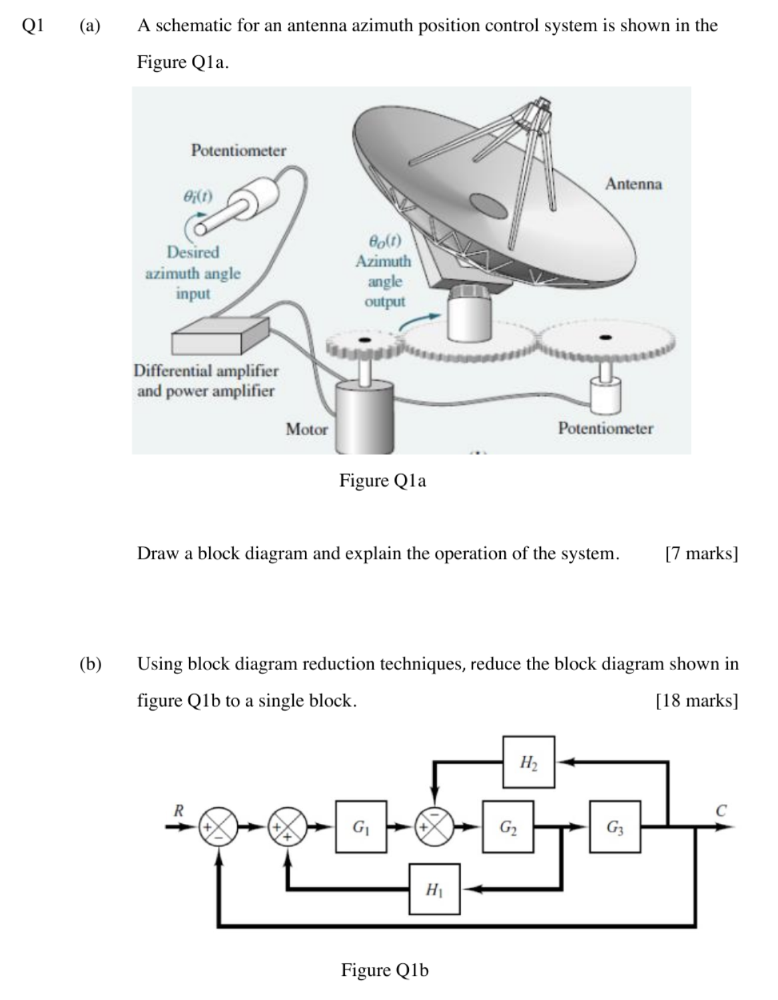
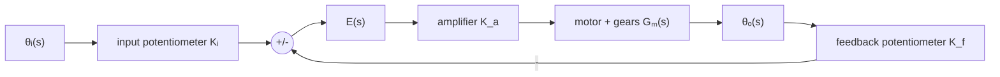
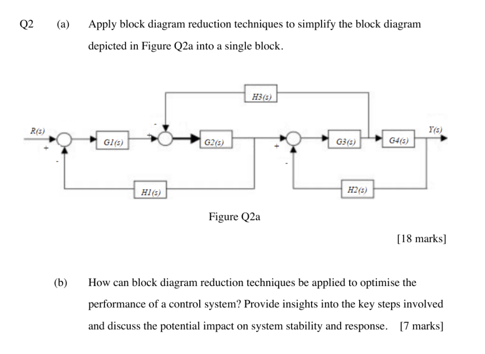

> 题源：Tutorial 1。参考答案与解析将按题目分块整理；若与课堂讲解或官方答案冲突，以课堂讲解或官方答案为准。

## Q1 Antenna Azimuth Position Control

### Q1(a) Block diagram and operation [7 marks]

A schematic for an antenna azimuth position control system is shown in Figure Q1a. Draw a block diagram and explain the operation of the system.

展示参考答案

一个合理的功能框图可以写成：

工作过程如下：输入电位器把期望方位角 $\theta_i(t)$ 转换成参考电压，输出端电位器测量天线实际方位角 $\theta_o(t)$ 并转换成反馈电压。两个电压在比较点相减，得到误差信号 $E(s)$。误差信号经过差动放大器和功率放大器后驱动电机，电机通过齿轮转动天线，直到反馈信号接近参考信号，误差趋近于零。

若把电机和齿轮整体写成 $G_m(s)$，则闭环传递函数为

$$
\frac{\theta_o(s)}{\theta_i(s)}
=
\frac{K_iK_aG_m(s)}{1+K_fK_aG_m(s)}
$$

如果输入和反馈电位器匹配，则通常有 $K_i=K_f$。

### Q1(b) Block diagram reduction [18 marks]

Using block diagram reduction techniques, reduce the block diagram shown in Figure Q1b to a single block.

展示参考答案

设 $G_2$ 后、$G_3$ 前的信号为 $X(s)$。由图中各比较点可写出

$$
\begin{aligned}
E_1(s) &= R(s)-C(s) \\
E_2(s) &= E_1(s)+H_1(s)X(s) \\
E_3(s) &= G_1(s)E_2(s)-H_2(s)C(s) \\
X(s) &= G_2(s)E_3(s) \\
C(s) &= G_3(s)X(s)
\end{aligned}
$$

因为 $X(s)=C(s)/G_3(s)$，代入可得

$$
\frac{C(s)}{G_3(s)}
=
G_2(s)
\left[
G_1(s)\left(R(s)-C(s)+H_1(s)\frac{C(s)}{G_3(s)}\right)
-H_2(s)C(s)
\right]
$$

整理 $C(s)$ 项：

$$
C(s)
\left[
1+G_1G_2G_3-G_1G_2H_1+G_2G_3H_2
\right]
=
G_1G_2G_3R(s)
$$

所以单一等效方框为

$$
\boxed{
\frac{C(s)}{R(s)}
=
\frac{G_1G_2G_3}
{1+G_1G_2G_3-G_1G_2H_1+G_2G_3H_2}
}
$$

其中所有 $G_i$ 和 $H_i$ 都是 $s$ 的函数。

## Q2 Block Diagram Reduction and Design Insight

### Q2(a) Reduce Figure Q2a [18 marks]

Apply block diagram reduction techniques to simplify the block diagram depicted in Figure Q2a into a single block.

展示参考答案

设 $G_2$ 后的信号为 $X(s)$，$G_3$ 后、$G_4$ 前的信号为 $Z(s)$。由图可列出

$$
\begin{aligned}
E_1(s) &= R(s)-H_1(s)X(s) \\
E_2(s) &= G_1(s)E_1(s)-H_3(s)Z(s) \\
X(s) &= G_2(s)E_2(s) \\
E_3(s) &= X(s)-H_2(s)Y(s) \\
Z(s) &= G_3(s)E_3(s) \\
Y(s) &= G_4(s)Z(s)
\end{aligned}
$$

先化简右侧反馈环：

$$
Z(s)=G_3(s)\left[X(s)-H_2(s)G_4(s)Z(s)\right]
$$

因此

$$
Z(s)=\frac{G_3(s)}{1+G_3(s)G_4(s)H_2(s)}X(s)
$$

再代入中间部分：

$$
X(s)=G_2(s)
\left[
G_1(s)\left(R(s)-H_1(s)X(s)\right)-H_3(s)Z(s)
\right]
$$

所以

$$
X(s)
\left[
1+G_1G_2H_1+
\frac{G_2G_3H_3}{1+G_3G_4H_2}
\right]
=G_1G_2R(s)
$$

又因为

$$
Y(s)=G_4(s)Z(s)=\frac{G_3G_4}{1+G_3G_4H_2}X(s)
$$

于是总传递函数为

$$
\boxed{
\frac{Y(s)}{R(s)}
=
\frac{G_1G_2G_3G_4}
{\left(1+G_1G_2H_1\right)\left(1+G_3G_4H_2\right)+G_2G_3H_3}
}
$$

展开分母也可写为

$$
\boxed{
\frac{Y(s)}{R(s)}
=
\frac{G_1G_2G_3G_4}
{1+G_1G_2H_1+G_3G_4H_2+G_1G_2G_3G_4H_1H_2+G_2G_3H_3}
}
$$

### Q2(b) Performance optimisation [7 marks]

How can block diagram reduction techniques be applied to optimise the performance of a control system? Provide insights into the key steps involved and discuss the potential impact on system stability and response.

展示参考答案

方框图化简的作用，是把复杂互连结构等效成一个传递函数，使系统的稳定性和动态性能可以直接从分子、分母中分析。

常用步骤是：

1. 串联方框相乘：$G_{eq}=G_1G_2$。
2. 并联方框相加：$G_{eq}=G_1+G_2$。
3. 反馈环化简：负反馈时

$$
G_{cl}(s)=\frac{G(s)}{1+G(s)H(s)}
$$

4. 必要时移动比较点或分支点，但要保持信号关系不变。
5. 得到最终闭环传递函数，并检查特征方程。

最终分母决定闭环极点，因此直接影响稳定性、阻尼、超调和响应速度；分子决定零点，会影响瞬态响应形状。通过调节控制器参数，可以降低稳态误差、改善调节时间、增加阻尼或增强扰动抑制。但增益过大或反馈结构设计不当，也可能把闭环极点推到右半平面，使系统振荡甚至不稳定。

