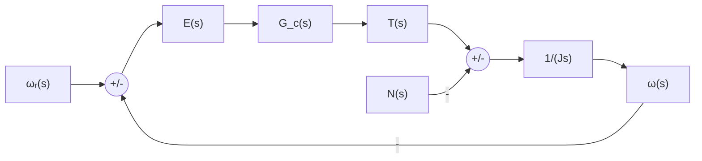

> 题源：Tutorial 2。参考答案与解析将按题目分块整理；若与课堂讲解或官方答案冲突，以课堂讲解或官方答案为准。

## Q1 Aircraft Control Surface Servo-Actuator

The aircraft control surface servo-actuator is controlled by a unity-feedback system. The surface angular velocity is $\omega$, the reference is $\omega_r$, and the controller transfer function is $G_1(s)$.

### Q1(a) Proportional control [7 marks]

If a proportional controller is used, what value of gain $K_p$ is required to ensure a steady-state error of 5% due to a step input?

展示参考答案

被控对象为

$$
G_p(s)=\frac{1}{0.2s+1}
$$

比例控制器为

$$
G_1(s)=K_p
$$

单位负反馈下，闭环传递函数为

$$
\frac{\omega(s)}{\omega_r(s)}
=
\frac{K_pG_p(s)}{1+K_pG_p(s)}
=
\frac{K_p}{0.2s+1+K_p}
$$

误差传递函数为

$$
\frac{E(s)}{\omega_r(s)}
=
\frac{1}{1+K_pG_p(s)}
$$

对单位阶跃输入 $\omega_r(s)=1/s$，由终值定理得

$$
e_{ss}
=
\lim_{s\to 0}sE(s)
=
\frac{1}{1+K_p}
$$

题目要求稳态误差为 $5\%=0.05$：

$$
\frac{1}{1+K_p}=0.05
$$

因此

$$
\boxed{K_p=19}
$$

### Q1(b) Integral control [7 marks]

To eliminate the steady-state error, an integral controller of gain $K_i$ is used. Determine the conditions on $K_i$ which ensure a non-oscillatory response.

展示参考答案

积分控制器为

$$
G_1(s)=\frac{K_i}{s}
$$

开环传递函数为

$$
G_{ol}(s)=\frac{K_i}{s(0.2s+1)}
$$

闭环传递函数为

$$
\frac{\omega(s)}{\omega_r(s)}
=
\frac{K_i}{s(0.2s+1)+K_i}
=
\frac{K_i}{0.2s^2+s+K_i}
$$

特征方程为

$$
0.2s^2+s+K_i=0
$$

两边除以 $0.2$：

$$
s^2+5s+5K_i=0
$$

与标准二阶形式比较：

$$
s^2+2\zeta\omega_ns+\omega_n^2=0
$$

可得

$$
\omega_n^2=5K_i,
\qquad
2\zeta\omega_n=5
$$

非振荡响应要求 $\zeta\ge 1$，所以

$$
\frac{5}{2\sqrt{5K_i}}\ge 1
$$

整理得

$$
25\ge 20K_i
$$

因此

$$
\boxed{0<K_i\le 1.25}
$$

### Q1(c) PID design [11 marks]

A PID controller is applied with $K_i = 2$. If a closed-loop damping factor of 0.8 is required, determine appropriate values for $K_p$ and $K_d$ such that the settling time is 1.5 seconds.

展示参考答案

PID 控制器为

$$
G_1(s)=K_p+\frac{K_i}{s}+K_ds
=
\frac{K_ds^2+K_ps+K_i}{s}
$$

题目给出 $K_i=2$，所以闭环特征方程来自

$$
s(0.2s+1)+K_ds^2+K_ps+2=0
$$

即

$$
(0.2+K_d)s^2+(1+K_p)s+2=0
$$

两边除以 $0.2+K_d$：

$$
s^2+
\frac{1+K_p}{0.2+K_d}s
+
\frac{2}{0.2+K_d}=0
$$

与标准二阶形式比较：

$$
s^2+2\zeta\omega_ns+\omega_n^2=0
$$

题目要求 $\zeta=0.8$，但没有说明 settling time 对应的是 $5\%$ 误差带还是 $2\%$ 误差带。两种常用口径如下。

如果采用 $5\%$ 调节时间近似

$$
t_s\approx \frac{3}{\zeta\omega_n}
$$

则

$$
\omega_n=\frac{3}{0.8\times 1.5}=2.5
$$

于是

$$
\omega_n^2=6.25=\frac{2}{0.2+K_d}
$$

所以

$$
0.2+K_d=0.32
$$

$$
\boxed{K_d=0.12}
$$

又因为

$$
2\zeta\omega_n=2(0.8)(2.5)=4
$$

所以

$$
\frac{1+K_p}{0.2+K_d}=4
$$

代入 $0.2+K_d=0.32$：

$$
1+K_p=1.28
$$

因此

$$
\boxed{K_p=0.28}
$$

则可取

$$
\boxed{K_i=2,\quad K_p=0.28,\quad K_d=0.12}
$$

如果采用 $2\%$ 调节时间近似

$$
t_s\approx \frac{4}{\zeta\omega_n}
$$

则

$$
\omega_n=\frac{4}{0.8\times 1.5}=\frac{10}{3}
$$

于是

$$
\omega_n^2=\frac{100}{9}=\frac{2}{0.2+K_d}
$$

所以

$$
0.2+K_d=0.18
$$

$$
\boxed{K_d=-0.02}
$$

同时

$$
2\zeta\omega_n=2(0.8)\left(\frac{10}{3}\right)=\frac{16}{3}
$$

因此

$$
\frac{1+K_p}{0.2+K_d}=\frac{16}{3}
$$

代入 $0.2+K_d=0.18$：

$$
1+K_p=0.96
$$

$$
\boxed{K_p=-0.04}
$$

所以按 $2\%$ 口径可得

$$
\boxed{K_i=2,\quad K_p=-0.04,\quad K_d=-0.02}
$$

若课堂没有特别说明，一般应在答案中写明采用的 settling-time 误差带；本题按 $5\%$ 口径会得到正的 $K_p$ 与 $K_d$，按 $2\%$ 口径会得到负值。

## Q2 Cooling Fan Speed Control

A cooling fan's angular speed $\omega$ is related to the applied torque $T_A(t)$. The applied torque is the difference between the motor driving torque $T(t)$ and a disturbance torque $N(t)$. A feedback controller $G_c(s)$ is used to keep the fan speed close to $\omega_r$.

### Q2(a) Block diagram [8 marks]

Draw the block diagram of this system.

展示参考答案

风扇动力学为

$$
J\dot{\omega}(t)=T_A(t)
$$

其中

$$
T_A(t)=T(t)-N(t)
$$

零初始条件下拉普拉斯变换为

$$
Js\omega(s)=T_A(s)
$$

所以被控对象为

$$
G_p(s)=\frac{\omega(s)}{T_A(s)}=\frac{1}{Js}
$$

方框图可表示为：

也就是误差信号为

$$
E(s)=\omega_r(s)-\omega(s)
$$

力矩比较点为

$$
T_A(s)=T(s)-N(s)
$$

### Q2(b) Proportional control disturbance error [8 marks]

If proportional control with gain $K_p$ is used, derive an expression for the steady-state error due to a unit step in the disturbance.

展示参考答案

比例控制器为

$$
G_c(s)=K_p
$$

控制力矩为

$$
T(s)=K_p\left[\omega_r(s)-\omega(s)\right]
$$

系统方程为

$$
Js\omega(s)=T(s)-N(s)
$$

代入 $T(s)$：

$$
Js\omega(s)=K_p\omega_r(s)-K_p\omega(s)-N(s)
$$

即

$$
(Js+K_p)\omega(s)=K_p\omega_r(s)-N(s)
$$

求扰动引起的误差时，令 $\omega_r(s)=0$：

$$
\omega(s)=-\frac{1}{Js+K_p}N(s)
$$

由于

$$
E(s)=\omega_r(s)-\omega(s)
$$

所以在 $\omega_r(s)=0$ 时

$$
E(s)=\frac{1}{Js+K_p}N(s)
$$

若扰动为单位阶跃，$N(s)=1/s$，由终值定理

$$
e_{ss}
=
\lim_{s\to 0}sE(s)
=
\lim_{s\to 0}s\frac{1}{Js+K_p}\frac{1}{s}
=
\frac{1}{K_p}
$$

因此

$$
\boxed{e_{ss}=\frac{1}{K_p}}
$$

增大 $K_p$ 可以减小扰动稳态误差，但单纯比例控制不能把它完全消除。

### Q2(c) PI control disturbance rejection [9 marks]

Show that if integral action of gain $K_i$ is added to the proportional action, then the steady-state error can be removed.

展示参考答案

加入积分作用后，控制器为

$$
G_c(s)=K_p+\frac{K_i}{s}
=
\frac{K_ps+K_i}{s}
$$

同样只看扰动响应，令 $\omega_r(s)=0$，则

$$
E(s)=-\omega(s)
$$

系统方程为

$$
Js\omega(s)=G_c(s)E(s)-N(s)
$$

代入 $E(s)=-\omega(s)$：

$$
Js\omega(s)=-G_c(s)\omega(s)-N(s)
$$

所以

$$
\left[Js+G_c(s)\right]\omega(s)=-N(s)
$$

误差为

$$
E(s)=-\omega(s)=\frac{N(s)}{Js+G_c(s)}
$$

代入 $G_c(s)=(K_ps+K_i)/s$：

$$
E(s)=
\frac{N(s)}{Js+\frac{K_ps+K_i}{s}}
=
\frac{sN(s)}{Js^2+K_ps+K_i}
$$

对单位阶跃扰动 $N(s)=1/s$：

$$
E(s)=\frac{1}{Js^2+K_ps+K_i}
$$

由终值定理

$$
e_{ss}
=
\lim_{s\to 0}sE(s)
=
\lim_{s\to 0}\frac{s}{Js^2+K_ps+K_i}
=0
$$

因此积分作用可以消除单位阶跃扰动造成的稳态误差：

$$
\boxed{e_{ss}=0}
$$

