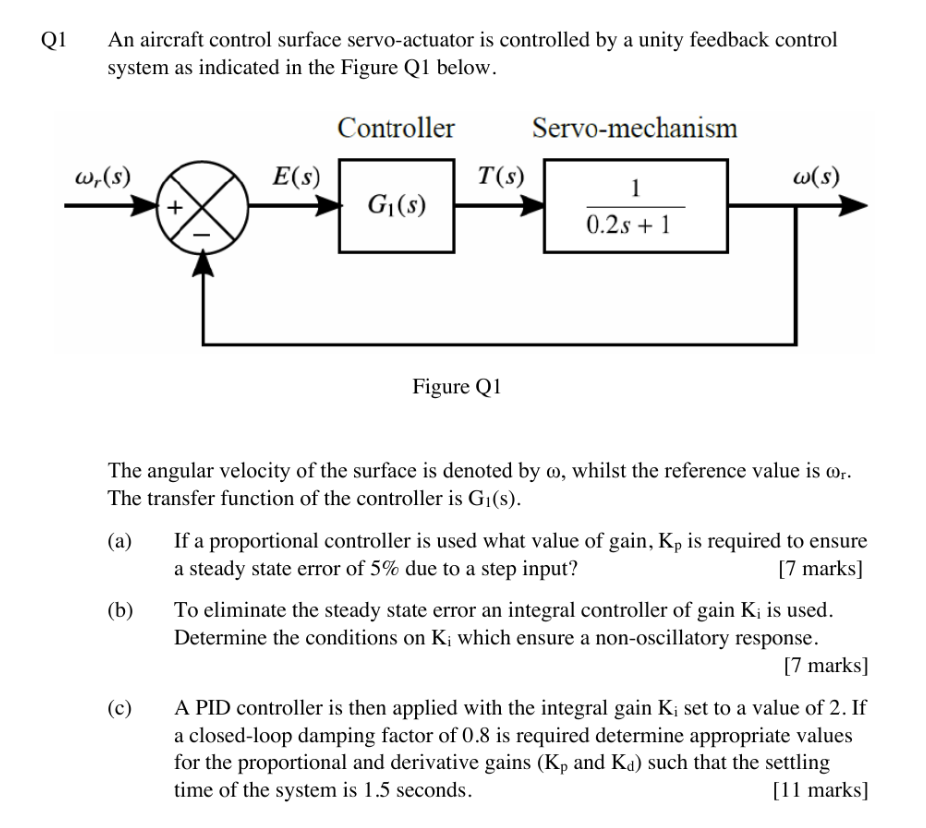
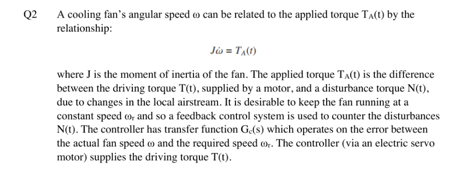
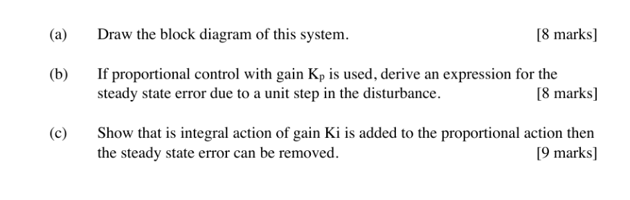

> 题源：Tutorial 2。参考答案与解析将按题目分块整理；若与课堂讲解或官方答案冲突，以课堂讲解或官方答案为准。

## Q1 Aircraft Control Surface Servo-Actuator

The aircraft control surface servo-actuator is controlled by a unity-feedback system. The surface angular velocity is $\omega$, the reference is $\omega_r$, and the controller transfer function is $G_1(s)$.

### Q1(a) Proportional control [7 marks]

If a proportional controller is used, what value of gain $K_p$ is required to ensure a steady-state error of 5% due to a step input?

展示参考答案

<!-- answer: Q1(a) -->

### Q1(b) Integral control [7 marks]

To eliminate the steady-state error, an integral controller of gain $K_i$ is used. Determine the conditions on $K_i$ which ensure a non-oscillatory response.

展示参考答案

<!-- answer: Q1(b) -->

### Q1(c) PID design [11 marks]

A PID controller is applied with $K_i = 2$. If a closed-loop damping factor of 0.8 is required, determine appropriate values for $K_p$ and $K_d$ such that the settling time is 1.5 seconds.

展示参考答案

<!-- answer: Q1(c) -->

## Q2 Cooling Fan Speed Control

A cooling fan's angular speed $\omega$ is related to the applied torque $T_A(t)$. The applied torque is the difference between the motor driving torque $T(t)$ and a disturbance torque $N(t)$. A feedback controller $G_c(s)$ is used to keep the fan speed close to $\omega_r$.

### Q2(a) Block diagram [8 marks]

Draw the block diagram of this system.

展示参考答案

<!-- answer: Q2(a) -->

### Q2(b) Proportional control disturbance error [8 marks]

If proportional control with gain $K_p$ is used, derive an expression for the steady-state error due to a unit step in the disturbance.

展示参考答案

<!-- answer: Q2(b) -->

### Q2(c) PI control disturbance rejection [9 marks]

Show that if integral action of gain $K_i$ is added to the proportional action, then the steady-state error can be removed.

展示参考答案

<!-- answer: Q2(c) -->

