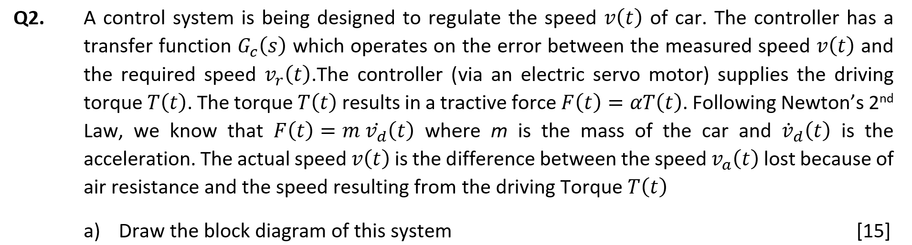
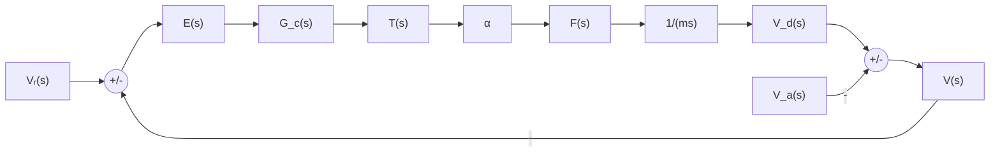
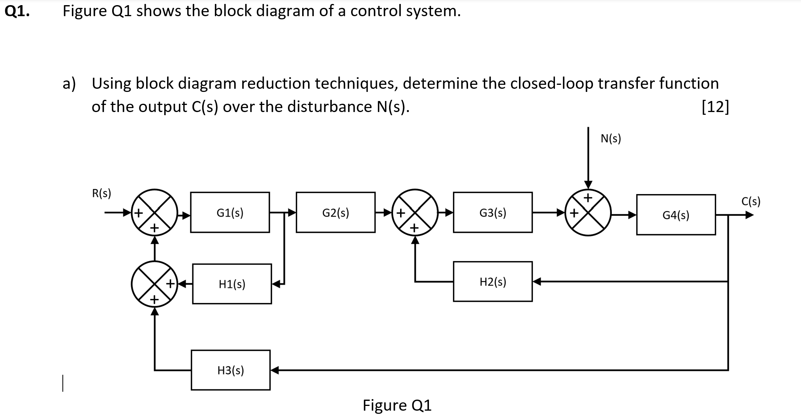
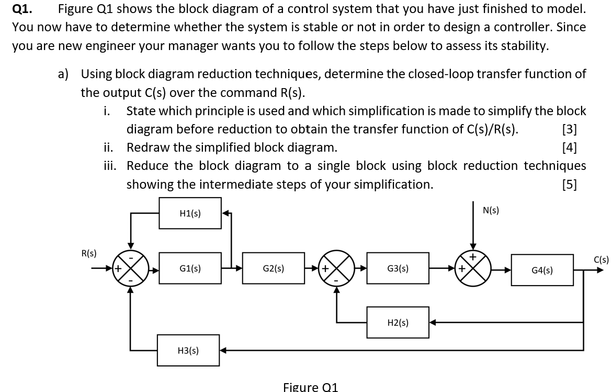
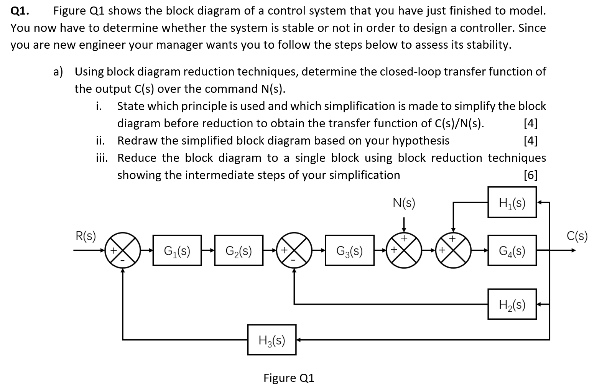
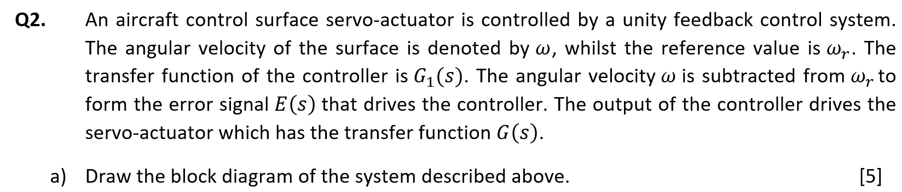
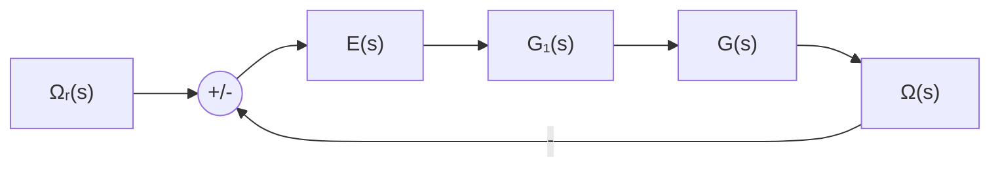
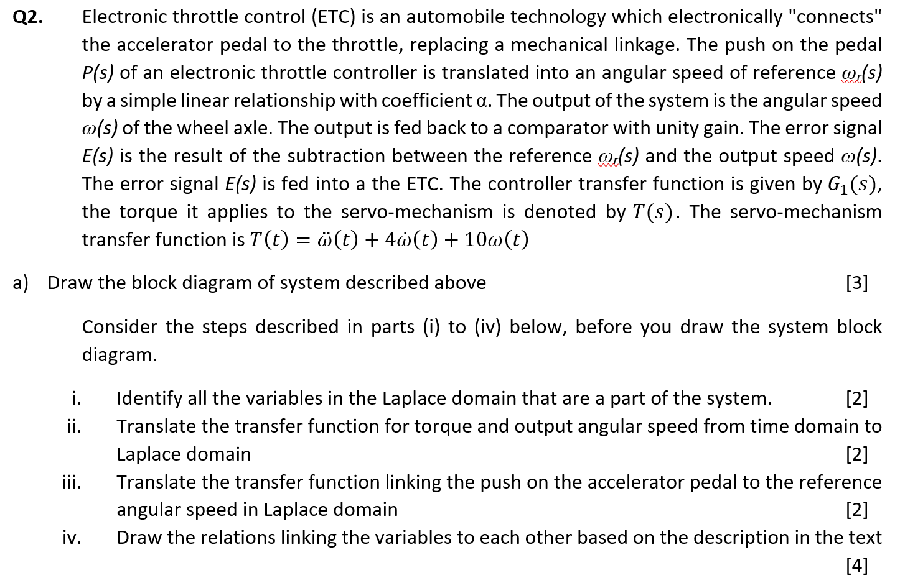
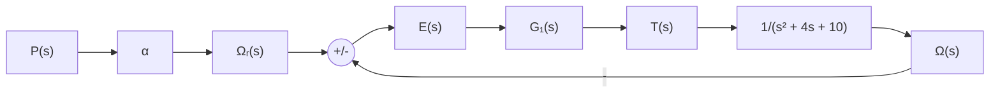

> 题源：Tutorial Extra。参考答案与解析将按题目分块整理；若与课堂讲解或官方答案冲突，以课堂讲解或官方答案为准。

## Extra Exercise 1

展示参考答案

这是一个车速控制系统。参考速度和实际速度比较后得到误差，控制器根据误差输出驱动力矩，力矩经传动比例变成驱动力，车辆动力学再把力转换成速度。空气/坡度等扰动速度在输出端相减。

对应关系为

$$
E(s)=V_r(s)-V(s)
$$

$$
T(s)=G_c(s)E(s)
$$

$$
F(s)=\alpha T(s)
$$

$$
V_d(s)=\frac{F(s)}{ms}=\frac{\alpha T(s)}{ms}
$$

$$
V(s)=V_d(s)-V_a(s)
$$

## Extra Exercise 2

展示参考答案

题目要求扰动传递函数 $C(s)/N(s)$。使用叠加原理，求扰动通道时令 $R(s)=0$。

设 $G_1$ 后的信号为 $Y(s)$，由图可写为

$$
Y=G_1(R+H_1Y+H_3C)
$$

输出端关系为

$$
C=G_4\left[G_3(G_2Y+H_2C)+N\right]
$$

令 $R=0$ 后整理，可得

$$
\boxed{
\frac{C(s)}{N(s)}
=
\frac{G_4(1-G_1H_1)}
{(1-G_1H_1)(1-G_3G_4H_2)-G_1G_2G_3G_4H_3}
}
$$

其中所有 $G_i$、$H_i$ 都表示 $s$ 的函数。

## Extra Exercise 3

展示参考答案

题目要求参考输入到输出的传递函数 $C(s)/R(s)$。使用叠加原理，令扰动 $N(s)=0$。

先看 $G_1$ 与 $H_1$ 形成的局部反馈：

$$
G_{1,eq}=\frac{G_1}{1+G_1H_1}
$$

右侧输出反馈也参与最终闭环。整理后得到

$$
\boxed{
\frac{C(s)}{R(s)}
=
\frac{G_1G_2G_3G_4}
{(1+G_1H_1)(1+G_3G_4H_2)+G_1G_2G_3G_4H_3}
}
$$

展开分母为

$$
\boxed{
\frac{C(s)}{R(s)}
=
\frac{G_1G_2G_3G_4}
{1+G_1H_1+G_3G_4H_2+G_1G_3G_4H_1H_2+G_1G_2G_3G_4H_3}
}
$$

## Extra Exercise 4

展示参考答案

题目要求扰动传递函数 $C(s)/N(s)$。使用叠加原理，令 $R(s)=0$。

从图中信号关系可写成

$$
C
=
G_4\left[
G_3\left(G_1G_2(R-H_3C)-H_2C\right)+N+H_1C
\right]
$$

令 $R=0$ 后整理 $C$ 与 $N$ 的关系：

$$
C
=
G_4\left[-G_1G_2G_3H_3C-G_3H_2C+N+H_1C\right]
$$

因此

$$
C\left(1-G_4H_1+G_3G_4H_2+G_1G_2G_3G_4H_3\right)=G_4N
$$

所以

$$
\boxed{
\frac{C(s)}{N(s)}
=
\frac{G_4}
{1-G_4H_1+G_3G_4H_2+G_1G_2G_3G_4H_3}
}
$$

## Extra Exercise 5

展示参考答案

这是单位负反馈的控制面伺服系统。参考角速度与实际角速度比较，误差进入控制器，再驱动伺服机构。

若伺服机构传递函数写作 $G(s)$，则闭环传递函数为

$$
\boxed{
\frac{\Omega(s)}{\Omega_r(s)}
=
\frac{G_1(s)G(s)}{1+G_1(s)G(s)}
}
$$

## Extra Exercise 6

展示参考答案

题中变量可以写成拉普拉斯域形式：

$$
P(s),\quad \Omega_r(s),\quad E(s),\quad T(s),\quad \Omega(s)
$$

伺服机构方程为

$$
T(t)=\ddot{\omega}(t)+4\dot{\omega}(t)+10\omega(t)
$$

零初始条件下取拉普拉斯变换：

$$
T(s)=(s^2+4s+10)\Omega(s)
$$

所以伺服机构传递函数为

$$
\boxed{
\frac{\Omega(s)}{T(s)}
=
\frac{1}{s^2+4s+10}
}
$$

踏板输入到参考角速度的关系为

$$
\boxed{\Omega_r(s)=\alpha P(s)}
$$

完整方框图可写为

因此从踏板输入到角速度输出的闭环传递函数为

$$
\boxed{
\frac{\Omega(s)}{P(s)}
=
\frac{\alpha G_1(s)}{s^2+4s+10+G_1(s)}
}
$$

