## Worked Example 1: Nyquist Encirclement

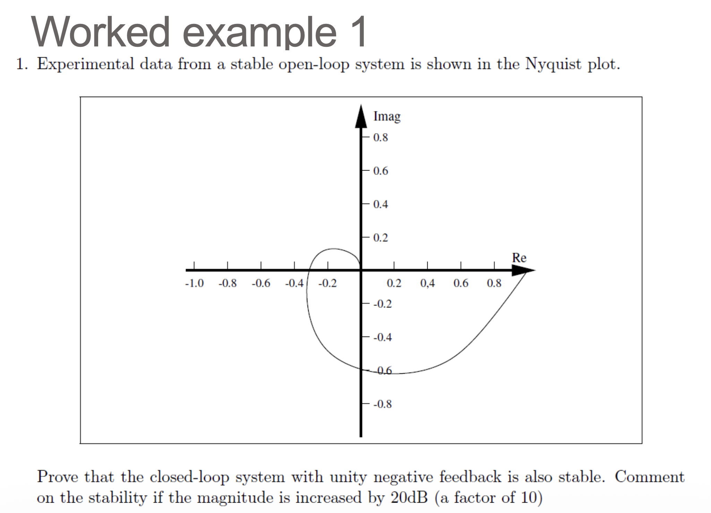

展示参考答案

开环系统稳定，因此 $P=0$。对单位负反馈系统，闭环稳定要求 $G(j\omega)$ 的 Nyquist 图对 $-1$ 没有净环绕，因此 $Z=0$。

从图中可见，原轨迹不包围 $-1$，所以闭环系统稳定。若幅值增加 $20\,\mathrm{dB}$，Nyquist 轨迹等效为绕原点放大 $10$ 倍；放大后的轨迹会包围 $-1$，因此闭环系统变为不稳定。

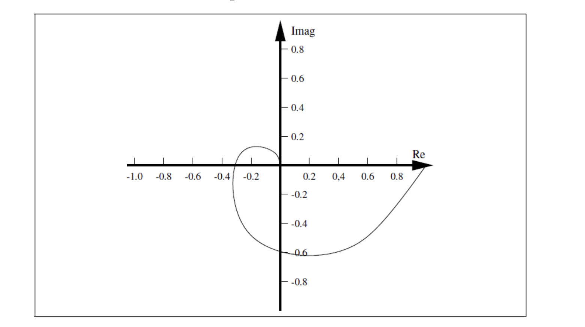

## Worked Example 2: Open-Loop Transfer Function

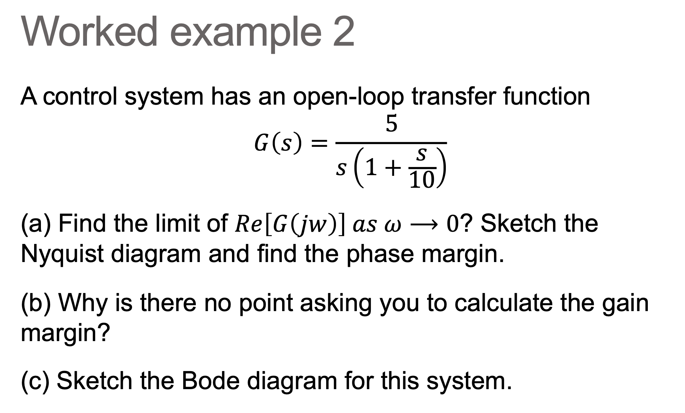

展示参考答案

令 $s=j\omega$，有

$$
G(j\omega)=\frac{5}{j\omega(1+j\omega/10)}
=\frac{5}{-\omega^2/10+j\omega}.
$$

因此

$$
\Re\{G(j\omega)\}=\frac{-1/2}{1+\omega^2/100},
\qquad
\Im\{G(j\omega)\}=\frac{-5/\omega}{1+\omega^2/100},
$$

所以

$$
\lim_{\omega\to 0}\Re\{G(j\omega)\}=-0.5.
$$

Bode 形式为

$$
|G(j\omega)|=\frac{5}{\omega\sqrt{1+(\omega/10)^2}},
\qquad
\angle G(j\omega)=-90^\circ-\tan^{-1}(\omega/10).
$$

在 $|G|=1$ 时，$\omega_{gc}\approx4.55\,\mathrm{rad\,s^{-1}}$，所以

$$
PM=180^\circ+\angle G(j\omega_{gc})\approx 65.5^\circ.
$$

没有有限频率处的 $-180^\circ$ 相位交越点，因此增益裕度为无穷大。

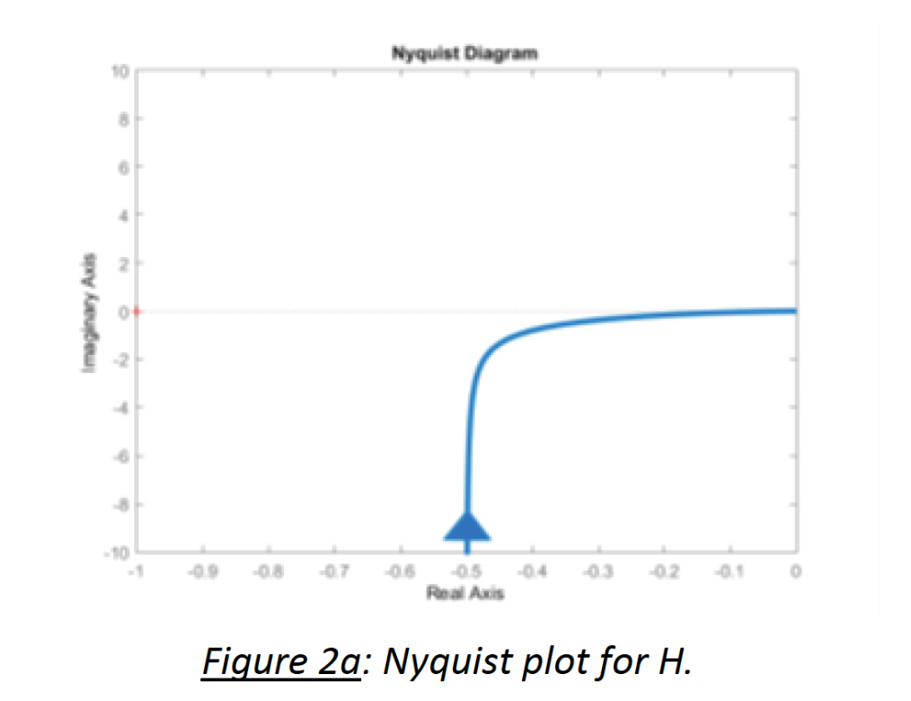

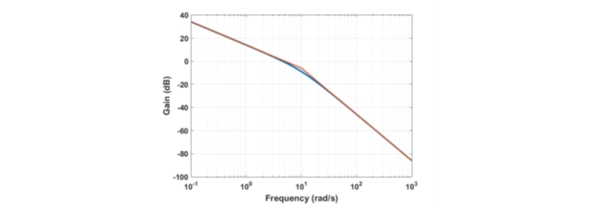

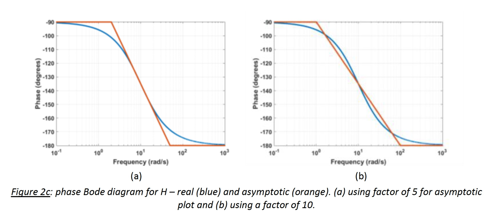

## Worked Example 3: Nyquist Criterion, Gain Margin, Phase Margin

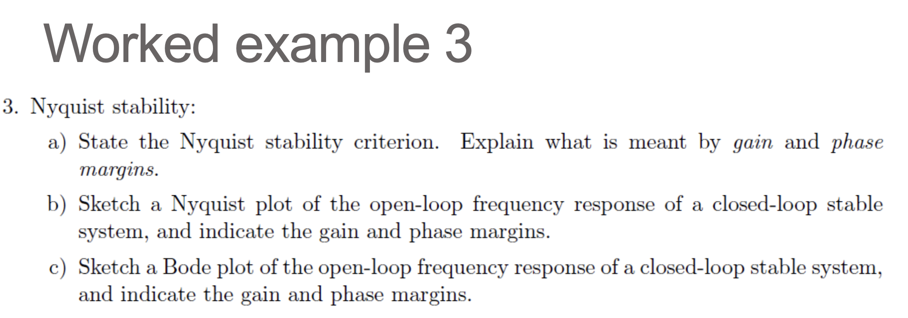

展示参考答案

Nyquist 判据：设 $P$ 为开环右半平面极点数，$Z$ 为闭环右半平面极点数，$N$ 为 $G(s)H(s)$ 的 Nyquist 图对 $-1$ 的净顺时针环绕次数，则

$$
N=Z-P.
$$

闭环稳定要求 $Z=0$。若开环没有不稳定极点，即 $P=0$，则 Nyquist 图不能环绕 $-1$。

增益裕度是在相位交越频率 $\omega_{pc}$ 处，开环增益还能被放大的倍数；再放大到该倍数时，Nyquist 图将经过 $-1$：

$$
GM=\frac{1}{|G(j\omega_{pc})|},
\qquad \angle G(j\omega_{pc})=-180^\circ.
$$

相位裕度是在增益交越频率 $\omega_{gc}$ 处，到达 $-180^\circ$ 之前还可以增加的相位滞后：

$$
PM=180^\circ+\angle G(j\omega_{gc}),
\qquad |G(j\omega_{gc})|=1.
$$

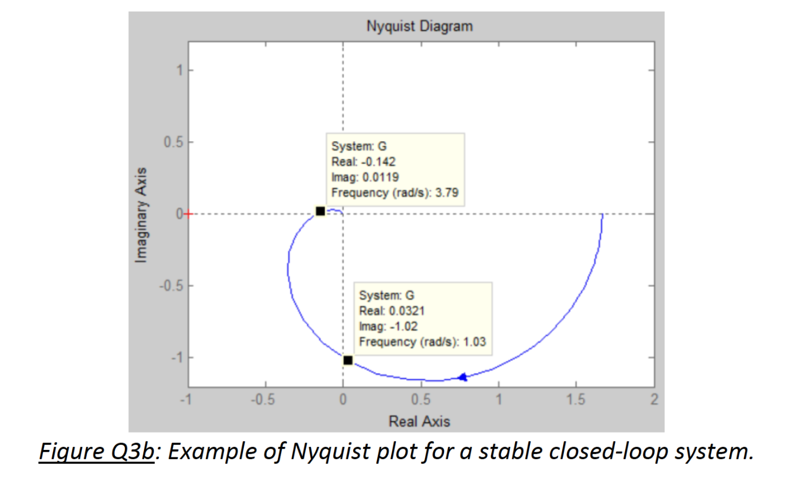

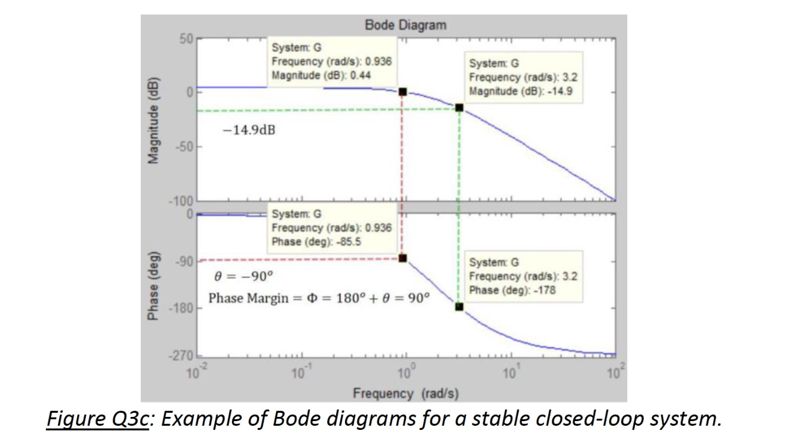

## Worked Example 4: Polar Locus And Gain Margin

本题开环传递函数为

$$
G(s)=\frac{1}{s(s+2)^2}.
$$

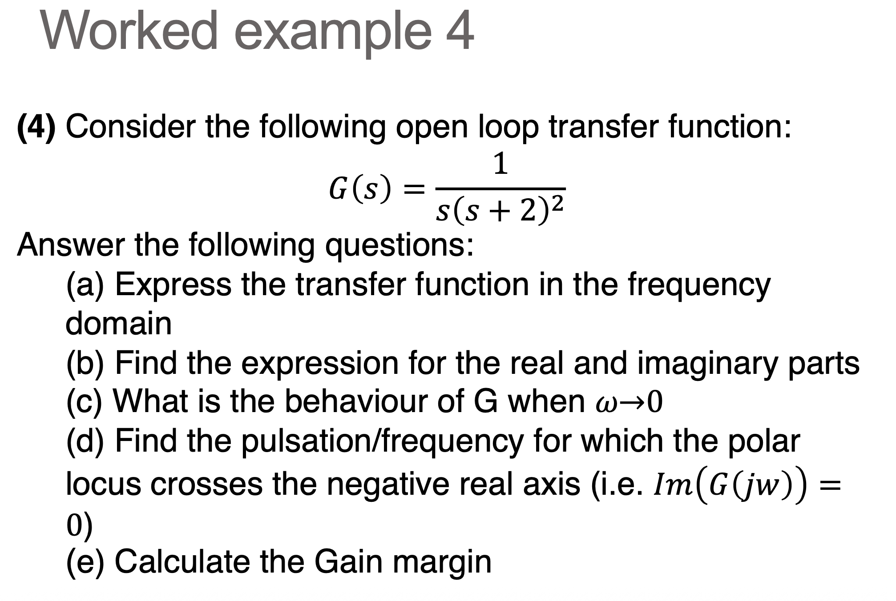

展示参考答案

GPT-5.5 生成。

在频域中，

$$
G(j\omega)=\frac{1}{j\omega(2+j\omega)^2}
=\frac{1}{-4\omega^2+j\omega(4-\omega^2)}.
$$

因此

$$
\Re\{G(j\omega)\}=\frac{-4}{(\omega^2+4)^2},
\qquad
\Im\{G(j\omega)\}=\frac{\omega^2-4}{\omega(\omega^2+4)^2}.
$$

当 $\omega\to0$ 时，

$$
\Re\{G(j\omega)\}\to -\frac14,
\qquad
\Im\{G(j\omega)\}\to -\infty,
$$

所以低频 Nyquist 分支从下方趋近于 $\Re=-0.25$ 这条竖直渐近线。

负实轴交点由下式给出：

$$
\Im\{G(j\omega)\}=0
\quad\Rightarrow\quad
\omega^2-4=0
\quad\Rightarrow\quad
\omega=2\,\mathrm{rad\,s^{-1}}.
$$

在该频率处，

$$
G(j2)=\frac{-4}{(2^2+4)^2}=-\frac{1}{16}.
$$

因此增益裕度为

$$
GM=16\approx24.1\,\mathrm{dB}.
$$

## Worked Example 5: Nyquist Stability Predictions

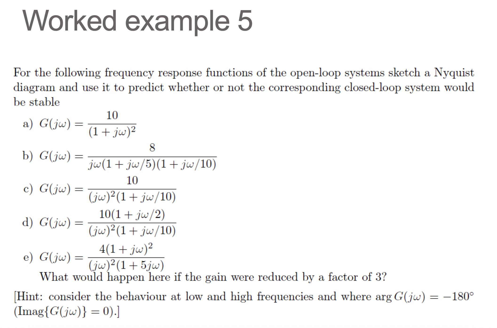

展示参考答案

对虚轴上的极点采用通常的小半圆绕行。闭环稳定性结论如下：

| Part | Open-loop frequency response | Closed-loop prediction |
| --- | --- | --- |
| a | $\dfrac{10}{(1+j\omega)^2}$ | 稳定。官方结果。 |
| b | $\dfrac{8}{j\omega(1+j\omega/5)(1+j\omega/10)}$ | 稳定。GPT-5.5 生成。 |
| c | $\dfrac{10}{(j\omega)^2(1+j\omega/10)}$ | 不稳定。GPT-5.5 生成。 |
| d | $\dfrac{10(1+j\omega/2)}{(j\omega)^2(1+j\omega/10)}$ | 稳定。GPT-5.5 生成。 |
| e | $\dfrac{4(1+j\omega)^2}{(j\omega)^2(1+5j\omega)}$ | 原增益下稳定；增益除以 $3$ 后不稳定。GPT-5.5 生成。 |

对 (a)，Nyquist 图不环绕 $-1$：

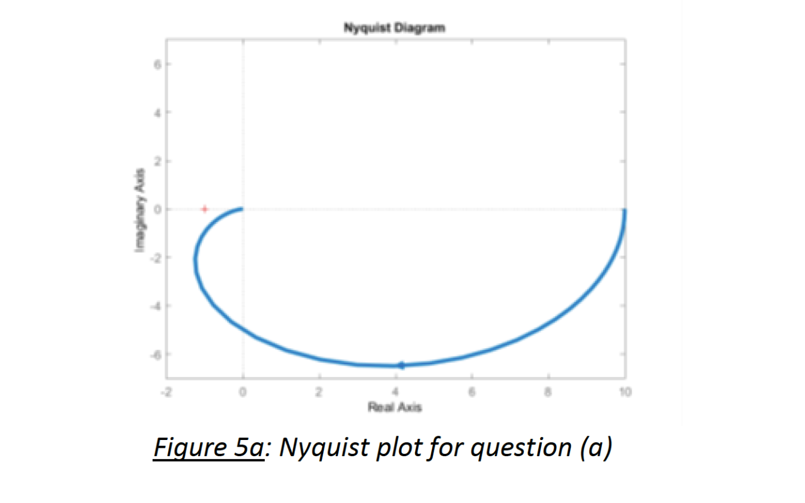

对 (b)-(e)，可用单位负反馈特征方程作简洁复核：

| 小问 | 特征多项式 | Routh/Nyquist 结论 |
| --- | --- | --- |
| b | $s^3+15s^2+50s+400$ | 第一列全正，因此稳定。 |
| c | $s^3+10s^2+100$ | Routh 表出现符号变化，因此不稳定。 |
| d | $s^3+10s^2+50s+100$ | 第一列全正，因此稳定。 |
| e | $5s^3+5s^2+8s+4$ | 第一列全正，因此稳定。 |
| e，增益 $/3$ | $5s^3+\dfrac{7}{3}s^2+\dfrac{8}{3}s+\dfrac{4}{3}$ | Routh 表出现符号变化，因此不稳定。 |

## Worked Example 6: Bode Stability Predictions

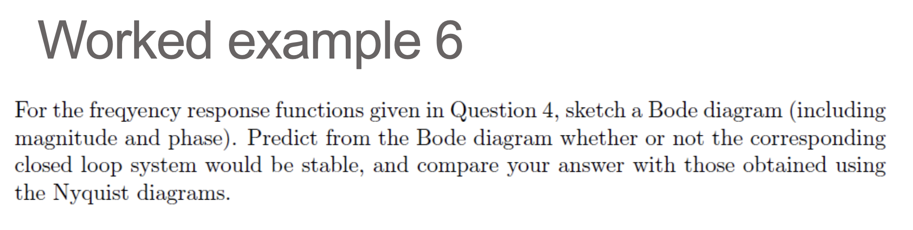

展示参考答案

Bode 图预测与 Worked Example 5 的 Nyquist 结论一致。

对 (a)，官方 Bode 图给出正相位裕度和无穷大增益裕度：

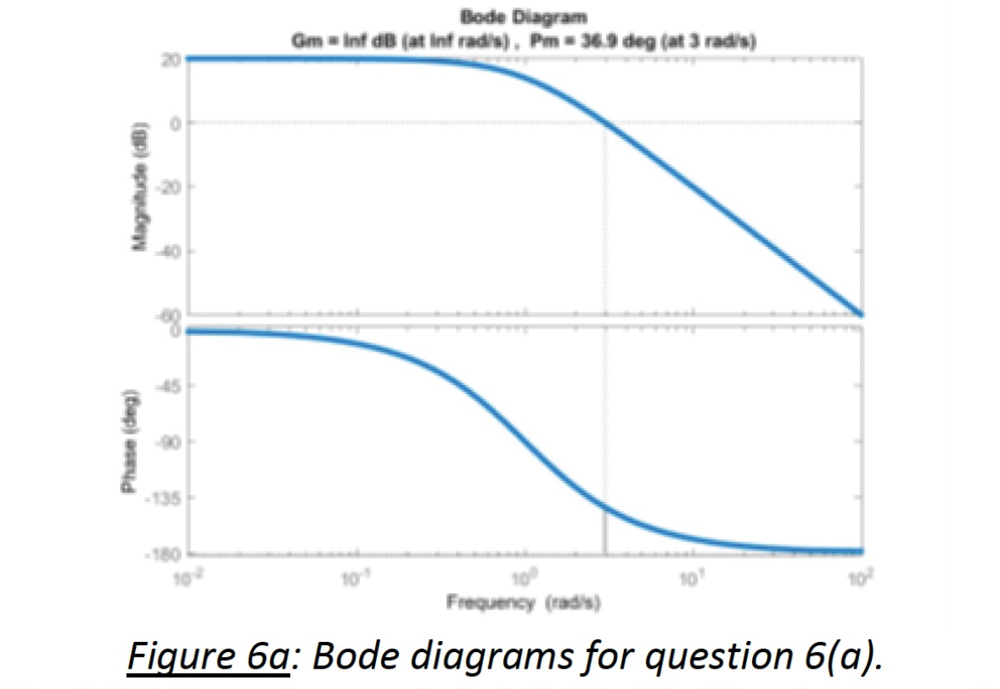

其余裕度数值如下：

| 小问 | $\omega_{gc}$ | 相位裕度 | 增益裕度 | 闭环预测 |
| --- | ---: | ---: | ---: | --- |
| a | $3.000$ | $36.9^\circ$ | $\infty$ | 稳定。官方结果。 |
| b | $5.035$ | $18.1^\circ$ | $1.875\;(5.46\,\mathrm{dB})$ | 稳定。GPT-5.5 生成。 |
| c | $3.091$ | $-17.2^\circ$ | $0$ | 不稳定。GPT-5.5 生成。 |
| d | $4.862$ | $41.7^\circ$ | $\infty$ | 稳定。GPT-5.5 生成。 |
| e | $1.276$ | $22.7^\circ$ | $0.375\;(-8.52\,\mathrm{dB})$ | 原增益下稳定；增益除以 $3$ 后不稳定。GPT-5.5 生成。 |

对 (e)，负 dB 增益裕度表示原系统是条件稳定的：临界增益因子为 $0.375$，而 $1/3<0.375$，所以把增益降为原来的三分之一会越过稳定边界。

## Worked Example 7A: Time Delay Stability Limit

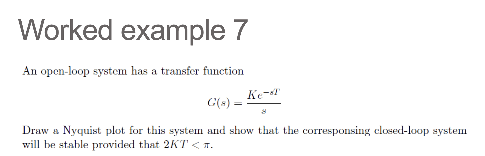

展示参考答案

GPT-5.5 生成。

对于

$$
G(s)=\frac{Ke^{-sT}}{s},
$$

频率响应为

$$
G(j\omega)=\frac{K}{\omega}e^{-j(\pi/2+\omega T)}.
$$

Nyquist 图到达负实轴的条件为

$$
\frac{\pi}{2}+\omega T=\pi
\quad\Rightarrow\quad
\omega=\frac{\pi}{2T}.
$$

在该交点处，

$$
|G(j\omega)|=\frac{K}{\omega}
=\frac{2KT}{\pi}.
$$

为了避免轨迹经过或越过 $-1$，该处幅值必须小于 $1$：

$$
\frac{2KT}{\pi}<1
\quad\Rightarrow\quad
2KT<\pi.
$$

等价地，在增益交越频率 $\omega=K$ 处，相位裕度为 $\pi/2-KT$，因此稳定要求 $KT<\pi/2$。

## Worked Example 7B: Choosing Gain From Margins

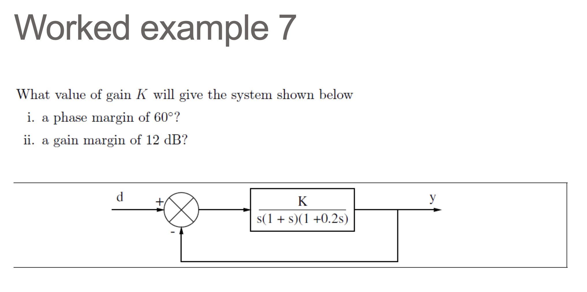

展示参考答案

GPT-5.5 生成。

环路传递函数为

$$
L(s)=\frac{K}{s(1+s)(1+0.2s)}.
$$

对单位增益部分 $L_0(s)=L(s)/K$，有

$$
|L_0(j\omega)|=\frac{1}{\omega\sqrt{1+\omega^2}\sqrt{1+0.04\omega^2}},
$$

$$
\angle L_0(j\omega)=-90^\circ-\tan^{-1}\omega-\tan^{-1}(0.2\omega).
$$

若相位裕度为 $60^\circ$，则增益交越处相位必须为 $-120^\circ$：

$$
\tan^{-1}\omega+\tan^{-1}(0.2\omega)=30^\circ.
$$

由此得 $\omega_{gc}\approx0.4607\,\mathrm{rad\,s^{-1}}$，因此

$$
K=\frac{1}{|L_0(j\omega_{gc})|}\approx0.5094.
$$

若增益裕度为 $12\,\mathrm{dB}$，相位交越满足

$$
\tan^{-1}\omega+\tan^{-1}(0.2\omega)=90^\circ
\quad\Rightarrow\quad
\omega_{pc}=\sqrt{5}.
$$

在 $\omega_{pc}$ 处，$|L_0(j\omega_{pc})|=1/6$。由于 $12\,\mathrm{dB}$ 对应倍数 $10^{12/20}\approx3.981$，

$$
GM=\frac{1}{K|L_0(j\omega_{pc})|}=3.981
\quad\Rightarrow\quad
K\approx1.507.
$$

