> 题源：Part.2 Worked Examples。题目截图保留在各题下方；参考答案由 GPT-5.5 生成。

## Worked Example 1

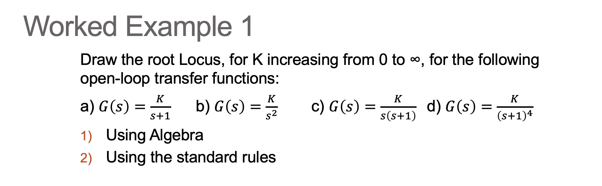

展示参考答案

> GPT-5.5 生成。

以下均按单位负反馈理解，特征方程为 $1+G(s)=0$。

### (a) First-order pole

$$
G(s)=\frac{K}{s+1}
$$

特征方程为

$$
s+1+K=0
$$

所以闭环极点为

$$
s=-(1+K)
$$

根轨迹从开环极点 $-1$ 出发，沿实轴向左移动到 $-\infty$。对所有 $K>0$，闭环极点位于左半平面，系统稳定。

### (b) Double pole at the origin

$$
G(s)=\frac{K}{s^2}
$$

特征方程为

$$
s^2+K=0
$$

所以

$$
s=\pm j\sqrt{K}
$$

两个分支从原点二重极点出发，分别沿正、负虚轴移动。对所有 $K>0$，闭环极点在虚轴上，系统为临界稳定，不是渐近稳定。

### (c) Two real poles

$$
G(s)=\frac{K}{s(s+1)}
$$

特征方程为

$$
s(s+1)+K=0
$$

即

$$
s^2+s+K=0
$$

开环极点为 $0$ 与 $-1$。实轴根轨迹位于 $(-1,0)$，在

$$
s=-\frac{1}{2}
$$

处重合并离开实轴，此时 $K=1/4$。之后两支沿过 $-1/2$ 的竖直渐近线趋向无穷远，渐近线角度为 $90^\circ$ 与 $270^\circ$。对所有 $K>0$，闭环极点均在左半平面，系统稳定。

### (d) Four repeated poles

$$
G(s)=\frac{K}{(s+1)^4}
$$

特征方程为

$$
(s+1)^4+K=0
$$

根轨迹从 $s=-1$ 的四重极点出发。无有限零点，因此四条渐近线的交点为

$$
\sigma_a=-1
$$

渐近线角度为

$$
45^\circ,\quad 135^\circ,\quad 225^\circ,\quad 315^\circ
$$

虚轴穿越点由 $s=j\omega$ 代入得到：当 $\omega=1$ 时，

$$
(1+j)^4=-4
$$

因此穿越发生在

$$
s=\pm j,\qquad K=4
$$

所以闭环系统在

$$
\boxed{0<K<4}
$$

时稳定；$K=4$ 时临界稳定；$K>4$ 时有极点进入右半平面，系统不稳定。

## Worked Example 2

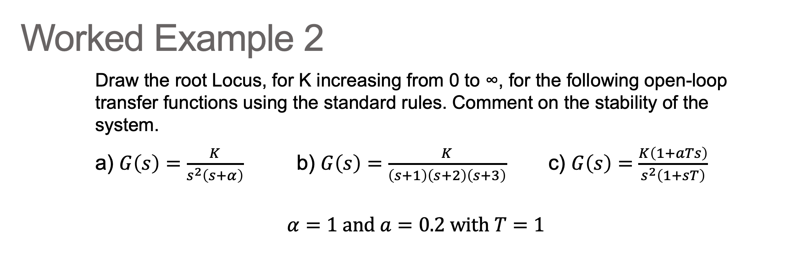

展示参考答案

> GPT-5.5 生成。

题图给出 $\alpha=1$，且 $a=0.2$、$T=1$。

### (a) Double origin pole with one real pole

$$
G(s)=\frac{K}{s^2(s+\alpha)},\qquad \alpha=1
$$

特征方程为

$$
s^2(s+1)+K=0
$$

即

$$
s^3+s^2+K=0
$$

Routh 表第一列为

$$
1,\quad 1,\quad -K,\quad K
$$

对任意 $K>0$，第一列出现符号变化，因此闭环系统对所有正增益均不稳定。

### (b) Three real poles

$$
G(s)=\frac{K}{(s+1)(s+2)(s+3)}
$$

特征方程为

$$
(s+1)(s+2)(s+3)+K=0
$$

即

$$
s^3+6s^2+11s+(6+K)=0
$$

Routh 表中 $s^1$ 行首项为

$$
\frac{6\cdot 11-(6+K)}{6}=\frac{60-K}{6}
$$

因此稳定条件为

$$
\boxed{0<K<60}
$$

当 $K=60$ 时，辅助方程来自 $s^2$ 行：

$$
6s^2+66=0
$$

所以根轨迹穿越虚轴于

$$
\boxed{s=\pm j\sqrt{11}}
$$

### (c) Double origin pole with one zero

$$
G(s)=\frac{K(1+0.2s)}{s^2(1+s)}
$$

特征方程为

$$
s^2(1+s)+K(1+0.2s)=0
$$

即

$$
s^3+s^2+0.2Ks+K=0
$$

Routh 表第一列为

$$
1,\quad 1,\quad -0.8K,\quad K
$$

对任意 $K>0$，第一列出现符号变化，因此闭环系统对所有正增益均不稳定。

此系统有开环极点 $0,0,-1$，有限零点 $-5$。两条渐近线的交点为

$$
\sigma_a=\frac{(0+0-1)-(-5)}{3-1}=2
$$

因此渐近线通过右半平面 $\operatorname{Re}(s)=2$，这也解释了系统对正增益不稳定。

## Worked Example 3

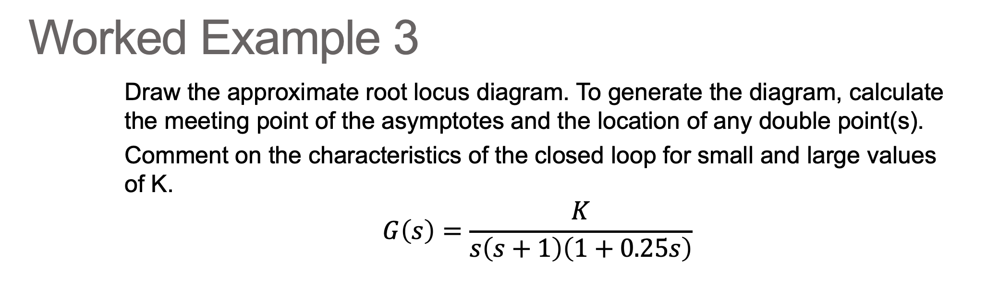

展示参考答案

> GPT-5.5 生成。

开环传递函数为

$$
G(s)=\frac{K}{s(s+1)(1+0.25s)}
$$

开环极点为

$$
0,\quad -1,\quad -4
$$

无有限零点。三条渐近线的交点为

$$
\sigma_a=\frac{0-1-4}{3}=-\frac{5}{3}
$$

渐近线角度为

$$
60^\circ,\quad 180^\circ,\quad 300^\circ
$$

实轴根轨迹位于 $(-1,0)$ 与 $(-\infty,-4)$。用等效分母

$$
D(s)=s(s+1)(s+4)
$$

求重合点。由 $K_e=-D(s)$，令 $dK_e/ds=0$：

$$
3s^2+10s+4=0
$$

得到

$$
s=\frac{-5\pm\sqrt{13}}{3}
$$

数值为

$$
s\approx -0.4648,\quad -2.8685
$$

其中只有 $-0.4648$ 位于实轴根轨迹段 $(-1,0)$ 上，因此它是有效 breakaway point。

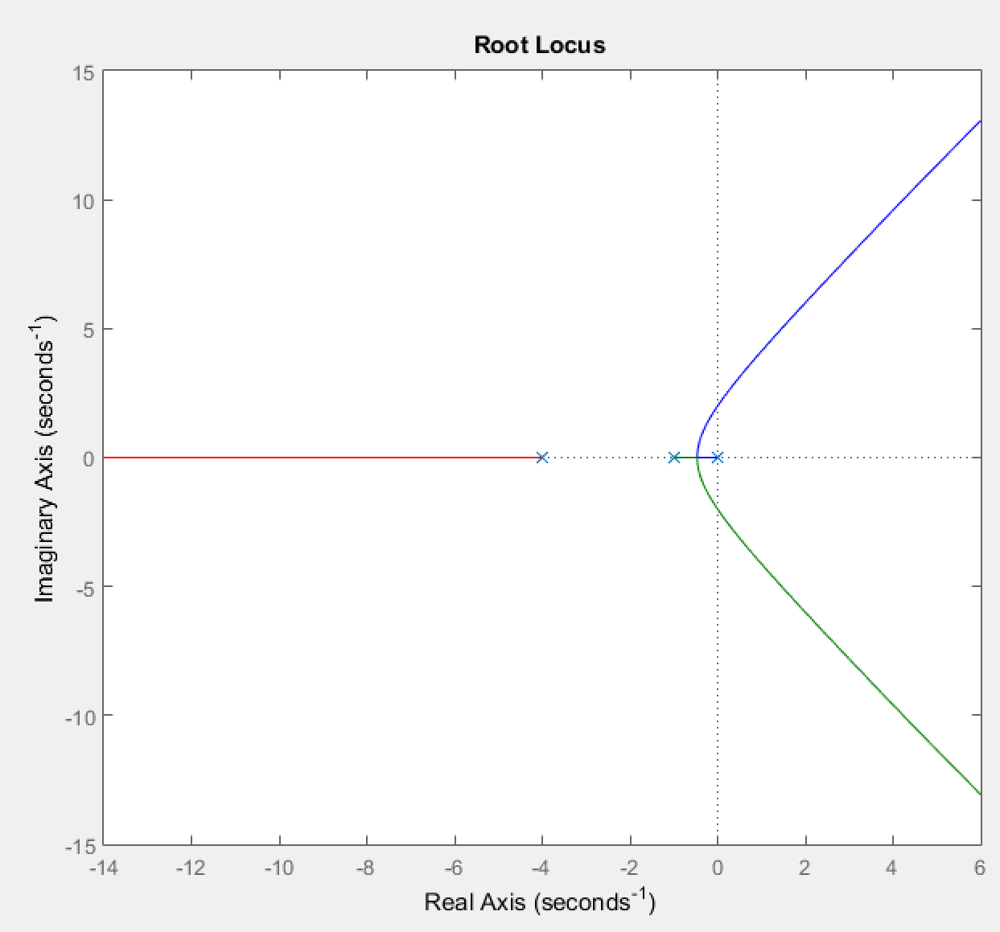

闭环特征方程为

$$
s(s+1)(1+0.25s)+K=0
$$

两边乘以 $4$：

$$
s^3+5s^2+4s+4K=0
$$

Routh 稳定条件给出

$$
K>0,\qquad 20-4K>0
$$

因此

$$
\boxed{0<K<5}
$$

当 $K=5$ 时，辅助方程为

$$
5s^2+20=0
$$

所以根轨迹穿越虚轴于

$$
\boxed{s=\pm 2j}
$$

小 $K$ 时闭环极点靠近 $0,-1,-4$；增大 $K$ 后，$(-1,0)$ 上两支先汇合，再形成一对复共轭极点。$K>5$ 时该复共轭极点进入右半平面，系统不稳定。

## Worked Example 4

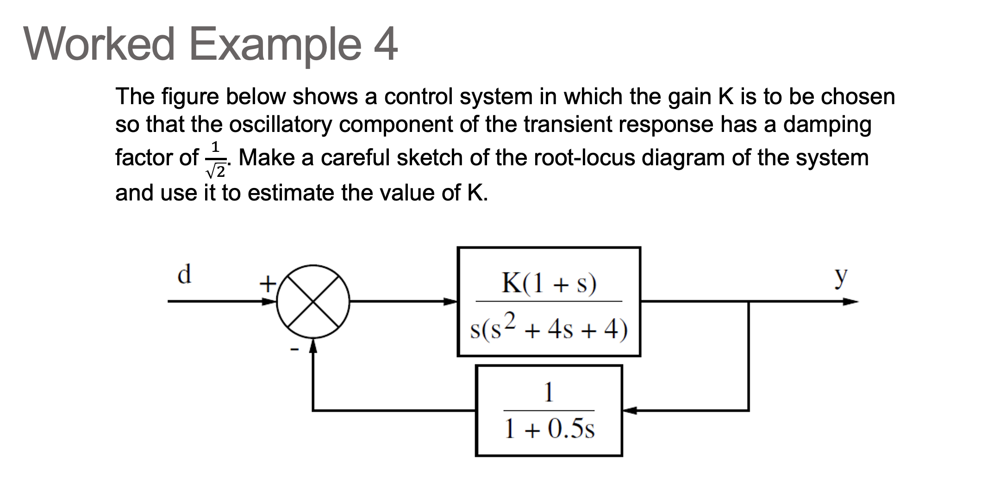

展示参考答案

> GPT-5.5 生成。

前向通道与反馈通道为

$$
G(s)=\frac{K(1+s)}{s(s^2+4s+4)},\qquad H(s)=\frac{1}{1+0.5s}
$$

由于 $s^2+4s+4=(s+2)^2$ 且 $1+0.5s=0.5(s+2)$，闭环特征方程 $1+G(s)H(s)=0$ 可写为

$$
\boxed{s(s+2)^3+2K(s+1)=0}
$$

对应的等效根轨迹开环模型为

$$
L(s)=\frac{2K(s+1)}{s(s+2)^3}
$$

开环极点为 $0$ 与 $-2$ 的三重极点，开环零点为 $-1$。

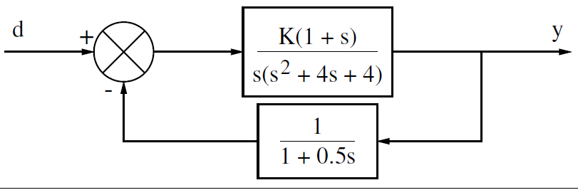

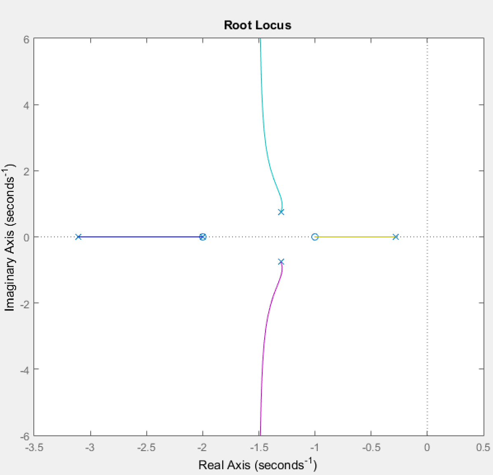

题目要求振荡分量阻尼比为

$$
\zeta=\frac{1}{\sqrt{2}}
$$

对应的常阻尼比线为 $45^\circ$，可令闭环主导极点为

$$
s=-\omega\pm j\omega
$$

将其代入特征方程并分离实部、虚部，解得

$$
\omega=1,\qquad K=2
$$

也可直接验证 $s=-1+j$：

$$
s(s+2)^3=(-1+j)(1+j)^3=-4j
$$

且

$$
2K(s+1)=2Kj
$$

令两项相加为零，得到

$$
-4j+2Kj=0
$$

因此

$$
\boxed{K=2}
$$

## Worked Example 5

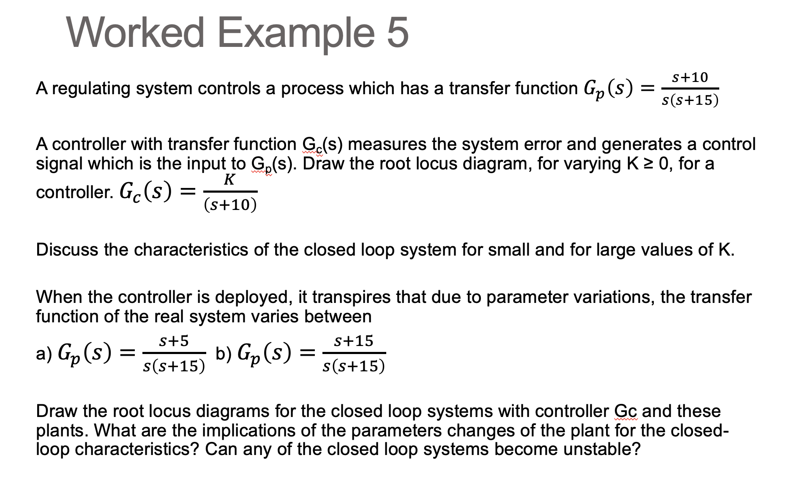

展示参考答案

> GPT-5.5 生成。

题图中的名义对象与控制器为

$$
G_p(s)=\frac{s+10}{s(s+15)},\qquad G_c(s)=\frac{K}{s+10}
$$

因此名义开环传递函数发生零极点相消：

$$
G_c(s)G_p(s)=\frac{K}{s(s+15)}
$$

闭环特征方程为

$$
s(s+15)+K=0
$$

即

$$
s^2+15s+K=0
$$

对所有 $K>0$，二阶多项式系数均为正，因此名义闭环系统稳定。

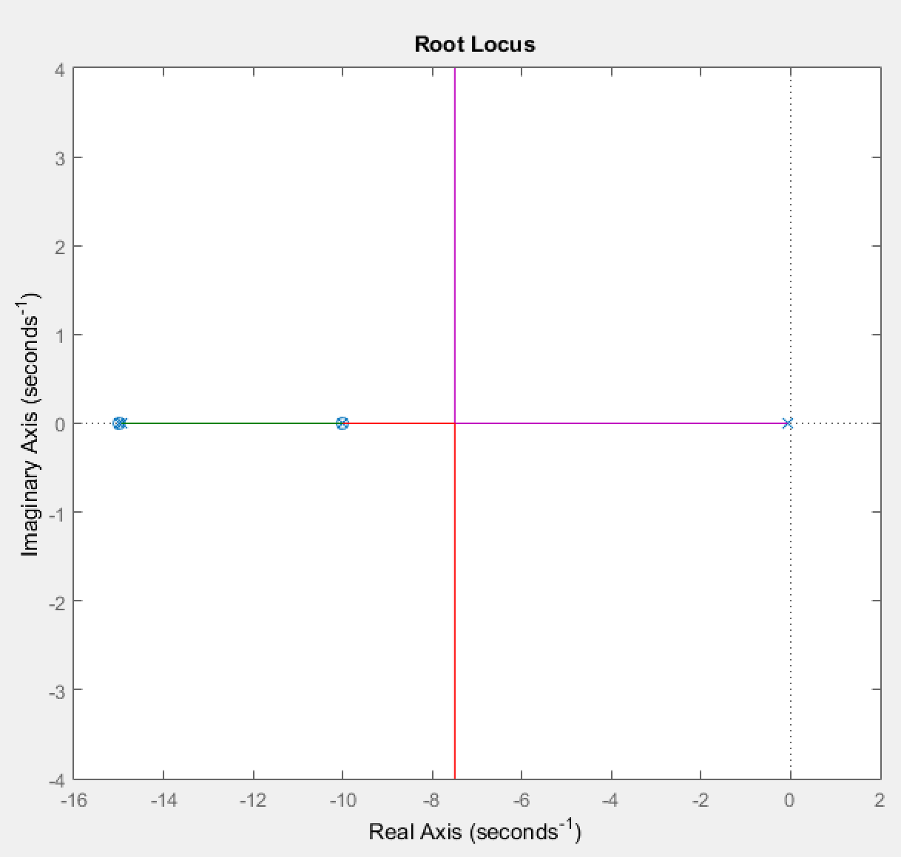

### Variation (a)

实际对象变为

$$
G_p(s)=\frac{s+5}{s(s+15)}
$$

则

$$
G_c(s)G_p(s)=\frac{K(s+5)}{s(s+15)(s+10)}
$$

闭环特征方程为

$$
s(s+15)(s+10)+K(s+5)=0
$$

即

$$
s^3+25s^2+(150+K)s+5K=0
$$

Routh 表对三阶多项式要求

$$
25(150+K)>5K
$$

此不等式对所有 $K>0$ 成立，因此 variation (a) 对所有正增益稳定。

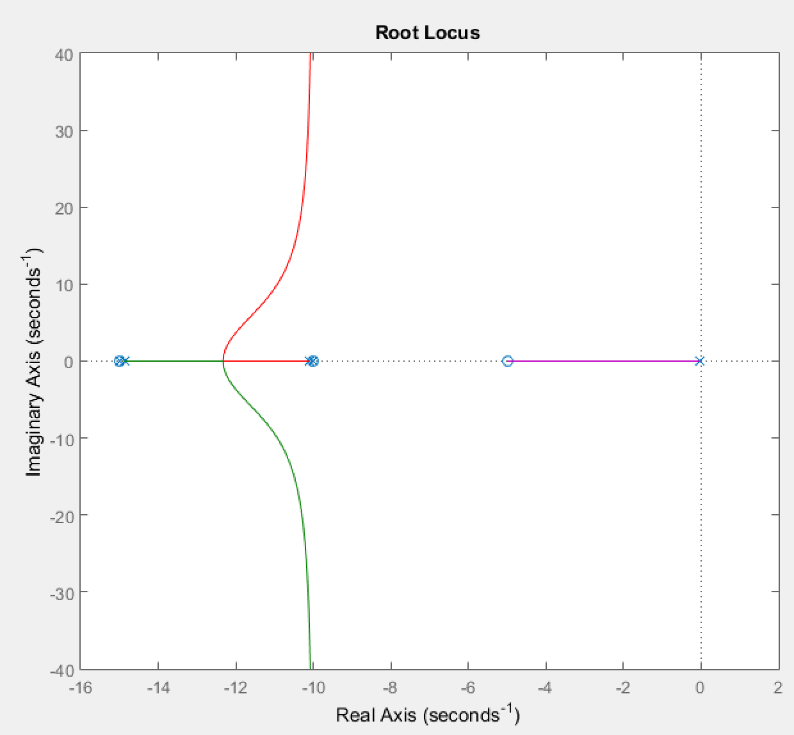

### Variation (b)

题图中的 variation (b) 为

$$
G_p(s)=\frac{s+15}{s(s+15)}
$$

因此对象内部可先相消为 $1/s$，再与控制器组成

$$
G_c(s)G_p(s)=\frac{K}{s(s+10)}
$$

闭环特征方程为

$$
s(s+10)+K=0
$$

即

$$
s^2+10s+K=0
$$

所以 variation (b) 也对所有 $K>0$ 稳定。

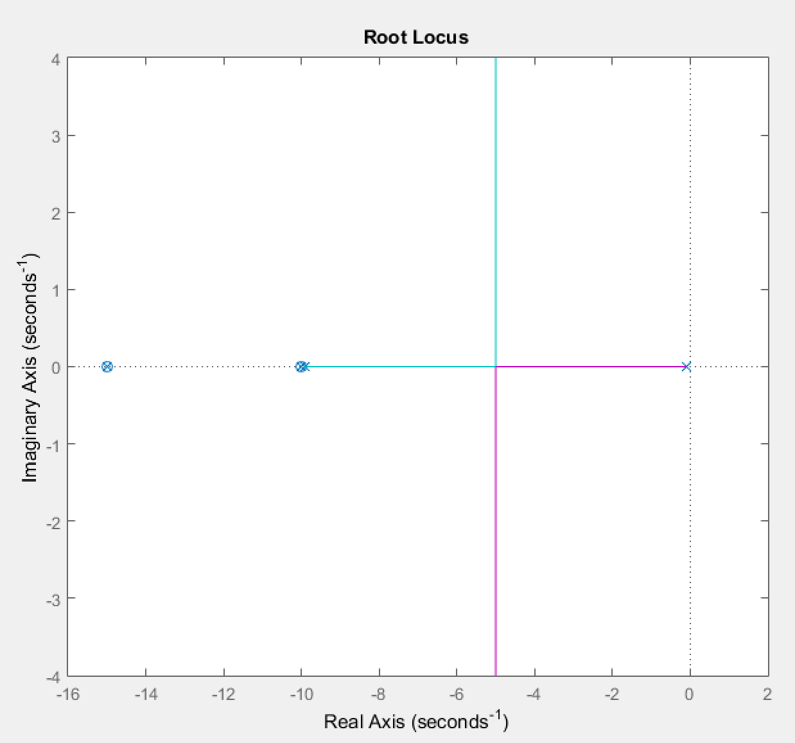

总结：这三种情形都不会因 $K>0$ 而失稳，但参数变化会明显改变根轨迹形状与闭环极点位置。小 $K$ 时闭环极点靠近开环极点，响应较慢；大 $K$ 时极点沿对应根轨迹移动，可能产生更快但更振荡的瞬态。另：Section 4.1 的 docx 中还出现过额外的 $s+30$ 变体，但本 PPT 截图使用的是 $s+15$ 版本，以上按截图为准。

