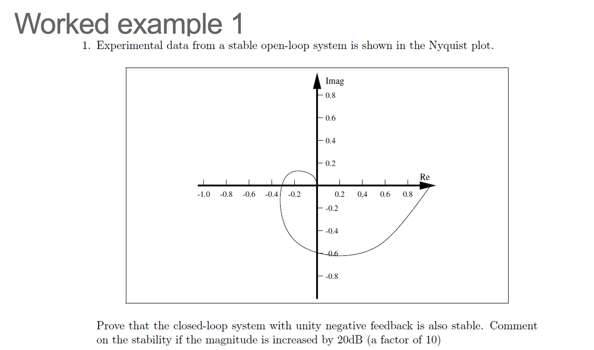
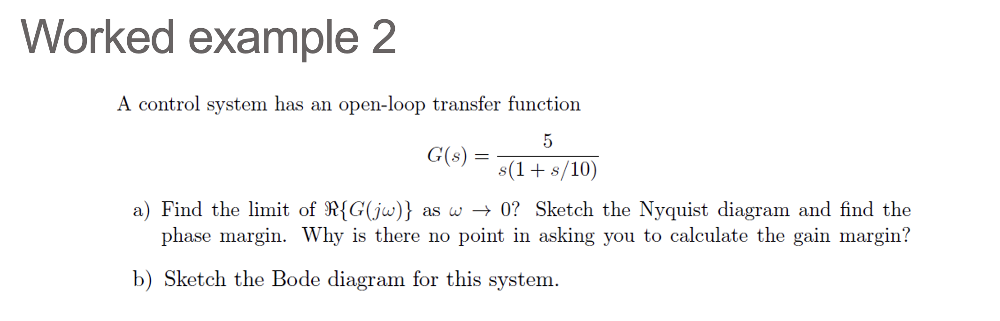
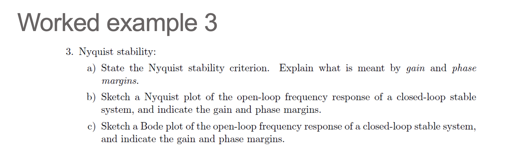
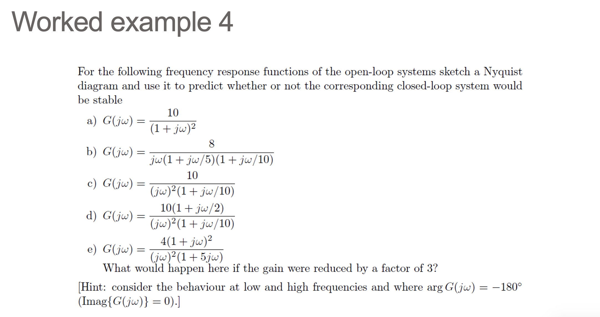
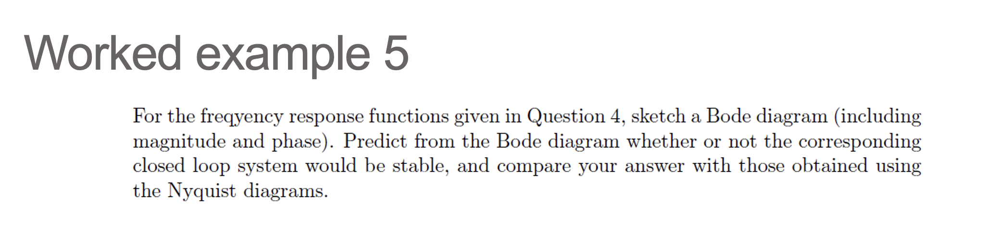
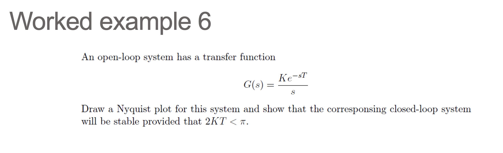
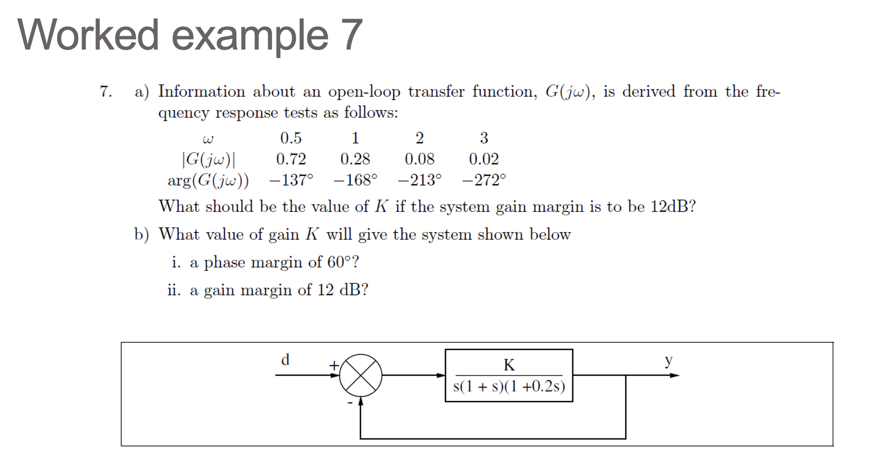

这一页把 Part.2 频率响应相关 worked examples 从截图草稿整理成可复习的参考解。PPTX 没有官方文字答案；下面每个答案块由 GPT-5.5 生成。

## WE1. Nyquist 图与增益增加

展示参考答案

**GPT-5.5 生成。**

题目说明开环系统稳定，因此 Nyquist 判据中

$$
P=0.
$$

从图上看，原 Nyquist 轨迹没有包围危险点 $(-1,j0)$，所以

$$
N=0,\qquad Z=P+N=0.
$$

闭环 unity negative feedback 系统稳定。

若幅值增加 $20\text{ dB}$，则频率响应整体乘以

$$
10^{20/20}=10.
$$

Nyquist 图相当于以原点为中心放大 $10$ 倍。此时原本靠近原点的小环会扩大并包围 $(-1,j0)$，于是 $N\ne0$。由于 $P=0$，得到 $Z\ne0$，闭环不稳定。

## WE2. 积分加一阶极点系统

展示参考答案

**GPT-5.5 生成。**

开环传递函数为

$$
G(s)=\frac{5}{s(1+s/10)}.
$$

令 $s=j\omega$：

$$
G(j\omega)=\frac{5}{j\omega(1+j\omega/10)}
=\frac{-0.5-j5/\omega}{1+(\omega/10)^2}.
$$

所以

$$
\lim_{\omega\to0^+}\Re\{G(j\omega)\}=-0.5.
$$

幅值和相位为

$$
|G(j\omega)|=\frac{5}{\omega\sqrt{1+(\omega/10)^2}},
$$

$$
\angle G(j\omega)=-90^\circ-\tan^{-1}(\omega/10).
$$

增益交越频率由 $|G(j\omega_{gc})|=1$ 得到：

$$
\omega_{gc}\approx4.5509\text{ rad/s}.
$$

因此

$$
PM=180^\circ+\angle G(j\omega_{gc})
\approx180^\circ-90^\circ-\tan^{-1}(0.45509)
\approx65.5^\circ.
$$

相位只在 $\omega\to\infty$ 时渐近到 $-180^\circ$，没有有限的相位交越频率；此时幅值趋于 $0$，所以 gain margin 为无穷大，问有限 GM 没有意义。

Bode 图：积分项从低频开始给 $-20\text{ dB/dec}$；在 $10\text{ rad/s}$ 之后，一阶极点再贡献 $-20\text{ dB/dec}$，总斜率变为 $-40\text{ dB/dec}$。相位从约 $-90^\circ$ 开始，经过 $10\text{ rad/s}$ 附近继续下降，最终趋于 $-180^\circ$。

## WE3. Nyquist 判据与稳定裕度

展示参考答案

**GPT-5.5 生成。**

采用本课程/PPT 的符号约定：$N$ 为 Nyquist 图对 $(-1,j0)$ 的顺时针环绕次数，逆时针为负。Nyquist 稳定判据为

$$
Z=P+N,
$$

其中 $P$ 是开环右半平面极点数，$Z$ 是闭环右半平面极点数。闭环稳定当且仅当

$$
Z=0.
$$

若开环稳定，则 $P=0$，闭环稳定要求 Nyquist 图不环绕 $(-1,j0)$。

若开环有 $P$ 个右半平面极点，则 Nyquist 图必须逆时针环绕 $(-1,j0)$ 共 $P$ 次，使 $N=-P$。

增益裕度和相位裕度都在量轨迹离 $(-1,j0)$ 的距离：

$$
\omega_{gc}: |G(j\omega_{gc})|=1,
\qquad PM=180^\circ+\angle G(j\omega_{gc}).
$$

在 Nyquist 图上，$PM$ 是单位圆交点到负实轴方向还差的角度；在 Bode 图上，是幅值 $0\text{ dB}$ 处相位到 $-180^\circ$ 的距离。

$$
\omega_{pc}: \angle G(j\omega_{pc})=-180^\circ,
\qquad GM=\frac{1}{|G(j\omega_{pc})|}.
$$

在 Nyquist 图上，$GM$ 是负实轴交点到 $(-1,j0)$ 的径向余量；在 Bode 图上，是相位 $-180^\circ$ 处幅值到 $0\text{ dB}$ 的距离。

## WE4. Nyquist 稳定性预测

展示参考答案

**GPT-5.5 生成。**

对 unity negative feedback，闭环特征方程为 $1+G(s)=0$。下面用与 Nyquist 判断一致的紧凑 Routh/相位检查复核稳定性。

| 系统 | 开环频率响应 | 稳定性结论 | 关键理由 |
|---|---|---|---|
| a | $\displaystyle G(j\omega)=\frac{10}{(1+j\omega)^2}$ | 稳定 | $1+G=0\Rightarrow s^2+2s+11=0$，二阶系数全正。Nyquist 不包围 $-1$。 |
| b | $\displaystyle G(j\omega)=\frac{8}{j\omega(1+j\omega/5)(1+j\omega/10)}$ | 稳定 | $1+G=0\Rightarrow s^3+15s^2+50s+400=0$，Routh 第一列为 $1,15,70/3,400$。相位交越满足 $\omega_{pc}=\sqrt{50}$，$\lvert G(j\omega_{pc})\rvert=8/15$，所以 $GM=15/8\gt1$。 |
| c | $\displaystyle G(j\omega)=\frac{10}{(j\omega)^2(1+j\omega/10)}$ | 不稳定 | $1+G=0\Rightarrow s^3+10s^2+100=0$，Routh 第一列出现负项，闭环有右半平面极点。 |
| d | $\displaystyle G(j\omega)=\frac{10(1+j\omega/2)}{(j\omega)^2(1+j\omega/10)}$ | 稳定 | $1+G=0\Rightarrow s^3+10s^2+50s+100=0$，Routh 第一列为 $1,10,40,100$。零点提供相位超前，Nyquist 避开 $-1$。 |
| e | $\displaystyle G(j\omega)=\frac{4(1+j\omega)^2}{(j\omega)^2(1+5j\omega)}$ | 稳定；但增益除以 $3$ 后不稳定 | 一般令分子增益为 $K$，特征方程为 $5s^3+(1+K)s^2+2Ks+K=0$。Routh 条件给 $K\gt1.5$。原题 $K=4$ 稳定；除以 $3$ 后 $K=4/3\lt1.5$，不稳定。 |

系统 e 是 conditionally stable：它不是“增益越小越安全”的常规情形。相位交越在

$$
2\tan^{-1}\omega-\tan^{-1}(5\omega)=0
\quad\Rightarrow\quad
\omega=\sqrt{0.6},
$$

该频率处原题 $K=4$ 的幅值为 $8/3$。临界增益为 $K=1.5$，所以把 $4$ 降到 $4/3$ 会穿过稳定边界。

## WE5. Bode 图稳定性预测

展示参考答案

**GPT-5.5 生成。**

这些 Bode 预测应与 WE4 的 Nyquist/Routh 结论一致。下表列出相位表达式和主要裕度。

| 系统 | 相位表达式 | Bode 预测 |
|---|---|---|
| a | $\phi_a=-2\tan^{-1}\omega$ | $\lvert G\rvert=1$ 给 $\omega_{gc}=3$，$PM\approx36.9^\circ$，稳定。无有限相位交越，$GM=\infty$。 |
| b | $\phi_b=-90^\circ-\tan^{-1}(\omega/5)-\tan^{-1}(\omega/10)$ | $\omega_{gc}\approx5.035$，$PM\approx18.1^\circ$。$\omega_{pc}=\sqrt{50}$，$GM=15/8\approx5.46\text{ dB}$，稳定但裕度较小。 |
| c | $\phi_c=-180^\circ-\tan^{-1}(\omega/10)$ | $\omega_{gc}\approx3.091$，$PM\approx-17.2^\circ$，闭环不稳定。 |
| d | $\phi_d=-180^\circ+\tan^{-1}(\omega/2)-\tan^{-1}(\omega/10)$ | $\omega_{gc}\approx4.862$，$PM\approx41.7^\circ$，稳定。 |
| e | $\phi_e=-180^\circ+2\tan^{-1}\omega-\tan^{-1}(5\omega)$ | 原增益 $K=4$ 稳定，但属于 conditionally stable。相位交越在 $\omega=\sqrt{0.6}$，临界增益 $K=1.5$；把增益除以 $3$ 后 $K=4/3$，进入不稳定区。 |

读 Bode 图时要注意：a 到 d 可直接用常规正 PM/正 GM 判断；e 有积分项和相位先低于再回到 $-180^\circ$ 的形状，必须结合相位交越处的实际增益方向判断。

## WE6. 带时间延迟的积分系统

展示参考答案

**GPT-5.5 生成。**

开环系统为

$$
G(s)=\frac{K e^{-sT}}{s}.
$$

令 $s=j\omega$：

$$
G(j\omega)=\frac{K}{\omega}e^{-j(\pi/2+\omega T)}.
$$

因此

$$
|G(j\omega)|=\frac{K}{\omega},
\qquad
\angle G(j\omega)=-\frac{\pi}{2}-\omega T.
$$

相位交越发生在

$$
-\frac{\pi}{2}-\omega_{pc}T=-\pi
\quad\Rightarrow\quad
\omega_{pc}=\frac{\pi}{2T}.
$$

该频率处幅值为

$$
|G(j\omega_{pc})|=\frac{K}{\pi/(2T)}=\frac{2KT}{\pi}.
$$

为了使 Nyquist 图在 $-180^\circ$ 方向穿越时仍在 $(-1,j0)$ 的右侧，需要

$$
\frac{2KT}{\pi}\lt1.
$$

所以闭环稳定条件为

$$
2KT\lt\pi.
$$

## WE7. 由频率响应数据反求增益

展示参考答案

**GPT-5.5 生成。**

### a) 表格插值

目标 gain margin 为 $12\text{ dB}$，对应倍数

$$
GM=10^{12/20}\approx3.981.
$$

在相位 $-168^\circ$ 到 $-213^\circ$ 之间，用对数频率和 dB 幅值线性插值到 $-180^\circ$，得到近似

$$
\omega_{pc}\approx1.20,
\qquad
|G(j\omega_{pc})|\approx0.2005.
$$

若加上增益 $K$，则

$$
GM=\frac{1}{K|G(j\omega_{pc})|}.
$$

所以

$$
K\approx\frac{1}{3.981\times0.2005}\approx1.25.
$$

这个结果依赖插值方式；若直接在线性频率和线性幅值上插值，会得到略不同的数值。

### b) 三阶反馈系统

$$
G(s)=\frac{K}{s(1+s)(1+0.2s)}
$$

不含 $K$ 的相位为

$$
\phi(\omega)=-90^\circ-\tan^{-1}\omega-\tan^{-1}(0.2\omega).
$$

要 $PM=60^\circ$，增益交越处相位应为 $-120^\circ$：

$$
\tan^{-1}\omega+
\tan^{-1}(0.2\omega)=30^\circ.
$$

解得

$$
\omega_{gc}\approx0.4607.
$$

令 $K|G_0(j\omega_{gc})|=1$，其中 $G_0=1/[s(1+s)(1+0.2s)]$，得到

$$
K=\omega_{gc}\sqrt{1+
\omega_{gc}^2}\sqrt{1+0.04\omega_{gc}^2}
\approx0.5094.
$$

要 $GM=12\text{ dB}$，先找相位交越：

$$
\tan^{-1}\omega+
\tan^{-1}(0.2\omega)=90^\circ
\quad\Rightarrow\quad
0.2\omega^2=1,
$$

所以

$$
\omega_{pc}=\sqrt{5}.
$$

此时

$$
|G_0(j\omega_{pc})|=\frac{1}{6}.
$$

加上增益 $K$ 后

$$
GM=\frac{1}{K/6}=\frac{6}{K}.
$$

令 $GM=10^{12/20}$，得到

$$
K=\frac{6}{10^{12/20}}\approx1.507.
$$

