本页汇总第 4.1 节关于 root locus 绘制与稳定性检查的官方例题解析。

对于具有 $n$ 个开环极点和 $m$ 个开环零点的传递函数，下文使用的渐近线规则为

$$
x_c = \frac{\sum \operatorname{Re}(p_i) - \sum \operatorname{Re}(z_j)}{n-m},
\qquad
\theta_k = \frac{(2k+1)180^\circ}{n-m}.
$$

## WE1. 四个基本 root-locus 草图

**题目。** 对下列系统，绘制 $K$ 从 $0$ 增大到 $\infty$ 时的 root locus：

$$
\text{(a) }G(s)=\frac{K}{s+1},\qquad
\text{(b) }G(s)=\frac{K}{s^2},\qquad
\text{(c) }G(s)=\frac{K}{s(s+1)},\qquad
\text{(d) }G(s)=\frac{K}{(s+1)^4}.
$$

展示参考答案

> GPT-5.5 生成。

### WE1(a) First-order pole

$$
G(s)=\frac{K}{s+1}
$$

极点位于 $s=-1$，没有零点，因此 $n-m=1$。渐近线中心为 $x_c=-1$，唯一的渐近线角为 $180^\circ$。轨迹从 $-1$ 出发，并沿实轴向左移动。

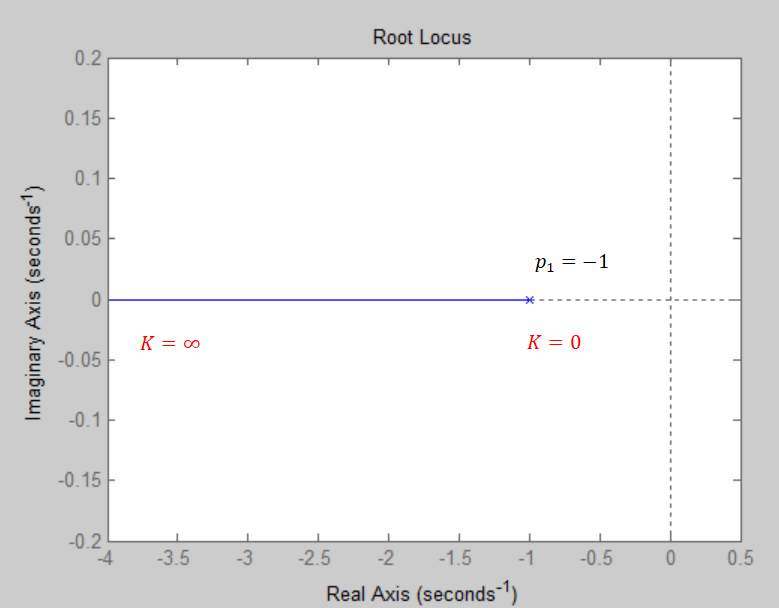

### WE1(b) Double pole at the origin

$$
G(s)=\frac{K}{s^2}
$$

原点处有两个重极点且没有零点，因此 $n-m=2$。中心为 $x_c=0$，渐近线角为 $90^\circ$ 和 $270^\circ$。

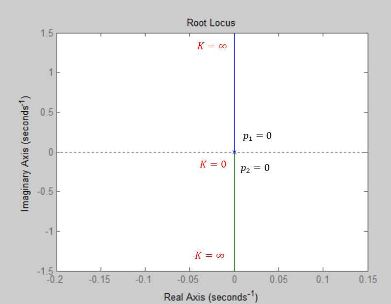

### WE1(c) Two real poles

$$
G(s)=\frac{K}{s(s+1)}
$$

极点位于 $0$ 和 $-1$，没有零点。因此 $n-m=2$，中心为

$$
x_c=\frac{0-1}{2}=-0.5,
$$

渐近线角为 $90^\circ$ 和 $270^\circ$。实轴分支位于 $-1$ 与 $0$ 之间。

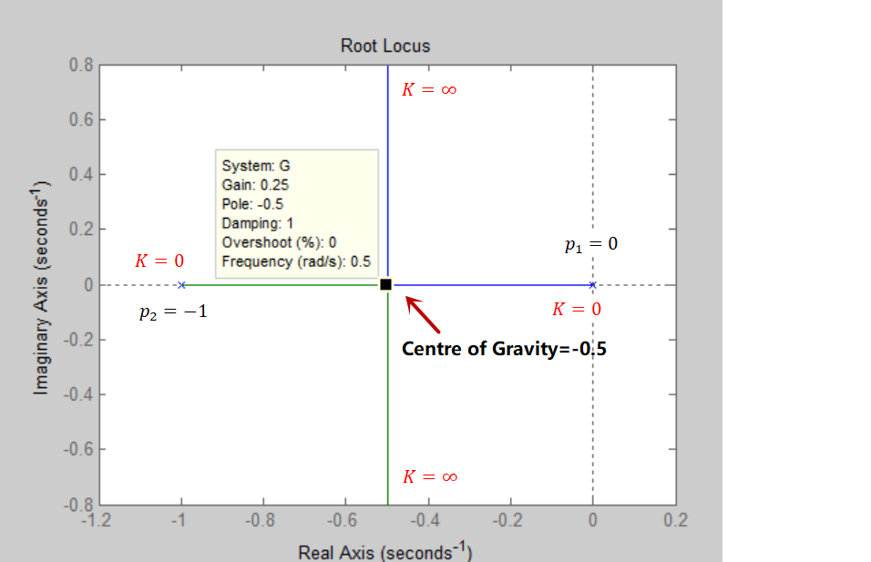

### WE1(d) Four repeated poles

$$
G(s)=\frac{K}{(s+1)^4}
$$

在 $s=-1$ 处有四个重极点且没有零点，因此 $n-m=4$。中心为 $x_c=-1$，渐近线角为

$$
45^\circ,
135^\circ,
225^\circ,
315^\circ.
$$

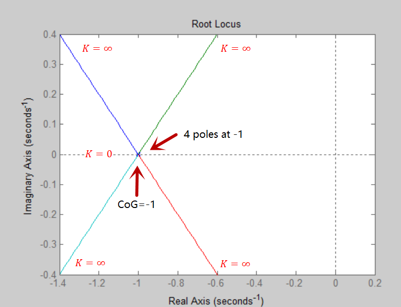

## WE2. 三种 root-locus 情形与稳定性

**题目。** 对下列系统，绘制 $K$ 从 $0$ 增大到 $\infty$ 时的 root locus，并讨论稳定性：

$$
\text{(a) }G(s)=\frac{K}{s^2(s+\alpha)},
$$

$$
\text{(b) }G(s)=\frac{K}{(s+1)(s+2)(s+3)},
$$

$$
\text{(c) }G(s)=\frac{K(1+aTs)}{s^2(1+sT)},\qquad
T=1,\quad a=5\text{ or }0.2.
$$

展示参考答案

> GPT-5.5 生成。

### WE2(a) Double origin pole with one real pole

$$
G(s)=\frac{K}{s^2(s+\alpha)}
$$

极点为 $0,0,-\alpha$，且没有零点。因此 $n-m=3$，并且

$$
x_c=-\frac{\alpha}{3},
\qquad
\theta=60^\circ,180^\circ,300^\circ.
$$

分离点候选值由下式得到：

$$
\frac{dG}{ds}=0
\quad\Rightarrow\quad
3s^2+2\alpha s=0
\quad\Rightarrow\quad
s=0,\ -\frac{2\alpha}{3}.
$$

在官方数值草图中，$\alpha=9$。因此 $x_c=-3$，第二个候选值为

$$
-\frac{2\alpha}{3}=-6,
$$

而不是 $-2$。点 $s=-6$ 不在轨迹上，因为其右侧有偶数个开环奇点。

闭环特征方程为 $s^3+\alpha s^2+K=0$。对任意 $K>0$，Routh 表都会出现符号变化，因此该情形在所有正增益下均不稳定。

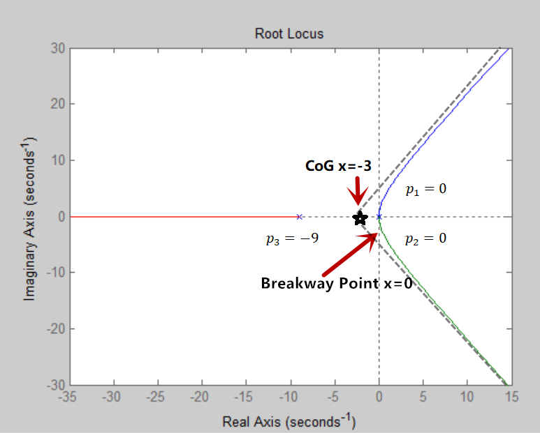

### WE2(b) Three real poles

$$
G(s)=\frac{K}{(s+1)(s+2)(s+3)}
$$

极点为 $-1,-2,-3$，没有零点。因此

$$
x_c=\frac{-1-2-3}{3}=-2,
\qquad
\theta=60^\circ,180^\circ,300^\circ.
$$

分离点方程为

$$
3s^2+12s+11=0
\quad\Rightarrow\quad
s=-2\pm\frac{1}{\sqrt{3}}.
$$

只有 $s=-2+1/\sqrt{3}\approx -1.4226$ 位于相关的实轴分支上。特征方程为

$$
s^3+6s^2+11s+(6+K)=0.
$$

Routh 稳定性判据给出 $6\cdot 11>6+K$，因此系统在下列范围内稳定：

$$
0<K<60.
$$

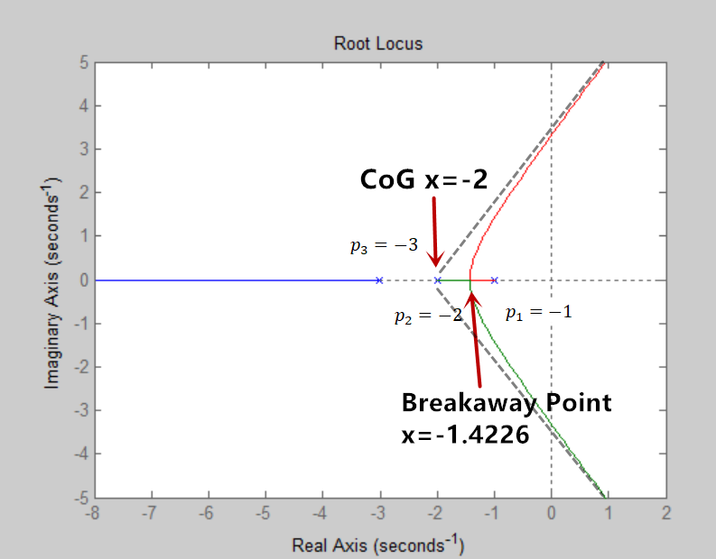

### WE2(c1) Lead zero near the origin

$$
a=5,\qquad T=1
$$

此时

$$
G(s)=\frac{K(1+5s)}{s^2(1+s)}.
$$

开环极点为 $0,0,-1$，零点为 $-0.2$。因此 $n-m=2$，中心为

$$
x_c=\frac{-1-(-0.2)}{2}=-0.4,
$$

渐近线角为 $90^\circ$ 和 $270^\circ$。分离点计算得到

$$
s(5s^2+4s+1)=0
\quad\Rightarrow\quad
s=0,\ -0.4\pm0.2j.
$$

特征方程为 $s^3+s^2+5Ks+K=0$。当 $K>0$ 时，Routh 判据给出 $5K>K$，因此系统对所有 $K>0$ 都稳定。

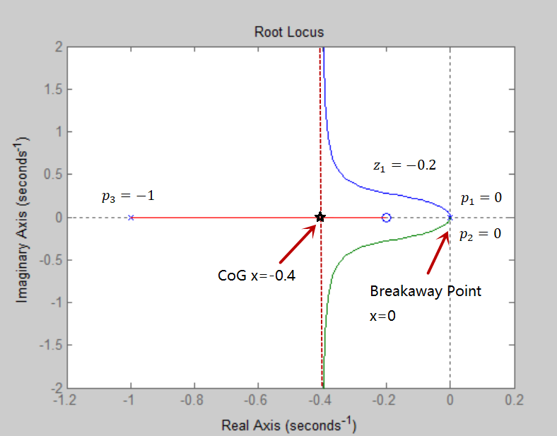

### WE2(c2) Lead zero far from the origin

$$
a=0.2,\qquad T=1
$$

此时

$$
G(s)=\frac{K(1+0.2s)}{s^2(1+s)}.
$$

开环极点为 $0,0,-1$，零点为 $-5$。因此 $n-m=2$，中心为

$$
x_c=\frac{-1-(-5)}{2}=2,
$$

渐近线角为 $90^\circ$ 和 $270^\circ$。修正后的分离点候选值为

$$
s(s^2+8s+5)=0
\quad\Rightarrow\quad
s=0,\ -4\pm\sqrt{11},
$$

而不是 $-1$ 和 $-6$。只有原点属于相关的出发点计算；两个实数候选值都不在 root locus 的实轴线段上。

特征方程为 $s^3+s^2+0.2Ks+K=0$。Routh 判据要求 $0.2K>K$，但这对任意 $K>0$ 都不成立，因此该情形在所有正增益下均不稳定。

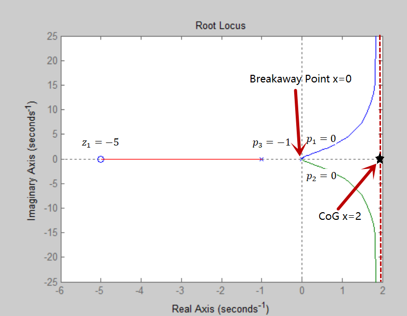

## WE3. 三阶近似 root locus

**题目。** 绘制近似 root locus，并计算渐近线交点及所有重合点。讨论小 $K$ 与大 $K$ 时的闭环特性。

$$
G(s)=\frac{K}{s(s+1)(1+0.25s)}
$$

展示参考答案

> GPT-5.5 生成。

开环极点为 $0,-1,-4$，没有零点，因此 $n-m=3$。中心为

$$
x_c=\frac{0-1-4}{3}=-\frac{5}{3},
$$

渐近线角为 $60^\circ$、$180^\circ$ 和 $300^\circ$。

利用 $s(s+1)(1+0.25s)=0.25(s^3+5s^2+4s)$，重合点计算为

$$
\frac{dG}{ds}=0
\quad\Rightarrow\quad
3s^2+10s+4=0.
$$

因此

$$
s=\frac{-5\pm\sqrt{13}}{3}
\approx -0.4648,\ -2.8685.
$$

只有 $s\approx -0.4648$ 位于实轴轨迹线段上。特征方程为

$$
s^3+5s^2+4s+4K=0,
$$

因此 Routh 稳定性判据要求 $20>4K$。所以闭环系统在下列范围内稳定：

$$
0<K<5.
$$

当 $K$ 为较小正值时，极点仍在左半平面内，并且有一个靠近原点的慢极点。当 $K$ 较大时，复数分支穿越到右半平面，因此响应变得不稳定且振荡性增强。

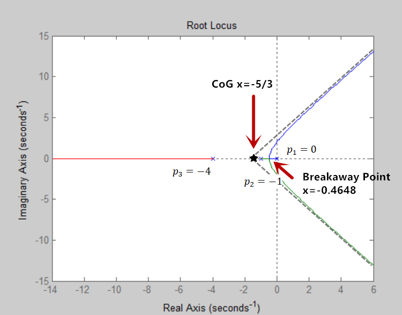

## WE4. 阻尼比设计

**题目。** 对下面的控制系统，选择 $K$，使暂态响应中的振荡分量具有阻尼因子 $1/\sqrt{2}$。绘制 root locus，并估计 $K$。

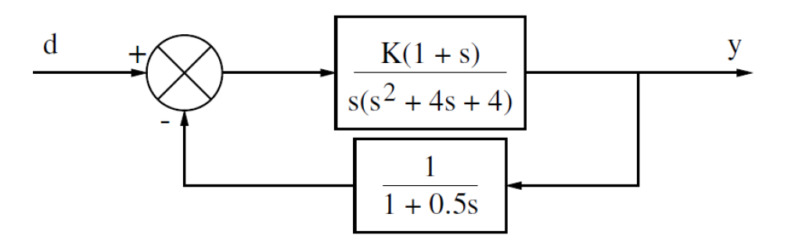

展示参考答案

> GPT-5.5 生成。

开环传递函数为

$$
G(s)H(s)=K\frac{1+s}{s(s^2+4s+4)}\frac{1}{0.5s+1}
=2K\frac{s+1}{s(s+2)^3}.
$$

极点为 $0,-2,-2,-2$，零点为 $-1$。因此 $n-m=3$，并且

$$
x_c=\frac{-2-2-2-(-1)}{3}=-\frac{5}{3},
\qquad
\theta=60^\circ,180^\circ,300^\circ.
$$

官方 root-locus 草图如下：

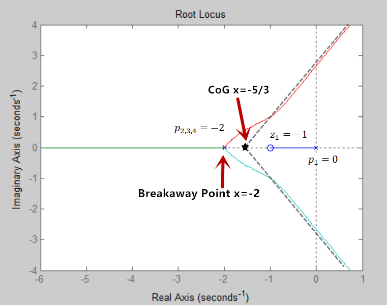

阻尼因子 $\zeta=1/\sqrt{2}$ 对应一条 $45^\circ$ 等阻尼线，因此期望的复极点满足修正后的符号约定

$$
s=-\omega\pm j\omega.
$$

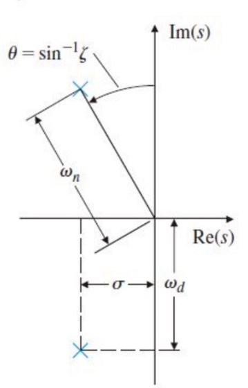

特征方程为

$$
s(s+2)^3+2K(s+1)=0,
$$

即

$$
s^4+6s^3+12s^2+(8+2K)s+2K=0.
$$

代入 $s=-\omega+j\omega$ 并分离实部和虚部，可得

$$
\omega=1,
\qquad
K=2.
$$

因此所需增益为

$$
K=2.
$$

## WE5. 调节系统的变化情形

**题目。** 某调节系统在反馈回路中使用被控对象 $G_p(s)$ 和控制器 $G_c(s)$。对标称被控对象及两个变化情形，绘制 $K\ge 0$ 时的 root locus：

$$
\text{(a) }G_p(s)=\frac{s+10}{s(s+15)},\quad G_c(s)=\frac{K}{s+10},
$$

$$
\text{(b) }G_p(s)=\frac{s+5}{s(s+15)},\quad G_c(s)=\frac{K}{s+10},
$$

$$
\text{(c) }G_p(s)=\frac{s+30}{s(s+15)},\quad G_c(s)=\frac{K}{s+10}.
$$

展示参考答案

> GPT-5.5 生成。

### WE5(a) 标称抵消

$$
G_p(s)G_c(s)=\frac{s+10}{s(s+15)}\frac{K}{s+10}
=\frac{K}{s(s+15)}.
$$

开环极点为 $0$ 和 $-15$，没有零点。因此 $n-m=2$，中心为

$$
x_c=\frac{-15}{2}=-7.5,
$$

渐近线角为 $90^\circ$ 和 $270^\circ$。分离点为

$$
\left[\frac{1}{s(s+15)}\right]'=0
\quad\Rightarrow\quad
-2s-15=0
\quad\Rightarrow\quad
s=-7.5.
$$

二阶特征方程为 $s^2+15s+K=0$，因此该标称情形对所有 $K>0$ 都稳定。

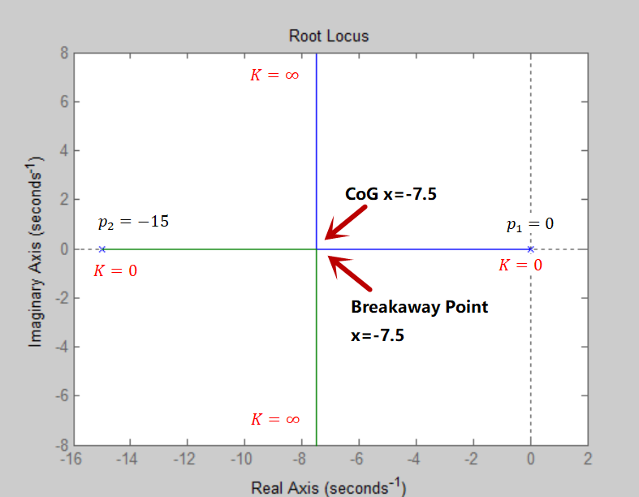

### WE5(b) 零点变化情形一

$$
s=-5
$$

$$
G_p(s)G_c(s)=K\frac{s+5}{s(s+15)(s+10)}.
$$

极点为 $0,-10,-15$，零点为 $-5$。因此 $n-m=2$，并且

$$
x_c=\frac{-15-10-(-5)}{2}=-10,
\qquad
\theta=90^\circ,270^\circ.
$$

分离点候选值由下式求解：

$$
-2s^3-40s^2-250s-750=0,
$$

得到实轴轨迹点 $s\approx -12.3279$，以及一对不在实轴轨迹上的复数根。特征方程为

$$
s^3+25s^2+(150+K)s+5K=0.
$$

Routh 判据给出 $25(150+K)>5K$，因此系统对所有 $K>0$ 都稳定。

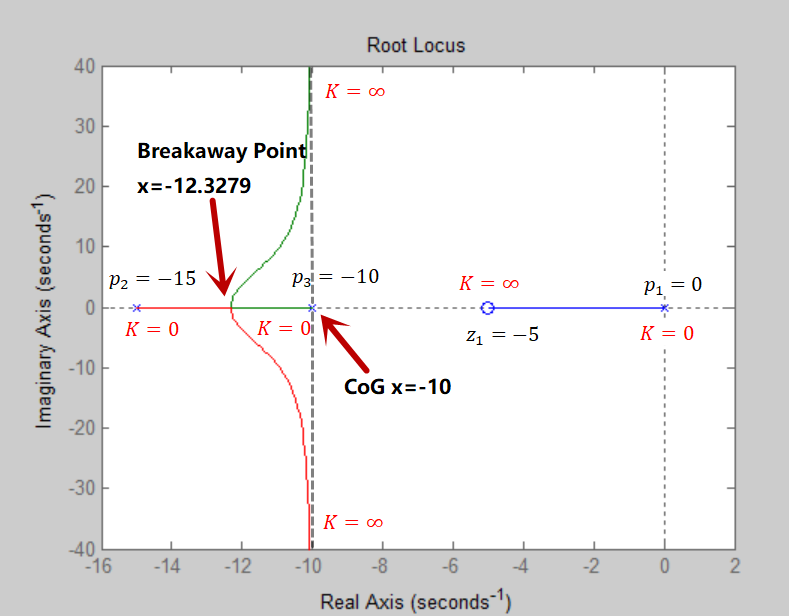

### WE5(c) 零点变化情形二

$$
s=-30
$$

$$
G_p(s)G_c(s)=K\frac{s+30}{s(s+15)(s+10)}.
$$

极点为 $0,-10,-15$，零点为 $-30$。因此 $n-m=2$，中心为

$$
x_c=\frac{-15-10-(-30)}{2}=2.5,
$$

渐近线角为 $90^\circ$ 和 $270^\circ$。分离点候选值由下式求解：

$$
-2s^3-115s^2-1500s-4500=0,
$$

其根近似为

$$
s=-40.2587,
\quad
-12.9133,
\quad
-4.3280.
$$

只有 $s\approx -4.3280$ 位于相关的实轴轨迹线段上。特征方程为

$$
s^3+25s^2+(150+K)s+30K=0.
$$

Routh 边界为

$$
25(150+K)=30K
\quad\Rightarrow\quad
K=750.
$$

因此修正后的虚轴穿越对应 $K=750$，而不是 $757$。系统在 $0<K<750$ 时稳定，在 $K>750$ 时不稳定。

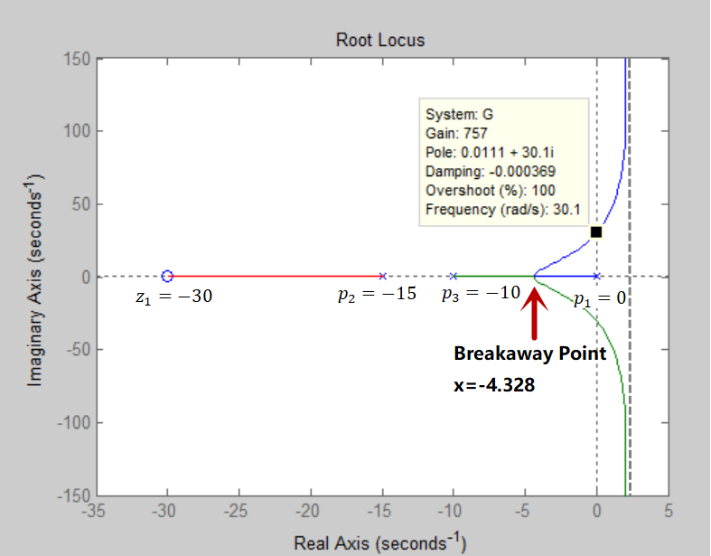

