## WE1. 实验 Nyquist 图

下图 Nyquist 图给出了一个稳定开环系统的实验数据。证明采用单位负反馈时闭环系统也是稳定的。若幅值增加 20 dB，即放大 10 倍，请说明稳定性会如何变化。

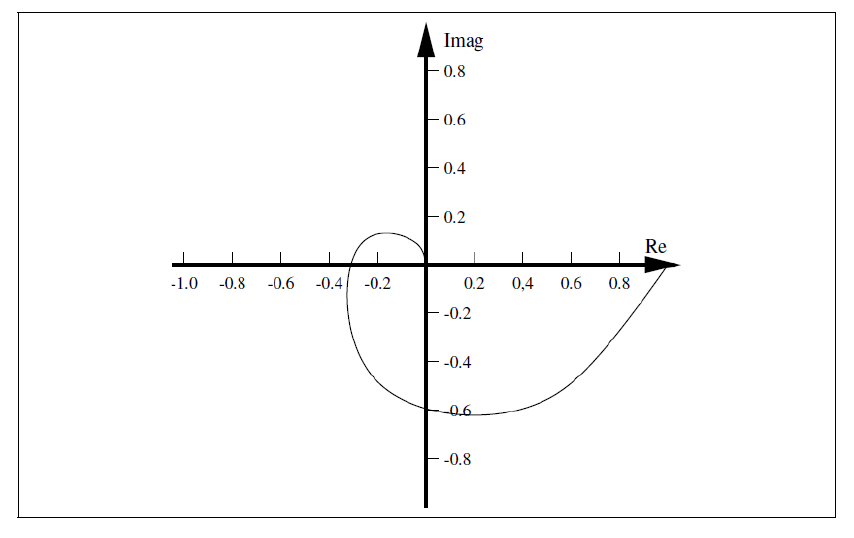

展示参考答案

> GPT-5.5 生成。

该轨迹没有包围临界点 $(-1,0)$。由于开环系统稳定，根据 Nyquist 判据可知闭环系统稳定。

如果幅值增加 20 dB，Nyquist 图上的每个半径都会乘以 10。负实轴交点会从约 $-0.3$ 移到约 $-3$，因此轨迹将包围 $(-1,0)$。此时闭环系统将变为不稳定。

## WE2. Nyquist 图和 Bode 图

本题开环传递函数为

$$
G(s)=\frac{5}{s(1+s/10)}.
$$

对于开环传递函数

$$
G(s)=\frac{5}{s(1+s/10)},
$$

回答以下问题。

a. 求 $\lim_{\omega\to 0}\Re\{G(j\omega)\}$。画出 Nyquist 图，并求相位裕度。为什么询问增益裕度没有意义？

b. 画出该系统的 Bode 图。

展示参考答案

> GPT-5.5 生成。

令 $s=j\omega$，

$$
G(j\omega)=\frac{5}{j\omega(1+j\omega/10)}
=\frac{-5\omega^2/10-j5\omega}{\omega^2+\omega^4/100}.
$$

因此

$$
\Re\{G(j\omega)\}
=\frac{-5/10}{1+\omega^2/100}
\quad\Longrightarrow\quad
\lim_{\omega\to 0}\Re\{G(j\omega)\}=-0.5.
$$

幅值和相位为

$$
|G(j\omega)|=\frac{5}{\omega\sqrt{1+\omega^2/100}},
\qquad
\angle G(j\omega)=-90^\circ-\tan^{-1}\!\left(\frac{\omega}{10}\right).
$$

因此轨迹从相位为 $-90^\circ$ 的无穷远处开始，以相位 $-180^\circ$ 接近原点，并始终位于第三象限。在 $\omega=10$ 时，

$$
|G(j10)|=\frac{1}{2\sqrt{2}},
\qquad
\angle G(j10)=-135^\circ.
$$

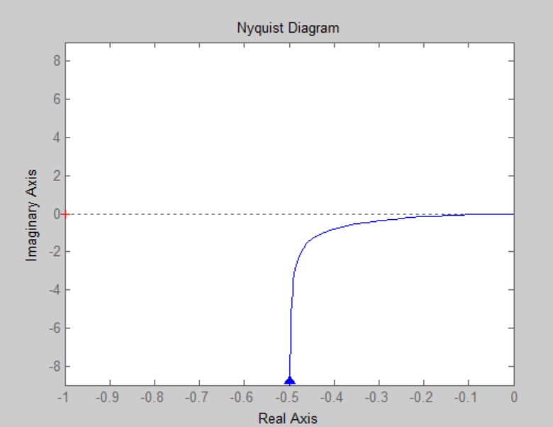

为求相位裕度，解 $|G(j\omega)|=1$：

$$
\frac{5}{\omega\sqrt{1+\omega^2/100}}=1
\quad\Longrightarrow\quad
\omega\approx 4.5509.
$$

在该频率处，

$$
\angle G(j\omega)
=-90^\circ-\tan^{-1}(0.45509)
\approx -115^\circ,
$$

所以

$$
\mathrm{PM}=180^\circ-115^\circ\approx 65^\circ.
$$

不存在有限的负实轴交点：当相位趋于 $-180^\circ$ 时，轨迹只趋向原点。因此增益裕度为无穷大。

对于 Bode 图，

$$
20\log_{10}|G(j\omega)|
=20\log_{10}5-20\log_{10}\omega
-10\log_{10}\left(1+\frac{\omega^2}{100}\right),
$$

相位为

$$
\angle G(j\omega)=-90^\circ-\tan^{-1}\!\left(\frac{\omega}{10}\right).
$$

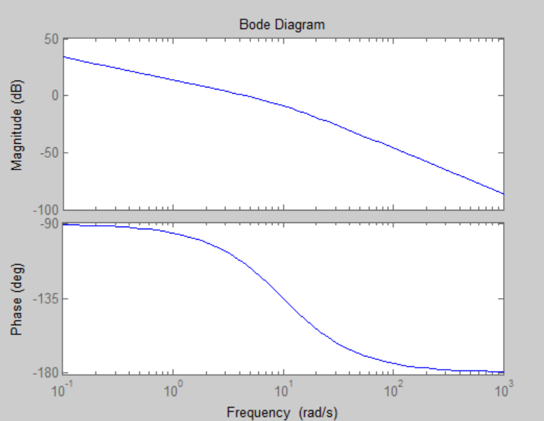

## WE3. Nyquist 判据与稳定裕度

a. 陈述 Nyquist 稳定判据。解释增益裕度和相位裕度。

b. 画出一个闭环稳定系统的开环频率响应 Nyquist 图，并标出增益裕度和相位裕度。

c. 画出一个闭环稳定系统的开环频率响应 Bode 图，并标出增益裕度和相位裕度。

使用例子

$$
G(s)=\frac{10}{(s+1)(s+2)(s+3)}.
$$

展示参考答案

> GPT-5.5 生成。

对于具有 $P$ 个右半平面极点的开环系统，令 $N$ 为对临界点 $(-1,0)$ 的顺时针包围次数。Nyquist 判据给出 $Z=P-N$，其中 $Z$ 是闭环右半平面极点数。因此闭环稳定要求 $Z=0$，即 $N=P$。

相位裕度是在增益穿越频率处使闭环达到不稳定所需额外增加的相位滞后：

$$
\mathrm{PM}=180^\circ+\angle G(j\omega_{gc}),
\qquad |G(j\omega_{gc})|=1.
$$

增益裕度是在相位穿越频率处、系统达到不稳定前环路增益还能增加的倍数：

$$
\mathrm{GM}=\frac{1}{|G(j\omega_{pc})|},
\qquad \angle G(j\omega_{pc})=-180^\circ.
$$

对该例，官方 Nyquist 草图显示轨迹是稳定的，并且近似有

$$
\lambda\approx 0.15,
\qquad
\mathrm{GM}\approx \frac{1}{\lambda}\approx 6.67,
$$

以及

$$
\angle G(j\omega_{gc})\approx -90^\circ,
\qquad
\mathrm{PM}\approx 90^\circ.
$$

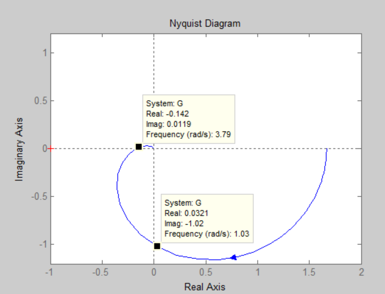

在 Bode 图上，相位裕度在 0 dB 穿越处读取，增益裕度在 $-180^\circ$ 相位穿越处读取。官方 Bode 草图近似给出

$$
\mathrm{PM}\approx 90^\circ,
\qquad
\mathrm{GM}\approx 14.9\ \mathrm{dB}.
$$

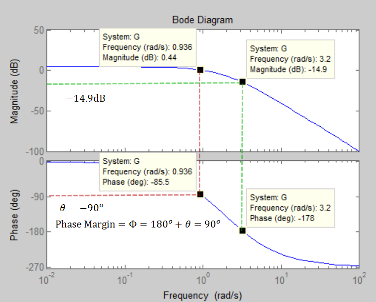

## WE4. Nyquist 稳定性预测

对下面每个开环频率响应，画出 Nyquist 图，并判断相应的单位反馈闭环系统是否稳定。

$$
\begin{aligned}
\text{a.}\quad &G(j\omega)=\frac{10}{(1+j\omega)^2},\\
\text{b.}\quad &G(j\omega)=\frac{8}{j\omega(1+j\omega/5)(1+j\omega/10)},\\
\text{c.}\quad &G(j\omega)=\frac{10}{(j\omega)^2(1+j\omega/10)},\\
\text{d.}\quad &G(j\omega)=\frac{10(1+j\omega/2)}{(j\omega)^2(1+j\omega/10)},\\
\text{e.}\quad &G(j\omega)=\frac{4(1+j\omega)^2}{(j\omega)^2(1+5j\omega)}.
\end{aligned}
$$

对于 e 小问，还需说明若增益减小为原来的 $1/3$ 会发生什么。

展示参考答案

> GPT-5.5 生成。

**a.**

$$
G(j\omega)=\frac{10(1-\omega^2-2j\omega)}{(1+\omega^2)^2},
\qquad
|G(j\omega)|=\frac{10}{1+\omega^2},
\qquad
\angle G(j\omega)=-2\tan^{-1}\omega.
$$

轨迹从正实轴上的 $10$ 开始，在 $\omega=1$ 且 $|G|=5$ 时穿过负虚轴，并以相位 $-180^\circ$ 趋向原点。它不包围 $(-1,0)$。

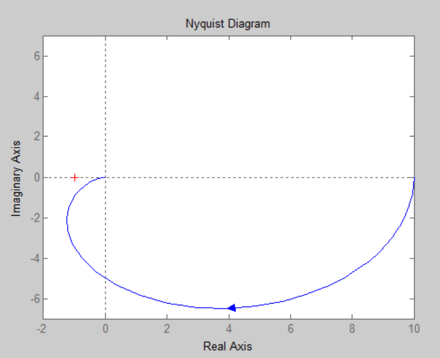

最终结果：稳定。

**b.**

$$
|G(j\omega)|=
\frac{8}{\omega\sqrt{1+\omega^2/25}\sqrt{1+\omega^2/100}},
$$

并且

$$
\angle G(j\omega)
=-90^\circ-\tan^{-1}\!\left(\frac{\omega}{5}\right)
-\tan^{-1}\!\left(\frac{\omega}{10}\right).
$$

当满足下式时，相位为 $-180^\circ$：

$$
\tan^{-1}\!\left(\frac{\omega}{5}\right)
+\tan^{-1}\!\left(\frac{\omega}{10}\right)=90^\circ,
$$

由此得到 $\omega=\sqrt{50}$。在该穿越点，

$$
|G(j\sqrt{50})|
=\frac{8}{\sqrt{50}\sqrt{3}\sqrt{3/2}}
=\frac{8}{15}.
$$

这修正了已知的原资料笔误：该值应为 $8/15$，而不是 $0.0533$。

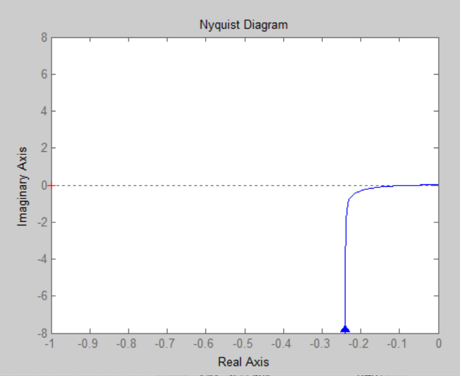

最终结果：稳定。

**c.**

$$
|G(j\omega)|=\frac{10}{\omega^2\sqrt{1+\omega^2/100}},
\qquad
\angle G(j\omega)=-180^\circ-\tan^{-1}\!\left(\frac{\omega}{10}\right).
$$

正频率分支也可等价地画在负实轴上方，从无穷远趋向原点。官方 Nyquist 草图从临界点上方经过。

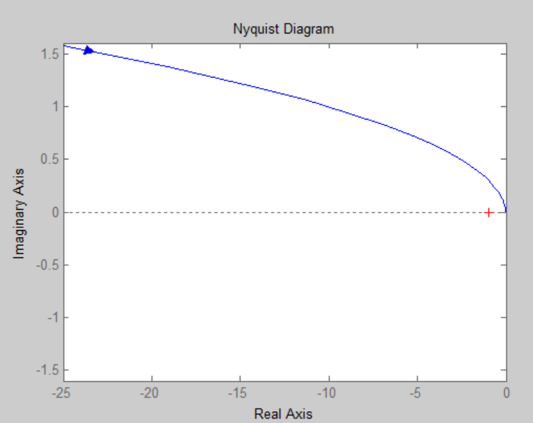

最终结果：不稳定。

**d.**

$$
|G(j\omega)|=
\frac{10\sqrt{1+\omega^2/4}}{\omega^2\sqrt{1+\omega^2/100}},
$$

并且

$$
\angle G(j\omega)
=-180^\circ+\tan^{-1}\!\left(\frac{\omega}{2}\right)
-\tan^{-1}\!\left(\frac{\omega}{10}\right).
$$

超前项使轨迹从临界点下方而不是上方弯过，因此不会形成导致不稳定的包围。

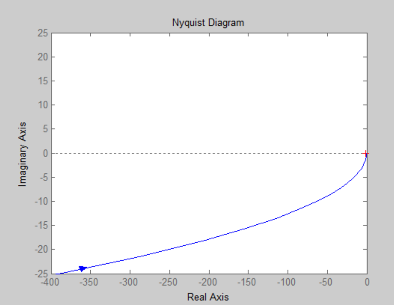

最终结果：稳定。

**e.**

$$
|G(j\omega)|=
\frac{4(1+\omega^2)}{\omega^2\sqrt{1+25\omega^2}},
$$

并且

$$
\angle G(j\omega)
=-180^\circ+2\tan^{-1}\omega-\tan^{-1}(5\omega).
$$

等价地，

$$
G(j\omega)
=\frac{4\bigl(-(1+9\omega^2)+j(3\omega-5\omega^3)\bigr)}{\omega^2+25\omega^4}.
$$

对于题中给定的增益，官方 Nyquist 草图不包围临界点。

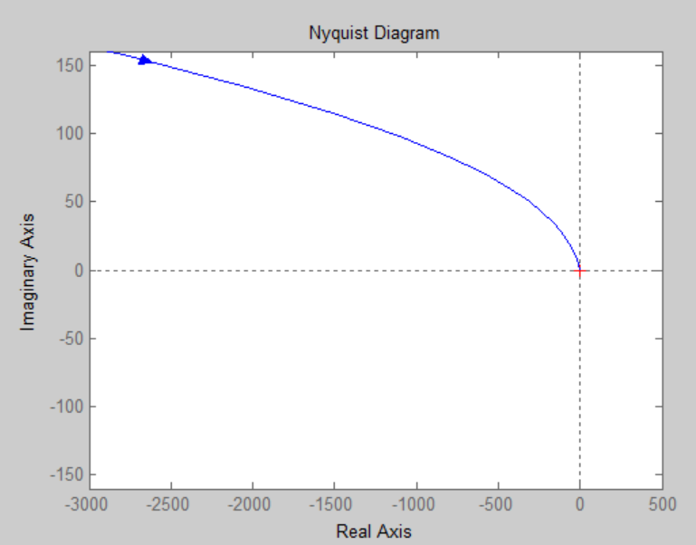

最终结果：稳定。若增益除以 3，轨迹会按比例缩放，并在官方草图中从临界点上方经过，因此闭环系统变为不稳定。

## WE5. WE4 各系统的 Bode 图

对于 WE4 中的五个频率响应，画出 Bode 幅频图和相频图。

展示参考答案

> GPT-5.5 生成。

**a.** 对于

$$
G(j\omega)=\frac{10}{(1+j\omega)^2},
$$

其组成部分为增益 $10$，以及两个位于 $\omega_c=1$ 的相同滞后环节。因此

$$
20\log_{10}|G|=20-20\log_{10}(1+\omega^2),
\qquad
\phi(\omega)=-2\tan^{-1}\omega.
$$

渐近幅值在低于 $1\ \mathrm{rad/s}$ 时为平坦的 20 dB，高于该频率后斜率为 $-40\ \mathrm{dB/dec}$。相位从 $0^\circ$ 变化到 $-180^\circ$。

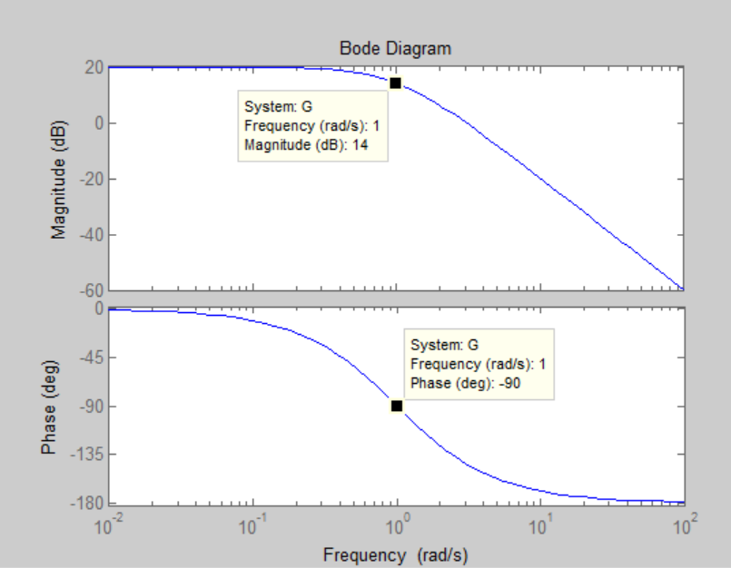

**b.** 对于

$$
G(j\omega)=\frac{8}{j\omega(1+j\omega/5)(1+j\omega/10)},
$$

其组成部分为增益 $8$、一个积分环节，以及位于 $5$ 和 $10\ \mathrm{rad/s}$ 的滞后环节。因此

$$
\begin{aligned}
20\log_{10}|G|={}&20\log_{10}8-20\log_{10}\omega\\
&-10\log_{10}\left(1+\frac{\omega^2}{25}\right)
-10\log_{10}\left(1+\frac{\omega^2}{100}\right),
\end{aligned}
$$

并且

$$
\phi(\omega)=-90^\circ
-\tan^{-1}\!\left(\frac{\omega}{5}\right)
-\tan^{-1}\!\left(\frac{\omega}{10}\right).
$$

斜率从 $-20\ \mathrm{dB/dec}$ 开始，在 $5\ \mathrm{rad/s}$ 后变为 $-40\ \mathrm{dB/dec}$，在 $10\ \mathrm{rad/s}$ 后变为 $-60\ \mathrm{dB/dec}$。

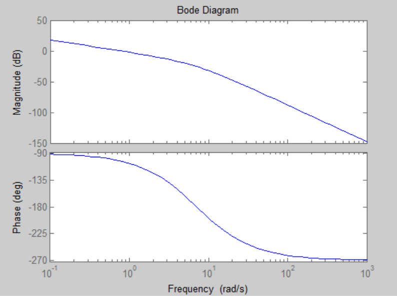

**c.** 对于

$$
G(j\omega)=\frac{10}{(j\omega)^2(1+j\omega/10)},
$$

其组成部分为增益 $10$、一个二重积分环节，以及位于 $10\ \mathrm{rad/s}$ 的滞后环节。因此

$$
20\log_{10}|G|
=20-40\log_{10}\omega
-10\log_{10}\left(1+\frac{\omega^2}{100}\right),
$$

并且

$$
\phi(\omega)=-180^\circ-\tan^{-1}\!\left(\frac{\omega}{10}\right).
$$

斜率在 $10\ \mathrm{rad/s}$ 之前为 $-40\ \mathrm{dB/dec}$，之后为 $-60\ \mathrm{dB/dec}$。

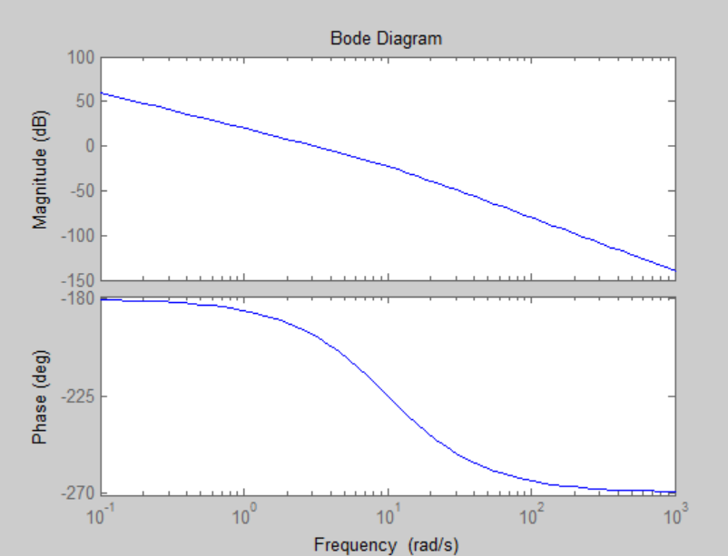

**d.** 对于

$$
G(j\omega)=\frac{10(1+j\omega/2)}{(j\omega)^2(1+j\omega/10)},
$$

其组成部分为增益 $10$、位于 $2\ \mathrm{rad/s}$ 的超前环节、一个二重积分环节，以及位于 $10\ \mathrm{rad/s}$ 的滞后环节。因此

$$
\begin{aligned}
20\log_{10}|G|={}&20-40\log_{10}\omega
+10\log_{10}\left(1+\frac{\omega^2}{4}\right)\\
&-10\log_{10}\left(1+\frac{\omega^2}{100}\right),
\end{aligned}
$$

并且

$$
\phi(\omega)=-180^\circ
+\tan^{-1}\!\left(\frac{\omega}{2}\right)
-\tan^{-1}\!\left(\frac{\omega}{10}\right).
$$

斜率在 $2\ \mathrm{rad/s}$ 之前为 $-40\ \mathrm{dB/dec}$，从 $2$ 到 $10\ \mathrm{rad/s}$ 为 $-20\ \mathrm{dB/dec}$，高于 $10\ \mathrm{rad/s}$ 后为 $-40\ \mathrm{dB/dec}$。

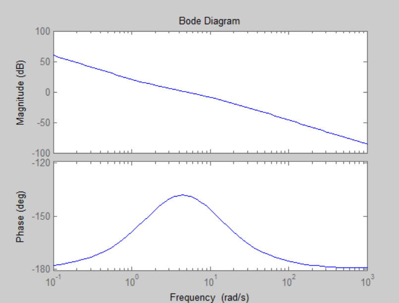

**e.** 对于

$$
G(j\omega)=\frac{4(1+j\omega)^2}{(j\omega)^2(1+5j\omega)},
$$

其组成部分为增益 $4$、一个二重积分环节、两个位于 $1\ \mathrm{rad/s}$ 的超前环节，以及一个位于 $0.2\ \mathrm{rad/s}$ 的滞后环节，因为 $1+5j\omega=1+j\omega/0.2$。因此

$$
20\log_{10}|G|
=20\log_{10}4-40\log_{10}\omega
+20\log_{10}(1+\omega^2)
-10\log_{10}(1+25\omega^2),
$$

并且

$$
\phi(\omega)=-180^\circ+2\tan^{-1}\omega-\tan^{-1}(5\omega).
$$

斜率在低于 $0.2\ \mathrm{rad/s}$ 时为 $-40\ \mathrm{dB/dec}$，从 $0.2$ 到 $1\ \mathrm{rad/s}$ 为 $-60\ \mathrm{dB/dec}$，高于 $1\ \mathrm{rad/s}$ 后为 $-20\ \mathrm{dB/dec}$。

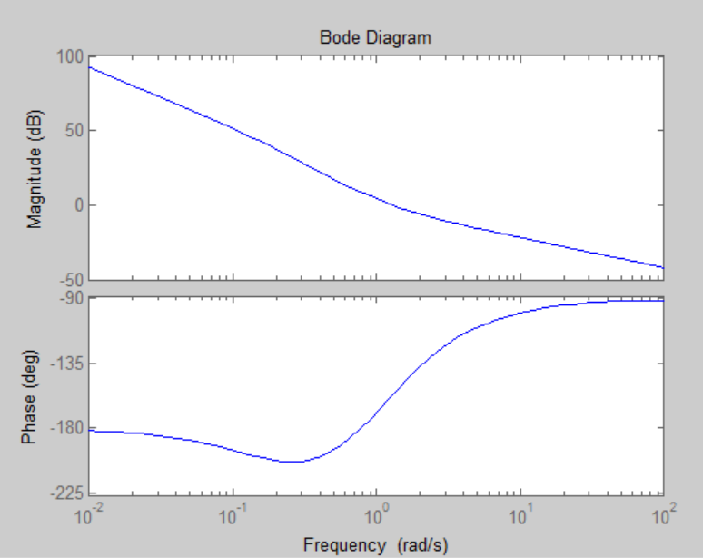

## WE6. 时间延迟与 Nyquist 稳定性

某开环系统的传递函数为

$$
G(s)=\frac{Ke^{-sT}}{s}.
$$

画出 Nyquist 图，并证明只要满足下式，相应的单位反馈闭环系统就是稳定的：

$$
2KT<\pi.
$$

展示参考答案

> GPT-5.5 生成。

令 $s=j\omega$，

$$
G(j\omega)=\frac{Ke^{-j\omega T}}{j\omega}.
$$

由于 $|e^{-j\omega T}|=1$，

$$
|G(j\omega)|=\frac{K}{\omega},
\qquad
\angle G(j\omega)=-90^\circ-\omega T\frac{180^\circ}{\pi}.
$$

临界情况发生在轨迹到达临界方向时：

$$
-180^\circ=-90^\circ-\omega T\frac{180^\circ}{\pi}
\quad\Longrightarrow\quad
\omega=\frac{\pi}{2T}.
$$

在该频率处，

$$
|G(j\omega)|=\frac{K}{\pi/(2T)}=\frac{2KT}{\pi}.
$$

为了使轨迹不到达或不包围 $(-1,0)$，该幅值必须小于 1：

$$
\frac{2KT}{\pi}<1
\quad\Longrightarrow\quad
2KT<\pi.
$$

## WE7. 根据相位裕度和增益裕度设计增益

对于下图所示系统，求满足以下条件的增益 $K$：

i. 相位裕度为 $60^\circ$；

ii. 增益裕度为 12 dB。

展示参考答案

> GPT-5.5 生成。

开环传递函数为

$$
G(s)=\frac{K}{s(1+s)(1+0.2s)}.
$$

令 $s=j\omega$，

$$
G(j\omega)=\frac{5K}{j\omega(1+j\omega)(5+j\omega)}
=\frac{5K}{-6\omega^2+j(5\omega-\omega^3)}.
$$

因此

$$
|G(j\omega)|=
\frac{5K}{\sqrt{36\omega^4+(5\omega-\omega^3)^2}},
$$

并且

$$
\angle G(j\omega)=
\tan^{-1}\!\left(\frac{-5\omega+\omega^3}{-6\omega^2}\right)-180^\circ.
$$

若相位裕度为 $60^\circ$，增益穿越处的相位必须为 $-120^\circ$。求解该相位条件得到

$$
\omega\approx 0.4607.
$$

在该频率处令 $|G(j\omega)|=1$：

$$
K^2=\frac{\omega^6+26\omega^4+25\omega^2}{25},
$$

所以

$$
K\approx 0.5094.
$$

对于增益裕度，使用相位穿越条件 $\angle G(j\omega)=-180^\circ$：

$$
-5\omega+\omega^3=0
\quad\Longrightarrow\quad
\omega=\sqrt{5}.
$$

当 $K=1$ 时，

$$
|G(j\sqrt{5})|=\frac{1}{6},
$$

因此增益裕度倍数为 $6/K$。要求增益裕度为 12 dB，得到

$$
\frac{6}{K}=10^{12/20}
\quad\Longrightarrow\quad
K=\frac{6}{10^{12/20}}
\approx 1.5068.
$$

