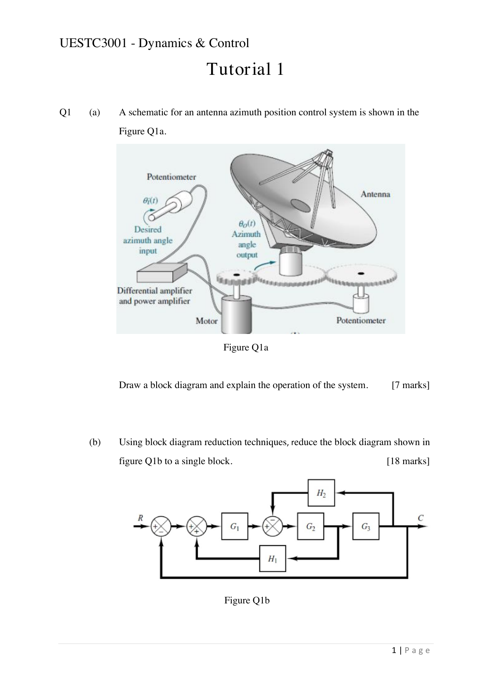
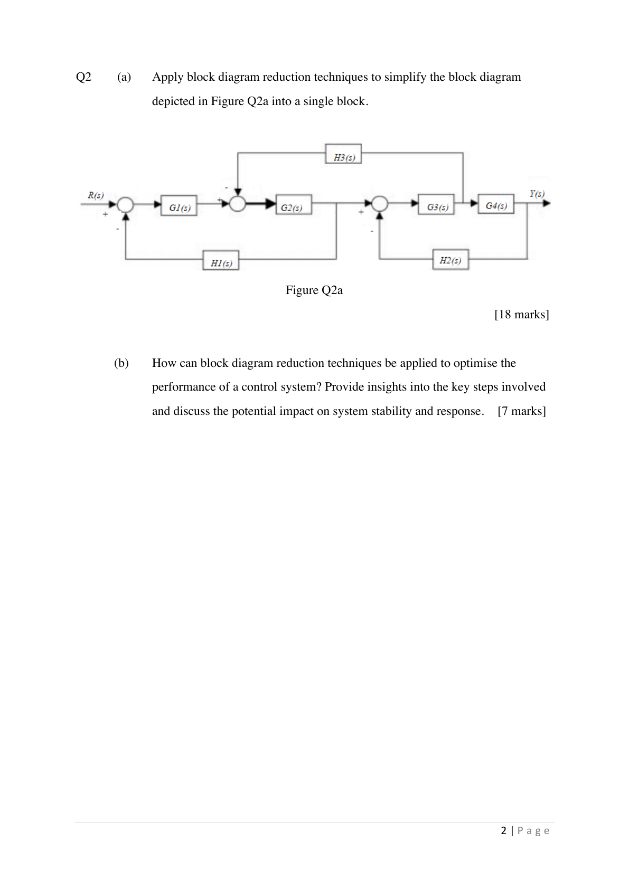

# Tutorial 1：框图与系统化简

> 题源：`slides/raw/part1/Tutorial and Answers-20260617/Tutorial 1.pdf`。
>
> 这一份主要练 [Lec.2](../part.1/lec2.md) 和 [Lec.3](../part.1/lec3.md) 的内容：把实际系统画成框图，再用框图化简规则把复杂反馈结构压成单个传递函数。

## Q1 Antenna Azimuth Position Control

### 做题顺序

Q1(a) 不是先急着写公式，而是先把信号链讲清楚：参考方位角进入比较器，误差经过控制器/放大器驱动执行机构，天线实际方位角经测量环节反馈回来。

Q1(b) 是标准框图化简题。比较稳的做法是：

1. 先合并串联方块。
2. 再合并并联支路。
3. 优先处理最内层反馈环。
4. 每移动求和点或取样点，都把等效增益补上。
5. 最后检查结果是不是只剩一个从输入到输出的等效方块。

Q1 解题提醒

Q1(a) 的解释应包含三件事：输入是什么、误差信号如何产生、反馈如何修正输出。这里的关键词是 **closed-loop position control**，不是单纯的开环驱动。

Q1(b) 化简时不要跨层硬算。只要每一步都遵守基本规则，最后的总传递函数应当可以写成

$$
\frac{C(s)}{R(s)}
$$

的形式。真正容易错的是求和点前后移动时漏乘或漏除某个方块。

## Q2 Block Diagram Reduction and Design Insight

### 做题顺序

Q2(a) 和 Q1(b) 一样是框图化简，但图更大。建议先在原图上圈出可以独立化简的局部反馈环，再逐层向外推。

Q2(b) 是文字题，重点不是“化简让系统更好”这种空话，而是说清楚化简能帮助我们看见什么。

Q2(b) 可写要点

框图化简能把复杂控制系统压缩成等效传递函数，因此可以更直接地分析：

- 闭环极点位置，从而判断稳定性。
- 稳态误差，例如阶跃输入下是否存在偏差。
- 瞬态响应，例如响应速度、超调和振荡趋势。
- 哪些子系统或反馈路径对整体性能影响最大。

优化控制系统时，常见步骤是先建立框图，再化简得到闭环传递函数，接着根据性能指标调整控制器增益或补偿器结构，最后重新检查稳定性和响应品质。

